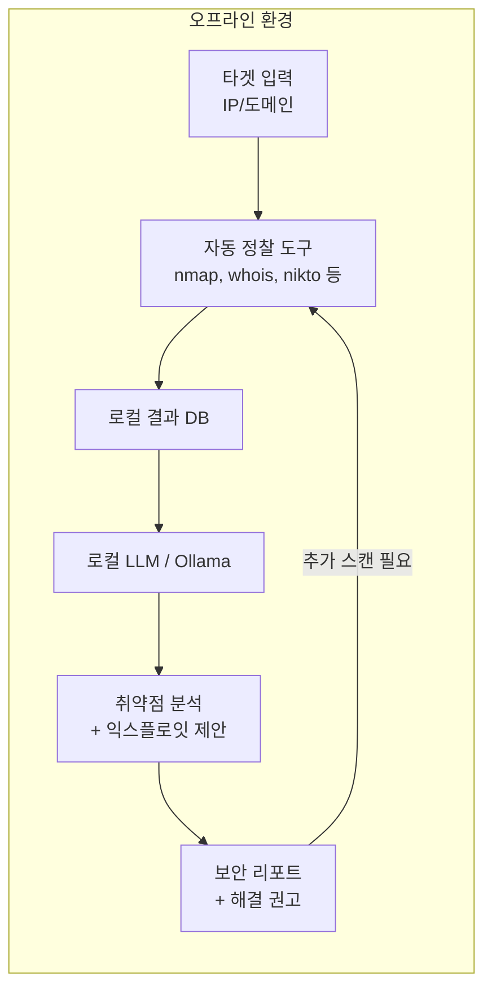

# METATRON (오프라인 AI 침투 테스트)

완전 오프라인 환경에서 동작하는 오픈소스 AI 침투 테스트 프레임워크. 로컬 LLM을 활용하여 민감 데이터의 외부 유출 없이 보안 평가를 수행한다.

## 개요

METATRON은 2026년 4월 출시된 오픈소스 침투 테스트 프레임워크로, 보안 연구자와 펜테스터를 위해 Parrot OS 및 기타 Debian 기반 리눅스 배포판에서 동작하도록 설계되었다. 핵심 특징은 자동화된 정찰 도구와 로컬 호스팅 LLM을 결합하여, 외부 API 연결 없이 취약점 평가를 수행한다는 점이다. 클라우드 서비스 의존성을 완전히 제거함으로써 데이터 주권과 운영 보안을 최우선으로 하는 조직에 적합하다.

## 핵심 특징

### 오프라인 우선 아키텍처

- 모든 정찰 및 분석이 온프레미스에서 수행된다
- 인터넷 연결 없이 취약점 평가가 가능하다
- 취약점 데이터를 외부 서비스로 전송하는 리스크를 제거한다

### [[on-device-llm|Ollama]] 통합

Ollama 오픈소스 프레임워크를 활용하여 로컬 하드웨어에서 LLM을 관리하고 실행한다. 이를 통해 보안 팀이 민감한 평가 데이터에 대한 완전한 통제권을 유지하면서도 정교한 AI 분석 기능을 사용할 수 있다.

### 통합 정찰 도구 체인

METATRON은 다음의 전통적 보안 도구를 자동으로 실행하고 결과를 수집한다:

- **nmap**: 네트워크 스캐닝 및 포트 탐지
- **whois**: 도메인 등록 정보 조회
- **subfinder**: 서브도메인 열거
- **whatweb**: 웹 기술 스택 식별
- **curl**: HTTP 요청 및 응답 분석
- **dnsutils**: DNS 레코드 조회
- **nikto**: 웹 서버 취약점 스캐닝

### 핵심 구성 요소



## 운영 워크플로

METATRON의 자동화된 파이프라인은 다음 단계를 순환한다:

1. **타겟 지정**: 사용자가 IP 주소 또는 도메인 이름을 입력
2. **자동 정찰 실행**: nmap, whois, subfinder, whatweb, curl, dnsutils, nikto 등의 도구를 자동으로 실행
3. **결과 수집**: 정찰 단계의 모든 출력을 로컬 데이터베이스에 집계
4. **AI 분석**: 로컬 LLM이 수집된 데이터를 분석하고 잠재적 취약점을 식별
5. **익스플로잇 제안**: 발견된 취약점에 대한 공격 방법론과 해결 권고안 생성
6. **반복 스캐닝**: AI 판단에 따라 추가 정밀 스캔을 자동으로 수행

## 기술 상세

### 설치 및 시스템 요구사항

**지원 플랫폼**: Ubuntu, Kali Linux, Parrot OS (Debian 기반 권장)
**최소 RAM**: 16GB (로컬 LLM 실행을 위한 권장 사양)

```bash
git clone https://github.com/sooryathejas/METATRON.git
cd METATRON
python3 -m venv venv
source venv/bin/activate
pip install -r requirements.txt
sudo apt install nmap whois whatweb curl dnsutils nikto
python metatron.py
```

### 기존 도구 대비 차별점

| 특성 | METATRON | 전통적 도구 (Metasploit/Nmap/Burp) |
|------|----------|----------------------------------|
| AI 통합 | 로컬 LLM 기반 분석 | 없음 |
| 오프라인 동작 | 완전 오프라인 | 부분적 (DB 업데이트 필요) |
| OS 호환성 | Debian 기반 전용 | 멀티 플랫폼 |
| 커뮤니티 규모 | 성장 초기 | 대규모/성숙 |
| 자동화 수준 | 정찰-분석-보고 통합 | 개별 도구 수동 조합 |
| 데이터 유출 위험 | 없음 (완전 로컬) | 클라우드 연동 시 존재 |

전통적 펜테스팅 도구(Metasploit, Nmap 등)는 취약점 데이터베이스 업데이트와 분석에 클라우드 연결이 필요한 경우가 많다. METATRON은 LLM의 추론 능력을 활용하여 오프라인에서도 맥락 기반의 취약점 분석과 보고서 생성이 가능하다.

### 보안 이점

- **데이터 프라이버시**: 평가 대상의 민감 정보가 디바이스 밖으로 유출되지 않는다
- **규제 준수**: 데이터 주권 요구사항이 엄격한 환경(군사, 금융, 의료)에 적합
- **독립 운영**: 네트워크 장애나 인터넷 차단 상황에서도 보안 평가를 계속 수행 가능

### 주요 사용 사례

- 개인 네트워크 및 프로젝트의 보안 자가 점검
- 윤리적 해킹 교육 및 실습 환경 구성
- 고급 도구 투입 전 초기 정찰 및 위협 평가
- 에어갭(air-gapped) 실험실 환경에서의 취약점 분석

### 현재 한계

- Debian 기반 리눅스로 플랫폼이 제한됨 (Windows/macOS 미지원)
- Metasploit/Burp Suite 대비 커뮤니티와 문서가 아직 소규모
- AI 기능 활용을 위한 학습 곡선이 존재
- 로컬 LLM 실행에 16GB+ RAM이 필요하여 저사양 장비에서는 제약

### 전통적 펜테스팅 워크플로 대비

전통적 침투 테스트는 개별 도구(Nmap으로 스캔, Metasploit으로 익스플로잇, Burp Suite로 웹 취약점 분석)를 수동으로 조합하고 결과를 직접 해석해야 한다. METATRON은 이 과정을 단일 파이프라인으로 통합한다: 도구 실행 -> 결과 수집 -> AI 분석 -> 보고서 생성이 자동으로 연결된다. 특히 정찰 단계의 결과를 LLM이 맥락적으로 분석하여, 단순 포트 스캔 결과에서 잠재적 공격 벡터를 추론하고 우선순위화할 수 있다.

### 관련 리소스

- GitHub: [sooryathejas/METATRON](https://github.com/sooryathejas/METATRON)

## 관련 문서

- [[ai-red-teaming|AI 레드팀 & LLM 취약점 스캐닝]]
- [[llm-security-owasp|LLM 보안 (OWASP / 적대적 공격)]]
- [[agent-prompt-injection-defense|Agent Prompt Injection Defense]]
