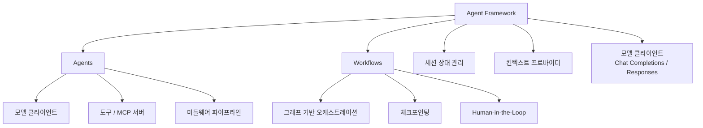

## 개요

Microsoft Agent Framework는 Semantic Kernel과 AutoGen을 통합한 차세대 AI 에이전트 개발 플랫폼이다. 동일 팀이 개발한 두 프로젝트의 강점을 결합하여, AutoGen의 간결한 에이전트 추상화와 Semantic Kernel의 엔터프라이즈급 기능(세션 기반 상태 관리, 타입 안전성, 미들웨어, 텔레메트리)을 하나의 프레임워크로 제공한다. 2026년 2월 RC(Release Candidate)가 공개되었으며, .NET과 Python 두 언어를 동등하게 지원한다.

## 핵심 특징

- **통합 아키텍처**: Semantic Kernel의 엔터프라이즈 기능 + AutoGen의 멀티에이전트 패턴을 단일 플랫폼으로 통합
- **그래프 기반 워크플로우**: 에이전트와 함수를 연결하는 멀티스텝 워크플로우. 타입 안전 라우팅, 체크포인팅, Human-in-the-Loop 지원
- **광범위 모델 지원**: Microsoft Foundry, Anthropic, Azure OpenAI, OpenAI, Ollama 등 다수 프로바이더 호환
- **[[model-context-protocol|MCP]] 네이티브**: MCP 서버와의 도구 통합을 1급 시민으로 지원
- **미들웨어 체계**: 에이전트 액션을 인터셉트하는 미들웨어 파이프라인
- **세션 관리**: 장기 실행 및 Human-in-the-Loop 시나리오를 위한 상태 관리 시스템

## 기술 상세

### 아키텍처 구성



### 빌딩 블록 상세

| 빌딩 블록 | 설명 |
|---|---|
| **모델 클라이언트** | Chat Completions API와 Responses API 두 인터페이스 지원. Foundry, Azure OpenAI, Anthropic, Ollama 등 다수 프로바이더 호환 |
| **세션 관리** | 장기 실행 에이전트의 상태를 세션 단위로 관리. Human-in-the-Loop 시나리오에서 대화 중단/재개 지원 |
| **컨텍스트 프로바이더** | 에이전트 메모리 시스템. 외부 지식이나 이전 세션 정보를 에이전트에 주입 |
| **미들웨어** | 에이전트 액션을 인터셉트하는 파이프라인. 로깅, 가드레일, 텔레메트리 등 횡단 관심사를 처리 |
| **MCP 클라이언트** | MCP 서버와의 도구 통합을 1급 시민으로 지원. Hosted MCP Tools로 외부 도구 연결 |

### Agents vs Workflows 선택 기준

| 에이전트 사용 | 워크플로우 사용 |
|---|---|
| 개방형/대화형 작업 | 단계가 명확히 정의된 프로세스 |
| 자율적 도구 사용과 계획 | 실행 순서의 명시적 제어 필요 |
| 단일 LLM 호출로 충분 | 복수 에이전트/함수 간 조율 필요 |

참고: 함수로 처리 가능한 작업이라면 AI 에이전트 대신 함수를 사용하는 것이 권장된다.

### 마이그레이션 경로

기존 Semantic Kernel v1.x 프로젝트와 AutoGen 프로젝트 모두 공식 마이그레이션 가이드가 제공된다.

**Semantic Kernel v1.x 지원 정책**:
- GA 이후 최소 1년간 보안 패치 및 핵심 버그 수정 유지
- 신규 기능 개발은 Agent Framework에 집중
- .NET: `dotnet/samples/SemanticKernelMigration`, Python: `python/samples/semantic-kernel-migration` 가이드 제공

**마이그레이션 판단 기준**:

| Semantic Kernel 유지 | Agent Framework 전환 |
|---|---|
| 안정성이 필수인 기존 프로덕션 | 새 프로젝트, 유연한 타임라인 |
| 시간 제약으로 즉시 출시 필요 | Preview 단계 기능 활용 필요 |
| GA 릴리스 대기 가능 | 장기적 에이전트 중심 아키텍처 계획 |

### 포지셔닝

Semantic Kernel Product Lead Shawn Henry에 따르면 "Microsoft Agent Framework는 Semantic Kernel의 후속이며, 사실상 Semantic Kernel v2.0이다 -- 같은 팀이 만들었다." Agent Framework는 AutoGen의 간결한 에이전트 추상화 + Semantic Kernel의 엔터프라이즈 기능 + 새로운 그래프 기반 워크플로우를 하나로 통합한 차세대 플랫폼이다.

### 코드 예시

**Python**:

```python
from agent_framework.foundry import FoundryChatClient
from azure.identity import AzureCliCredential

client = FoundryChatClient(
    project_endpoint="https://your-foundry.services.ai.azure.com/api/projects/your-project",
    model="gpt-5.4-mini",
    credential=AzureCliCredential(),
)

agent = client.as_agent(
    name="HelloAgent",
    instructions="You are a friendly assistant.",
)

result = await agent.run("What is the largest city in France?")
```

**.NET (C#)**:

```csharp
using Azure.AI.Projects;
using Azure.Identity;
using Microsoft.Agents.AI;

AIAgent agent = new AIProjectClient(
    new Uri("https://your-foundry.services.ai.azure.com/api/projects/your-project"),
    new AzureCliCredential())
  .AsAIAgent(
    model: "gpt-5.4-mini",
    instructions: "You are a friendly assistant. Keep your answers brief.");

Console.WriteLine(await agent.RunAsync("What is the largest city in France?"));
```

### 설치

```bash
# Python
pip install agent-framework

# .NET
dotnet add package Microsoft.Agents.AI.Foundry --prerelease
```

### 언어 지원 정책

Python과 C#/.NET을 GA 기능에 대해 동등하게 지원한다. Preview 단계에서는 개별 언어 구현이 팀 포커스에 따라 특정 기능에서 선행할 수 있다.

### 경쟁 프레임워크 비교

| 항목 | Microsoft Agent Framework | CrewAI | LangGraph | Google ADK |
|---|---|---|---|---|
| 설계 철학 | 에이전트 + 그래프 워크플로우 | 역할 기반 | 상태 그래프 | 코드 퍼스트 |
| 언어 | Python, C#/.NET | Python | Python, JS | Python, Java, Go, TS |
| 워크플로우 | 그래프 기반 (타입 안전 라우팅) | Sequential/Hierarchical | 유향 비순환 그래프 | 코드 정의 |
| 엔터프라이즈 기능 | 세션 관리, 미들웨어, 텔레메트리 | Studio, AMP | LangSmith 통합 | Vertex AI 배포 |
| MCP 지원 | 1급 시민 | 도구 로딩 | 도구 통합 | 내장 |
| Human-in-the-Loop | 워크플로우 체크포인팅 | 가드레일 | 인터럽트 포인트 | 콜백 |

### 주의사항

서드파티 서버, 에이전트, 코드, 비Azure 모델("Third-Party Systems")을 사용하여 애플리케이션을 구축할 경우 사용자 책임이다. 메타프롬프트, 콘텐츠 필터, 안전 시스템 등 책임 있는 AI 완화 조치를 직접 구현해야 한다.

## 관련 문서

- [[ag2]] - AutoGen의 독립 재브랜딩 프로젝트
- [[crewai]] - 역할 기반 멀티에이전트 오케스트레이션 프레임워크
- [[a2a-protocol]] - 에이전트 간 통신 프로토콜
- [[model-context-protocol-mcp]] - 도구 통합 프로토콜
