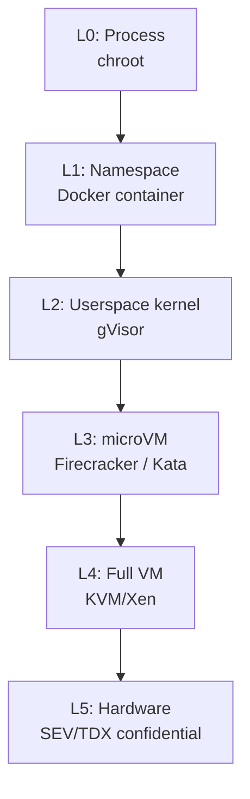

# Firecracker/microVM Sandboxes for Agent Code Execution

Linux 컨테이너의 공유 커널 대신 KVM 기반 microVM으로 에이전트 생성 코드를 격리 실행하는 방식.

## 왜 중요한가

2026년 들어 E2B가 자신의 샌드박스가 Firecracker microVM(≈125-150ms 부팅) 위에서 돈다고 공식화했고, Claude Code v2.1.98은 Linux에서 PID namespace 서브프로세스 sandboxing과 `CLAUDE_CODE_SUBPROCESS_ENV_SCRUB`를 추가하면서 "LLM 생성 코드 = 적대적 입력"이라는 하이퍼스케일러 컨센서스가 일반 개발자 환경까지 내려왔다.

## 대표 레퍼런스

- [E2B Documentation](https://e2b.dev/docs)
- [E2B Homepage](https://e2b.dev/)
- [e2b-dev/E2B (GitHub)](https://github.com/e2b-dev/E2B)
- [Claude Code Changelog](https://code.claude.com/docs/en/changelog)
- [Scaling Managed Agents: Decoupling the brain from the hands](https://www.anthropic.com/engineering/managed-agents)

## 해석 포인트

Firecracker/microVM Sandboxes for Agent Code Execution은 **모델 능력보다 개발자 경험과 운영 통합면이 중요한 도구 축** 으로 이해할 때 가장 명확하다. 이번 source 묶음이 `e2b.dev×2, github.com×1, code.claude.com×1, anthropic.com×1`처럼 분산돼 있다는 것은, 이 주제가 단일 주장보다 여러 층위의 검증을 거치고 있다는 뜻이다.

실무적으로는 개념 정의 자체보다 **어떤 병목을 해결하고 어떤 비용을 새로 만들까**를 묻는 편이 유익하다. 그래서 이 토픽은 통합 난이도, 관측 가능성, 운영 비용, 교체 가능성를 기준으로 비교·실험하는 식으로 다루는 것이 좋다.

## 2026년 4월 큐레이션 요약

- 정의: Linux 컨테이너의 공유 커널 대신 KVM 기반 microVM으로 에이전트 생성 코드를 격리 실행하는 방식.
- 왜 중요한가: 2026년 들어 E2B가 자신의 샌드박스가 Firecracker microVM(≈125-150ms 부팅) 위에서 돈다고 공식화했고, Claude Code v2.1.98은 Linux에서 PID namespace 서브프로세스 sandboxing과 `CLAUDE_CODE_SUBPROCESS_ENV_SCRUB`를 추가하면서 "LLM 생성 코드 = 적대적 입력"이라는 하이퍼스케일러 컨센서스가 일반 개발자 환경까지 내려왔다.
- 직접 수집 원문: 5개
- 주요 도메인: e2b.dev×2, github.com×1, code.claude.com×1, anthropic.com×1

## 핵심 메커니즘

Linux 컨테이너의 공유 커널 대신 KVM 기반 microVM으로 에이전트 생성 코드를 격리 실행하는 방식. 이 유형의 topic은 보통 하나의 제품보다 **반복 가능한 패턴 / 평가 기준 / 설계 trade-off**로 읽는 편이 유용하다. 이번 source 묶음에서도 `anthropic.com, code.claude.com, e2b.dev, github.com`가 함께 나오면서 개념, 구현, 평가가 연결되어 있다.

## 실무 관점

도구/프레임워크 페이지는 기능 목록보다 생태계 위치가 중요하다. 어떤 모델·런타임·개발 흐름과 잘 맞는지, 그리고 팀 워크플로우에 어떤 경계 조건을 추가하는지까지 같이 봐야 한다.

## 2026-05-06 보강 — 격리 레벨 매트릭스와 hosted sandbox 비교

### 왜 Container 는 Sandbox 가 아닌가

> "Unlike containers, which share the host system's kernel, each Firecracker
> microVM has its own kernel, providing true hardware-level isolation."

container 의 한계:

- shared kernel → kernel exploit 시 host 전체 노출
- namespace + cgroup 만으로는 untrusted code 격리 불충분
- AWS 의 Lambda 가 Firecracker 로 전환한 이유

### Firecracker 스펙

- Rust 로 작성된 KVM-based microVM hypervisor
- AWS 가 OSS 로 release (Apache 2.0)
- VM 1개당 KVM kernel + minimal device

**Boot Time**:

- 일반 VM: 수 초 ~ 수십 초
- Firecracker microVM cold boot: ~125ms
- e2b 의 pre-warmed snapshot pool 사용 시: **~150ms** restoration/provisioning

> "E2B uses pre-warmed microVM pools and VM snapshots to achieve roughly 150ms
> restoration/provisioning times by booting microVMs to a fully initialized
> state, taking a full snapshot, then restoring incoming requests from that
> snapshot."

→ snapshot 기반 multiplexing 이 hosted sandbox 의 사실상 표준 패턴.

### 격리 레벨 매트릭스



| Level | 격리 | 적용 |
|---|---|---|
| L0 | 약 | sandbox-exec, bubblewrap+landlock (untrusted user, trusted code) |
| L1 | 약중 | Docker (multi-tenant 부적합) |
| L2 | 중상 | gVisor (medium-trust workload) |
| L3 | 상 | Firecracker, Kata (untrusted code, hosted agent) |
| L4 | 최상 | full VM (legacy) |
| L5 | 최상 + memory | confidential VM (regulatory) |

### Hosted Sandbox 옵션 비교

#### e2b — Hosted Agent Sandbox

> "E2B is an open-source secure cloud environment (sandbox) made for running AI-
> generated code and agents."

- Firecracker microVM 위에 sandbox 실행
- 각 sandbox = 자체 kernel
- pre-warmed pool + snapshot multiplexing
- API: SDK (Python/JS/Go) + REST + MCP server

#### OpenHands Runtime

- Docker container runtime (default, 빠른 dev)
- e2b runtime (격리 강도 더 강함)
- Modal, Daytona 등 hosted alternative

OpenHands 는 **AGENT_RUNTIME** 환경변수로 runtime 교체:

```bash
export AGENT_RUNTIME=e2b
```

#### Daytona, Beam, Modal

- **Daytona**: 개발 환경 sandbox, GPU 지원
- **Beam**: Python-first sandbox, fast cold start
- **Modal**: serverless container + GPU
- **Cloudflare Workers**: edge runtime, V8 isolate (격리 약함, 비용 더 낮음)

### gVisor — Light alternative

- Google 이 OSS 로 release (Apache 2.0)
- **userspace kernel** (host syscall intercept)
- container-like 인터페이스 + 더 강한 격리
- overhead: ~10-20% 성능 페널티
- Firecracker 보다 light 하지만 일부 syscall (특히 networking) compatibility 문제

→ trust boundary 가 microVM 보다 약함, 그러나 container 보다 훨씬 강함.

### Kata Containers

- VM-isolated container runtime (OCI 호환)
- Firecracker 또는 QEMU backend
- container API + VM 격리
- Kubernetes 와 통합 용이 (RuntimeClass)

### Local vs Hosted 비교

| 측면 | Local (bwrap+landlock) | Hosted (e2b/Firecracker) |
|---|---|---|
| 격리 강도 | 중상 | 상 |
| Cold start | ms | ~150ms |
| Cost | 무료 (host 자원) | API 호출당 비용 |
| 운영 부담 | 직접 관리 | managed service |
| Multi-tenant | 부적합 | 적합 |
| 적합 use case | dev workstation, single-user | hosted agent platform |

### 격리 선택 매트릭스

| 시나리오 | 권장 격리 |
|---|---|
| 로컬 dev, trusted user 가 LLM 호출 | sandbox-exec / bwrap+landlock+seccomp |
| 단일 조직 internal agent | container + bwrap layer |
| Multi-tenant SaaS agent | Firecracker microVM (e2b 등) |
| Untrusted user code 실행 | Firecracker + network 차단 |
| Compliance-critical | Confidential VM (SEV/TDX) |

### 비용 모델 비교

| 서비스 | 단가 모델 | 특징 |
|---|---|---|
| e2b | per-second sandbox runtime | 250ms 단위 과금 |
| Modal | per-second container | GPU 옵션 |
| Daytona | per-second + storage | 개발 환경 |
| 자체 host (Firecracker) | EC2/bare metal cost | scale 시 가장 저렴 |

### Network Policy 패턴

격리 강도와 별개로 network 는 별도 정책:

- **default off**: agent 외부 통신 명시 승인 필요 (Codex 패턴)
- **whitelist domain**: 특정 도메인만 허용 (npm registry, pypi 등)
- **proxy 강제**: 모든 outgoing traffic 이 logging proxy 통과
- **VPC 격리**: hosted sandbox 가 자체 VPC 에서만 작동

## 관련 문서

- [[ai-hot-topics-2026-04|2026년 4월 AI 개발 핫토픽 100선]]
- [[git-worktree-isolation|Git Worktree Isolation for Parallel Coding Agents]]
- [[tool-contracts-for-agents|Tool Contracts & Writing Tools for Agents]]
- [[agent-sandbox-infrastructure]] — sandbox 인프라 일반
- [[e2b-ai-sandbox]] — e2b 디테일
- [[firecracker-microvm]] — Firecracker 자체
- [[claude-code-permission-modes]] — Claude Code 의 sandbox layer

