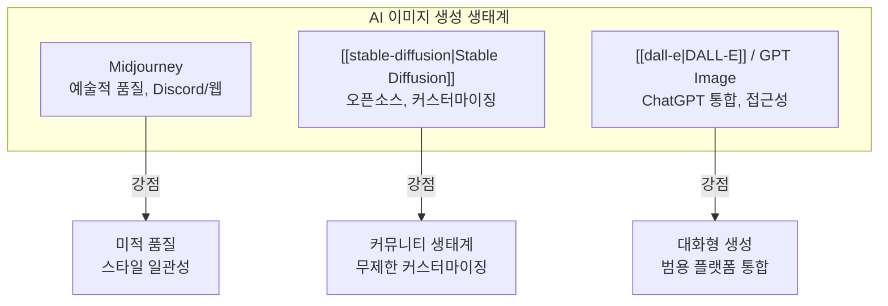

# Midjourney

## 개요

Midjourney는 David Holz(Leap Motion 공동 창업자)가 이끄는 샌프란시스코의 독립 연구소 Midjourney, Inc.가 개발한 [[ai-image-generation|AI 이미지 생성]] 서비스다. 2022년 7월 오픈 베타로 출시된 이후, V1에서 V7까지 빠른 버전 갱신을 거치며 예술적 품질과 프롬프트 충실도에서 업계를 선도해왔다.

Discord 봇 기반의 독특한 인터페이스(2024년 8월부터 웹 인터페이스 추가)와 구독 기반 비즈니스 모델을 채택하고 있으며, 2022년 8월 시점에 이미 수익성을 달성한 것으로 알려졌다. DALL-E, Stable Diffusion과 함께 생성형 AI 이미지 도구의 3대 축을 형성한다.

## 버전 진화

Midjourney는 약 6-12개월 주기로 메이저 버전을 업데이트하며, 각 버전마다 이미지 품질과 프롬프트 이해력이 크게 향상되었다.

| 버전 | 출시일 | 핵심 변화 |
|------|-------|----------|
| V1 | 2022.02 | 초기 알파. 추상적/회화적 결과물 |
| V2 | 2022.04 | 해상도와 일관성 개선 |
| V3 | 2022.07 | 오픈 베타 시작. 스타일 다양성 향상 |
| V4 | 2022.11 | Google TPU 학습으로 전환. 품질 도약 |
| V5 | 2023.03 | 사진 사실적 렌더링. 손/디테일 대폭 개선 |
| V6 | 2023.12 | 텍스트 렌더링 지원. 프롬프트 이해력 향상 |
| V6.1 | 2024.07 | 웹 인터페이스 출시와 동시 공개. 일관성 강화 |
| V7 | 2025.04 | 최신 버전. 구성적 이해, 스타일 정밀 제어 |

### V4: TPU 전환과 품질 도약

V4부터 Google TPU에서 학습하기 시작하면서 모델 규모와 학습 효율이 크게 향상되었다. 이전 버전 대비 사실적인 렌더링 품질이 눈에 띄게 개선되었으며, 이 시점부터 DALL-E 2와의 품질 경쟁에서 우위를 점하기 시작했다.

### V5: 포토리얼리즘의 시대

V5는 Midjourney를 "AI 아트 도구"에서 "포토리얼 이미지 생성기"로 전환시킨 분기점이다. 손가락, 치아, 눈 등 이전 버전에서 문제가 많았던 인체 디테일이 크게 개선되었으며, --stylize 파라미터로 예술적 해석 강도를 세밀하게 조절할 수 있게 되었다.

### V6-V7: 텍스트와 구성적 이해

V6부터 이미지 내 텍스트 렌더링을 지원하기 시작했으며, V7에서는 복잡한 구성적 프롬프트("A 위에 B가 있고, C 옆에 D가 있는 장면")에 대한 이해력이 대폭 향상되었다.

## 인터페이스와 사용 방식

### Discord 기반 인터페이스

Midjourney의 가장 독특한 특징은 Discord 봇을 통한 인터페이스다. 사용자는 Discord 서버의 채널에서 `/imagine` 명령으로 프롬프트를 입력하고, 봇이 이미지를 생성하여 같은 채널에 반환한다.

```
/imagine prompt: a cyberpunk city at sunset, volumetric lighting, 8k --ar 16:9 --v 7
```

**주요 파라미터**:
- `--ar`: 종횡비 지정 (16:9, 4:3, 1:1 등)
- `--v`: 모델 버전 선택
- `--stylize`: 예술적 해석 강도 (0-1000)
- `--chaos`: 생성 다양성 (0-100)
- `--no`: 네거티브 프롬프트 (제외할 요소)

### 웹 인터페이스 (2024.08-)

V6.1과 함께 공식 웹 인터페이스가 출시되어, Discord 없이도 브라우저에서 직접 이미지를 생성하고 관리할 수 있게 되었다. 이미지 라이브러리, 프롬프트 히스토리, 팔레트 도구 등 Discord에서 불가능했던 기능들을 제공한다.

## 핵심 기능

### 이미지 제어

- **Vary (Region)**: 생성된 이미지의 특정 영역만 선택적으로 재생성
- **Image Weight (--iw)**: 참조 이미지의 영향력을 수치로 제어
- **Style Reference (--sref)**: 특정 이미지의 예술적 스타일을 새 생성에 적용
- **Character Reference (--cref)**: 캐릭터의 일관된 외형을 여러 이미지에 걸쳐 유지

### 프롬프트 해석

Midjourney는 단순 키워드 매칭이 아닌 문맥적 프롬프트 해석을 수행한다. "melancholic"이나 "ethereal" 같은 추상적 감정 표현도 시각적 분위기로 변환하며, V6 이후 AI 기반 콘텐츠 모더레이션을 적용한다.

## 비즈니스 모델

구독 기반 서비스로, DALL-E(API 종량제)나 Stable Diffusion(오픈소스)과 차별화된 모델이다:

| 플랜 | 가격 (월) | GPU 시간 | 특징 |
|------|---------|---------|------|
| Basic | $10 | ~3.3시간 | 제한적 사용 |
| Standard | $30 | ~15시간 | 무제한 Relax 모드 |
| Pro | $60 | ~30시간 | Stealth 모드 (비공개 생성) |
| Mega | $120 | ~60시간 | 대량 사용자/팀 |

## 경쟁 포지셔닝



Midjourney는 미적 품질과 스타일 제어에서, Stable Diffusion은 오픈소스 커스터마이징에서, DALL-E/GPT Image는 접근성과 플랫폼 통합에서 각각 강점을 보인다.

- **vs Stable Diffusion**: 폐쇄형이지만 일관된 미적 품질. ControlNet/LoRA 같은 세밀한 제어는 불가
- **vs DALL-E 3**: 예술적 스타일에서 우위. DALL-E 3는 ChatGPT 통합으로 접근성에서 우위
- **vs Flux.1**: [[diffusion-transformer|DiT]] 기반 오픈소스 모델이 프롬프트 충실도에서 Midjourney를 위협

## 논쟁과 한계

- **아키텍처 비공개**: 모델 구조, 학습 데이터, 파라미터가 공개되지 않아 기술적 검증이 불가능하다
- **저작권 소송**: 아티스트들이 학습 데이터에 자신의 작품이 무단 사용되었다고 소송을 제기했다
- **가짜 이미지 논란**: 교황 패딩 이미지, 트럼프 체포 이미지 등 AI 생성 가짜 사진이 소셜 미디어에서 바이럴되면서 딥페이크/오정보 우려가 부각되었다
- **Discord 의존성**: V6.1까지 Discord를 필수로 사용해야 했으며, 이는 비기술 사용자에게 진입 장벽이었다

## 참고 자료

- [Midjourney - Wikipedia](https://en.wikipedia.org/wiki/Midjourney)
- [Midjourney Official](https://www.midjourney.com/)

## 관련 문서

- [[stable-diffusion]] -- 오픈소스 경쟁 모델
- [[dall-e]] -- OpenAI의 경쟁 서비스
- [[diffusion-transformer]] -- Flux.1 등 최신 오픈소스 생성 모델의 기반
- [[clip]] -- 이미지-텍스트 정렬의 기초 기술
