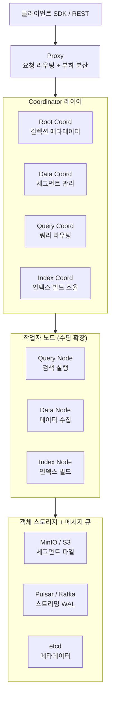

# Milvus

Zilliz가 주도하고 LF AI & Data Foundation이 졸업 프로젝트로 품은 오픈소스 분산 벡터 데이터베이스. 대규모 비정형 데이터의 유사도 검색을 클라우드 네이티브 방식으로 처리하도록 설계되어, 수십억 개 벡터에서도 밀리초 단위 근사 최근접 이웃(ANN) 검색을 제공한다.

## 개요

| 항목 | 내용 |
|---|---|
| 이름 | Milvus |
| 개발사 | Zilliz (주도) + LF AI & Data Foundation |
| 라이선스 | Apache 2.0 |
| 저장소 | github.com/milvus-io/milvus |
| 코어 언어 | Go + C++ |
| 클라이언트 | Python, Java, Go, Node.js, REST API |
| 관리형 서비스 | Zilliz Cloud |
| 주요 인덱스 | HNSW, IVF_FLAT, IVF_PQ, DISKANN |

## 아키텍처

Milvus는 저장과 연산을 분리(Storage-Compute Separation)하는 클라우드 네이티브 설계를 채택한다. 각 컴포넌트가 독립적으로 수평 확장된다.



### 스토리지-연산 분리의 이점

- **독립적 확장**: Query Node(검색 처리량)와 Data Node(수집 처리량)를 별도로 스케일 아웃
- **상태 비저장 작업자**: 작업자 노드가 장애를 겪어도 객체 스토리지에서 세그먼트를 재로드
- **클라우드 비용 최적화**: 검색 부하가 없을 때 Query Node를 축소, 스토리지는 유지

## 데이터 모델

Milvus는 컬렉션(Collection) 단위로 데이터를 관리한다. 각 엔티티(Entity)는 하나 이상의 벡터 필드와 스칼라 필드를 가질 수 있다.

```python
from pymilvus import MilvusClient, DataType

client = MilvusClient(uri="http://localhost:19530")

# 스키마 정의
schema = MilvusClient.create_schema(auto_id=False, enable_dynamic_field=True)
schema.add_field("id", DataType.INT64, is_primary=True)
schema.add_field("embedding", DataType.FLOAT_VECTOR, dim=1536)
schema.add_field("text", DataType.VARCHAR, max_length=512)

# 컬렉션 생성
client.create_collection(collection_name="docs", schema=schema)

# HNSW 인덱스 생성
index_params = client.prepare_index_params()
index_params.add_index(
    field_name="embedding",
    index_type="HNSW",
    metric_type="COSINE",
    params={"M": 16, "efConstruction": 200},
)
client.create_index("docs", index_params)
```

## 검색 유형

| 검색 유형 | 설명 | 사용 상황 |
|---|---|---|
| ANN 벡터 검색 | 근사 최근접 이웃 검색 | 기본 유사도 검색 |
| 필터링 검색 | 스칼라 조건 + 벡터 검색 병합 | 카테고리 제한 검색 |
| 하이브리드 검색 | 다중 벡터 필드 결합 + RRF 재순위화 | 멀티모달 RAG |
| 전문 검색 | BM25 역인덱스 | 키워드 매칭 |
| 범위 검색 | 거리 임계값 내 결과 반환 | 유사도 임계값 필터링 |

```python
# 필터링 검색 예시
results = client.search(
    collection_name="docs",
    data=[query_embedding],
    filter='category == "ML" and year >= 2025',
    limit=10,
    output_fields=["text", "category"],
)
```

## Milvus vs 경쟁 벡터 데이터베이스

| 항목 | Milvus | [[faiss|FAISS]] | [[weaviate|Weaviate]] | Qdrant |
|---|---|---|---|---|
| 배포 | 분산 클러스터 | 라이브러리 | 단일/클러스터 | 단일/클러스터 |
| 수평 확장 | 네이티브 지원 | 없음 | 제한적 | 지원 |
| 멀티 벡터 필드 | 지원 | 없음 | 지원 | 지원 |
| 인덱스 선택지 | 매우 다양 | 다양 | HNSW | HNSW + 기타 |
| 관리형 클라우드 | Zilliz Cloud | 없음 | WCS | Qdrant Cloud |
| 학습 곡선 | 중간 | 낮음 | 낮음 | 낮음 |

## 실무 관점

Milvus는 **수십억 개 벡터 규모의 프로덕션 RAG 시스템**이 목표일 때 유력한 선택지다. 스토리지-연산 분리 덕분에 검색 부하 급증 시 Query Node만 확장하면 되고, 수집 파이프라인은 독립적으로 운영할 수 있다. 다만 컴포넌트 수가 많아 운영 복잡도가 높으므로, 소규모 프로젝트에서는 [[weaviate|Weaviate]]나 ChromaDB처럼 단순한 도구가 적합하다. Zilliz Cloud를 사용하면 운영 부담 없이 Milvus 호환 API를 쓸 수 있다.

## 관련 문서

- [[faiss|FAISS]] - Meta의 고성능 벡터 검색 라이브러리
- [[weaviate|Weaviate]] - 객체-벡터 통합 그래프형 벡터 데이터베이스
- [[rag-pipeline|RAG 파이프라인]] - Milvus가 검색 백엔드로 활용되는 맥락
- [[chroma-db|ChromaDB]] - 소규모 RAG 프로토타이핑용 벡터 데이터베이스
