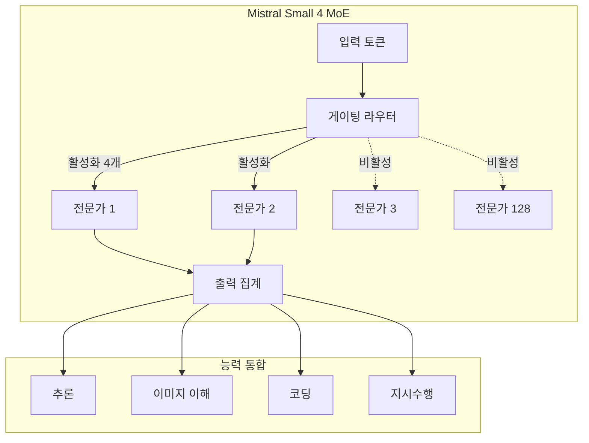

## 개요

Mistral Small 4는 Mistral AI가 출시한 효율적인 Mixture-of-Experts(MoE) 모델이다. 총 119B 파라미터에서 토큰당 약 6B(임베딩/출력 레이어 포함 시 8B)만 활성화하는 구조로, 지시수행, 추론, 이미지 이해, 코딩을 하나의 모델에 통합했다. Apache 2.0 라이선스로 완전 개방되어 있으며, 256K 컨텍스트 윈도우를 지원한다.

## 핵심 특징

- **MoE 아키텍처**: 128개 전문가, 토큰당 4개 활성화 -- 총 119B 중 6B만 사용하여 추론 비용 절감
- **통합 능력**: 추론, 멀티모달 비전, 에이전틱 코딩을 단일 모델에서 수행
- **조절 가능한 추론 깊이**: `reasoning_effort` 설정으로 성능/속도 트레이드오프 조정 가능
- **256K 컨텍스트 윈도우**: 장문 문서 처리 지원
- **Apache 2.0 라이선스**: 완전 개방형, 상업적 사용 자유

## 기술 상세

### 아키텍처

### 성능 지표

| 지표 | 값 |
|---|---|
| Artificial Analysis Intelligence Index | 27 (58개 모델 중 6위) |
| 출력 속도 | 137.3 tokens/sec (중앙값 79.1 t/s) |
| 첫 토큰 지연시간 (TTFT) | 0.97초 |
| 총 파라미터 | 119B |
| 활성 파라미터 | ~6B (임베딩 포함 ~8B) |
| 컨텍스트 윈도우 | 256K 토큰 |
| 입력 | 텍스트 + 이미지 (멀티모달) |
| 모델 ID | mistral-small-2603 |

### 가격

| 항목 | 가격 |
|---|---|
| 입력 | $0.15/1M 토큰 |
| 출력 | $0.60/1M 토큰 |
| 혼합 (3:1 비율) | $0.26/1M 토큰 |

GPT-5.4 Mini 대비 입력 5배, 출력 7.5배 저렴하다.

### 추론 깊이 조절

`reasoning_effort` 파라미터를 통해 태스크 복잡도에 맞는 추론 수준을 선택할 수 있다:

- `reasoning_effort="none"`: 빠른 채팅 모드 (Small 3.2 수준 성능)
- `reasoning_effort="low"`: 간단한 분류/요약 태스크
- `reasoning_effort="medium"`: 일반적인 지시수행
- `reasoning_effort="high"`: 복잡한 수학/코딩 문제에 심층 추론 활성화

### Small 3 대비 개선점

- 총 파라미터 **5배 증가** (Small 3 대비), 활성 파라미터는 MoE로 효율적 유지
- 엔드투엔드 완료 시간 **40% 감소**
- 초당 요청 처리량 **3배 증가**
- GPT-OSS 120B를 LiveCodeBench에서 능가하면서 출력량은 **20% 적음**

### 자체 호스팅 요구사항

| 하드웨어 | 구성 |
|----------|------|
| NVIDIA H100 | 4장 |
| NVIDIA H200 | 2장 |
| DGX B200 | 1장 (최소) |

배포 플랫폼: Mistral AI Studio, Amazon Bedrock, Azure Foundry, Hugging Face 등

## 포지셔닝

Mistral Small 4는 대규모 프론티어 모델(GPT-5, Claude Opus 4.6 등)과 소형 경량 모델 사이의 "효율적 중간 지대"를 목표로 한다. 6B 활성 파라미터만으로 119B급 성능을 제공함으로써, 기업 환경에서 비용 대비 성능을 극대화하는 데 적합하다. LMArena 리더보드에서 **OSS 비추론 모델 카테고리 2위**를 기록했다.

### 주요 제한사항

- 벤치마크 절대 점수는 GPT-5.4, Claude Opus 4.6 아래
- 컴퓨터 사용(computer use) 기능 미지원
- 비전 입력은 이미지만 지원 (비디오 미지원)

## Mistral 모델 라인업 내 위치

Mistral AI의 2026년 모델 라인업에서 Small 4는 중간 효율 계층에 위치한다:

| 모델 | 총 파라미터 | 활성 파라미터 | 특징 |
|------|-----------|-------------|------|
| Mistral Large 3 | 675B | 41B | 플래그십, MoE, 40+ 언어 |
| **Mistral Small 4** | **119B** | **~6B** | **효율적 MoE, 추론 조절** |
| Ministral 14B | 14B | 14B | 엣지 최적화, 추론 변형 포함 |
| Ministral 8B | 8B | 8B | 엣지 최적화 |
| Ministral 3B | 3B | 3B | 초경량 엣지 모델 |

Ministral 14B 추론 변형은 AIME '25에서 85%를 달성하며, Small 4와는 다른 특화 영역을 보인다.

## 경쟁 모델 비교

| 모델 | 활성 파라미터 | 라이선스 | 입력 가격 (/1M) | 비고 |
|------|-------------|---------|----------------|------|
| Mistral Small 4 | ~6B | Apache 2.0 | $0.15 | MoE, 추론 조절 |
| [[gemma-4]] | 27B | 개방형 | 무료(셀프호스팅) | 단일 모델 |
| [[deepseek-v3-2]] | ~37B | MIT | $0.27 | MoE, 높은 추론 성능 |
| GPT-5.4 Mini | 비공개 | 상용 | $0.75 | 범용 |

## 관련 문서

- [[voxtral-tts]] - Mistral의 음성합성 모델
- [[leanstral]] - Mistral의 형식 검증 AI
- [[gemma-4]] - Google의 경쟁 오픈소스 모델
- [[deepseek-v3-2]] - DeepSeek의 경쟁 오픈소스 모델
