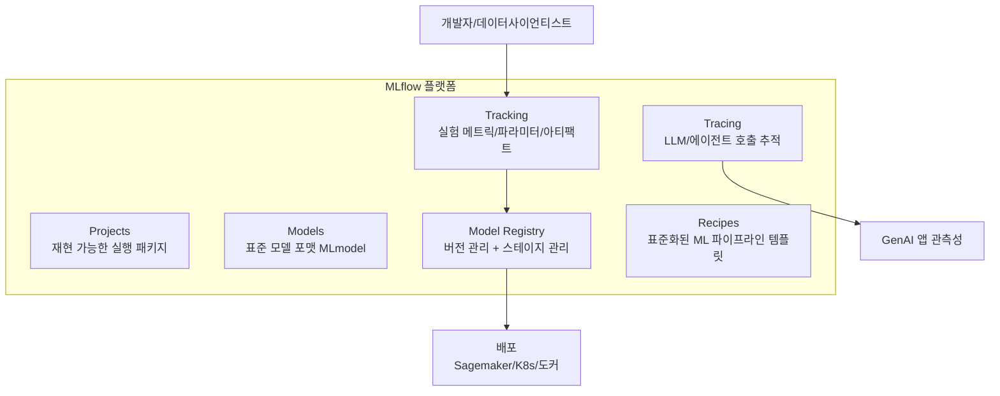

# MLflow

Databricks가 주도하는 오픈소스 ML 수명주기 관리 플랫폼. 실험 추적, 패키지화, 배포, 모델 레지스트리를 단일 오픈 인터페이스로 제공한다. 2018년 오픈소스로 공개된 이래 가장 널리 사용되는 오픈소스 MLOps 도구가 되었으며, LLM/GenAI 시대에 맞춰 트레이싱, 프롬프트 엔지니어링, 에이전트 평가 기능이 적극 추가되고 있다.

## 개요

| 항목 | 내용 |
|---|---|
| 이름 | MLflow |
| 개발사 | Databricks (주도) + 오픈소스 커뮤니티 |
| 라이선스 | Apache 2.0 |
| 저장소 | github.com/mlflow/mlflow |
| 코어 언어 | Python (서버), Java/R/JS 클라이언트 |
| 관리형 서비스 | Databricks Managed MLflow |
| 주요 백엔드 | 로컬 파일시스템, S3/GCS/ADLS, PostgreSQL/MySQL |

## 핵심 구성요소



## Tracking: 실험 추적

MLflow Tracking은 실험(Experiment) 단위로 Run을 관리한다. 파라미터, 메트릭, 아티팩트를 자동/수동으로 기록하고 UI에서 비교한다.

```python
import mlflow
import mlflow.sklearn
from sklearn.ensemble import RandomForestClassifier
from sklearn.metrics import accuracy_score

mlflow.set_experiment("my-classification")

with mlflow.start_run(run_name="rf-baseline"):
    # 파라미터 기록
    mlflow.log_param("n_estimators", 100)
    mlflow.log_param("max_depth", 5)

    # 모델 학습
    clf = RandomForestClassifier(n_estimators=100, max_depth=5)
    clf.fit(X_train, y_train)

    # 메트릭 기록
    acc = accuracy_score(y_test, clf.predict(X_test))
    mlflow.log_metric("accuracy", acc)

    # 모델 저장 (MLmodel 포맷)
    mlflow.sklearn.log_model(clf, "model")
```

### 자동 로깅 (autolog)

```python
mlflow.sklearn.autolog()   # sklearn 메트릭/파라미터 자동 캡처
mlflow.pytorch.autolog()   # PyTorch 학습 루프 자동 추적
mlflow.transformers.autolog()  # HuggingFace 자동 추적
```

## Model Registry

학습된 모델을 버전 관리하고 배포 스테이지를 관리하는 모델 카탈로그다.

```python
# 모델을 레지스트리에 등록
mlflow.register_model(
    model_uri="runs:/abc123/model",
    name="fraud-detector",
)

# 스테이지 전환 (Staging -> Production)
client = mlflow.tracking.MlflowClient()
client.transition_model_version_stage(
    name="fraud-detector",
    version=3,
    stage="Production",
)
```

| 스테이지 | 의미 |
|---|---|
| None | 새로 등록된 모델 버전 |
| Staging | QA/검증 중 |
| Production | 프로덕션 서빙 중 |
| Archived | 퇴역 |

## GenAI 추적 (MLflow Tracing)

MLflow 2.14+에서 추가된 GenAI 관측성 기능. LLM 호출, 체인, 에이전트 루프의 전체 트레이스를 캡처한다.

```python
import mlflow
from openai import OpenAI

mlflow.openai.autolog()   # OpenAI 호출 자동 추적

client = OpenAI()
# 이후 모든 API 호출이 MLflow에 자동 기록됨
response = client.chat.completions.create(
    model="gpt-4o",
    messages=[{"role": "user", "content": "RAG 개념 설명"}],
)
```

LangChain, LlamaIndex, Anthropic SDK와도 네이티브 통합된다.

## MLflow vs W&B 비교

| 항목 | MLflow | [[wandb|Weights & Biases]] |
|---|---|---|
| 라이선스 | 오픈소스 (Apache 2.0) | 상용 (무료 티어 있음) |
| 호스팅 | 자체 호스팅 + Databricks | SaaS 우선 (온프레미스 옵션) |
| 모델 레지스트리 | 내장 | 유료 플랜 |
| UI/UX | 기능적 | 더 세련된 시각화 |
| 데이터 프라이버시 | 완전 제어 | SaaS 전송 |
| GenAI 추적 | Tracing (네이티브) | Weave |
| 에코시스템 | Databricks, Spark | CoreWeave 수직 통합 |

[[experiment-tracking]] 문서에서 전체 도구 비교를 확인할 수 있다.

## 배포 옵션

```bash
# 로컬 MLflow 서버 시작
mlflow server \
    --backend-store-uri postgresql://user:pass@db/mlflow \
    --default-artifact-root s3://my-bucket/mlflow \
    --host 0.0.0.0 --port 5000
```

모델 서빙:
```bash
mlflow models serve -m "models:/fraud-detector/Production" -p 1234
```

## 실무 관점

MLflow는 **오픈소스 MLOps 파이프라인의 표준 허브** 역할을 한다. Databricks를 사용하는 팀에는 가장 자연스러운 선택이다. SaaS 도구(W&B)에 비해 UI가 단순하지만, 데이터 주권이 중요한 온프레미스 환경에서 강점을 갖는다. 2024년 이후 LLM/GenAI 추적 기능이 빠르게 추가되고 있어, 전통 ML과 GenAI 워크로드를 단일 추적 시스템으로 통합하려는 팀에게 유력한 선택지다.

## 관련 문서
- [[dvc]] -- DVC (Data Version Control)

- [[wandb|Weights & Biases (W&B)]] - 강력한 UI와 CoreWeave 통합을 갖춘 실험 추적 플랫폼
- [[experiment-tracking|실험 추적]] - MLflow를 포함한 실험 추적 도구 전반 비교
- [[rag-pipeline|RAG 파이프라인]] - MLflow Tracing으로 관측하는 GenAI 파이프라인
