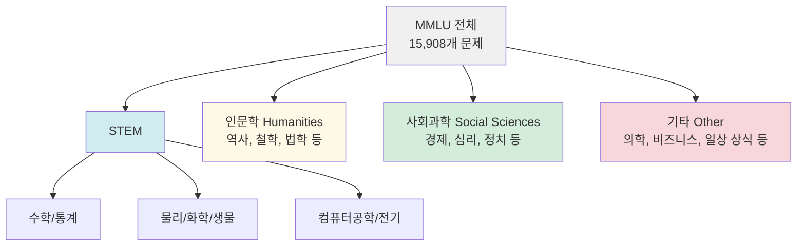

# MMLU 벤치마크 상세

MMLU(Massive Multitask Language Understanding)는 대규모 언어 모델의 지식 폭과 추론 능력을 측정하는 가장 광범위하게 사용되는 벤치마크 중 하나다. Hendrycks et al. (2020, UC Berkeley)이 제안했으며, 대학원 수준부터 초등 수준까지 57개 과목에 걸친 객관식 문제로 구성된다.

## 벤치마크 구조



총 57개 과목을 4개 대분류로 구성하며, 과목당 100-1,004개 문제를 포함한다. 전체 15,908개 문제 중 테스트셋은 14,042개다.

## 과목 목록 (주요 57개)

| 대분류 | 대표 과목 |
|--------|----------|
| STEM | Abstract Algebra, Anatomy, Astronomy, College Chemistry, College Mathematics, Computer Security, Electrical Engineering, High School Physics, Machine Learning |
| 인문학 | Formal Logic, High School European History, International Law, Jurisprudence, Philosophy, Prehistory, World Religions |
| 사회과학 | Econometrics, High School Geography, High School Government and Politics, Macroeconomics, Management, Marketing, Medical Genetics |
| 기타 | Clinical Knowledge, Global Facts, High School Biology, Medical Genetics, Nutrition, Professional Medicine, Virology |

## 평가 방식: 5-Shot

MMLU의 표준 평가 방식은 **5-shot in-context learning**이다. 각 문제 앞에 같은 과목에서 추출한 5개의 예제(질문+정답)를 프롬프트로 제공한다.

```
예제 형식:

[5개 예시 질문과 답]

Q: Which of the following best describes the function of mitochondria?
(A) Protein synthesis
(B) ATP production
(C) DNA replication
(D) Cell division

Answer:
```

모델은 (A)~(D) 중 하나의 토큰 확률로 평가되며, 로그 확률이 가장 높은 선택지를 정답으로 채택한다.

- **0-shot**: 예시 없이 직접 질문. 모델의 순수 지식 평가.
- **5-shot**: 표준 설정. 문맥 학습 능력도 포함.
- **Chain-of-Thought**: 추론 과정을 포함한 고급 평가.

## 주요 모델 성능 추이

GPT-3 논문(2020) 당시 인간 전문가 수준은 약 89.8%였다. 초기 GPT-3는 43.9%에 불과했으나, 이후 모델들이 급격히 향상되었다.

| 시기 | 모델 | 평균 정확도 |
|------|------|------------|
| 2020 | GPT-3 (175B) | 43.9% |
| 2022 | PaLM (540B) | 69.3% |
| 2023 | GPT-4 | 86.4% |
| 2024 | Claude 3 Opus | 86.8% |
| 2024 | Gemini Ultra | 90.0% |

2024년 이후 상위 모델들이 인간 전문가 수준을 초과하기 시작했다.

## MMLU의 의의와 한계

### 의의

- **폭넓은 커버리지**: 단일 벤치마크로 57개 분야를 측정해 모델의 지식 편향을 파악 가능
- **표준화**: 전세계 연구자들이 동일 기준으로 비교 가능
- **[[evaluation-harness|lm-evaluation-harness]]** 등 오픈소스 평가 도구와 통합돼 재현성이 높음

### 한계

- **암기 vs 추론 구분 어려움**: 사전학습 데이터에 MMLU 문제가 포함됐을 가능성(데이터 오염, data contamination)이 지속적으로 제기됨
- **선택지 기반의 한계**: 실제 지식 활용이 아닌 선택지 제거 전략으로 정답 가능
- **단일 정답 가정**: 모호하거나 맥락에 따라 달라지는 문제도 단일 정답으로 처리
- **고정된 난이도**: 모델이 발전함에 따라 포화(saturation) 문제 — 상위 모델들이 90%+ 달성 후 변별력 감소

## MMLU-Pro와 후속 버전

포화 문제를 해결하기 위해 2024년 **MMLU-Pro**가 제안됐다. 선택지를 4개에서 10개로 늘리고, 더 어려운 전문가 수준 문제를 추가해 변별력을 높였다. 또한 각 문제에 CoT(Chain-of-Thought) 추론을 권장한다.

## 관련 문서

- [[mmlu]] - MMLU 개념 상위 노드
- [[evaluation-harness]] - MMLU를 포함한 다양한 벤치마크를 실행하는 평가 프레임워크
- [[humaneval-mbpp]] - 코드 생성 능력을 평가하는 보완적 벤치마크
- [[math-benchmark]] - 수학적 추론에 특화된 심화 벤치마크
