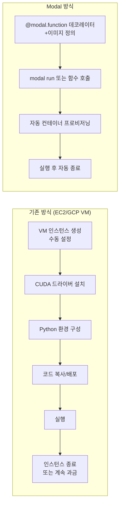
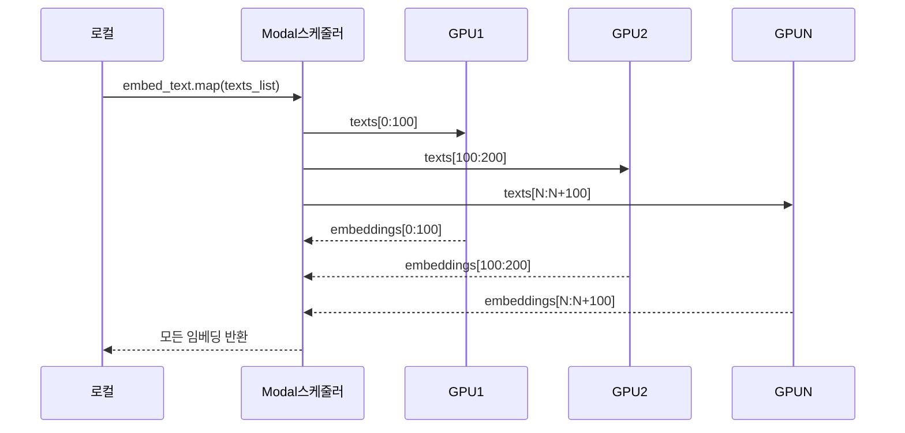
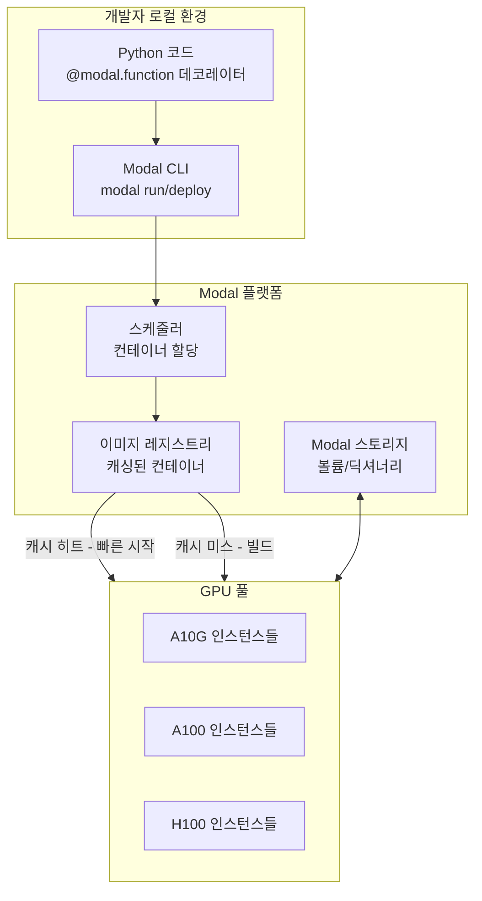
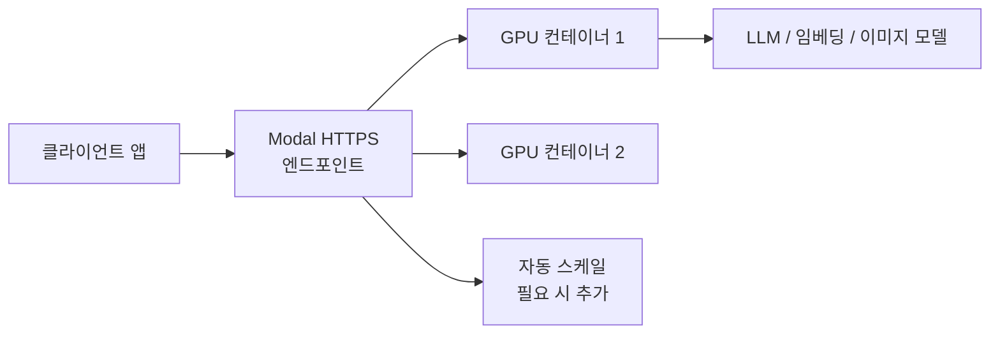

# Modal.com - 서버리스 ML 런타임

## 정체성

Modal은 Python 함수를 클라우드 GPU에서 실행하는 서버리스(serverless) ML 런타임이다. 인프라 설정 없이 `@modal.function` 데코레이터 하나로 함수를 GPU 클라우드에 배포하고, 호출하는 만큼만 비용을 낸다. ML 추론, 파인튜닝, 배치 처리, 웹 엔드포인트 호스팅을 Python 코드 수준에서 다룬다.

| 속성 | 값 |
|------|-----|
| 회사 | Modal Labs |
| 설립 | 2021년 |
| 라이선스 | 상용 (프리 티어 있음) |
| 과금 | GPU 사용 초(second) 단위 |
| 콜드 스타트 | 일반적으로 1-5초 (컨테이너 캐싱) |
| 지원 GPU | A10G, A100, H100, T4 등 |
| 공식 문서 | modal.com/docs |

---

## 핵심 개념: 함수가 곧 인프라

기존 클라우드 GPU 사용 패턴과의 비교:



Modal에서는 인프라 관리가 코드 안으로 들어온다. 필요한 Python 패키지, GPU 타입, 메모리, 타임아웃을 데코레이터 파라미터로 선언한다.

---

## 핵심 기능

### 기본 사용 패턴

```python
import modal

# Modal 앱 정의
app = modal.App("my-ml-app")

# GPU 함수 정의
@app.function(gpu="A10G", timeout=600)
def run_inference(prompt: str) -> str:
    import torch
    from transformers import pipeline

    pipe = pipeline("text-generation", model="gpt2", device=0)
    result = pipe(prompt, max_new_tokens=100)
    return result[0]["generated_text"]

# 로컬에서 원격 GPU 함수 호출
@app.local_entrypoint()
def main():
    result = run_inference.remote("안녕하세요, AI가 답합니다:")
    print(result)
```

```bash
modal run my_script.py
```

### 이미지(컨테이너) 정의

```python
# 커스텀 컨테이너 이미지 정의
image = (
    modal.Image.debian_slim(python_version="3.11")
    .pip_install([
        "torch==2.1.0",
        "transformers>=4.35.0",
        "accelerate",
        "bitsandbytes",
    ])
    .run_commands(
        "apt-get update && apt-get install -y git"
    )
)

@app.function(
    image=image,
    gpu="A100",
    memory=32768,  # 32GB RAM
)
def fine_tune_model():
    ...
```

### 병렬 맵(Parallel Map)

Modal의 `.map()` 메서드로 배치 작업을 병렬 GPU 인스턴스에 자동 분산한다.

```python
@app.function(gpu="T4")
def embed_text(text: str) -> list[float]:
    from sentence_transformers import SentenceTransformer
    model = SentenceTransformer("all-MiniLM-L6-v2")
    return model.encode(text).tolist()

@app.local_entrypoint()
def main():
    texts = ["문서 1", "문서 2", "문서 3", ...]  # 수천 개

    # 병렬 처리: 각 텍스트를 별도 GPU 컨테이너에서 처리
    embeddings = list(embed_text.map(texts))
```



### 웹 엔드포인트

```python
from fastapi import FastAPI

web_app = FastAPI()

@web_app.get("/generate")
async def generate(prompt: str):
    return {"result": run_inference.remote(prompt)}

@app.function(gpu="A10G")
@modal.asgi_app()
def fastapi_app():
    return web_app
```

`modal deploy`로 배포하면 HTTPS 엔드포인트가 자동 생성된다.

---

## 아키텍처



### 컨테이너 캐싱과 콜드 스타트

Modal의 콜드 스타트가 1-5초로 빠른 이유는 컨테이너 이미지를 레지스트리에 캐싱하기 때문이다. 이미지가 이미 빌드된 경우 새 컨테이너를 수 초 안에 띄울 수 있다.

---

## Modal Volumes (스토리지)

GPU 컨테이너는 일시적(ephemeral)이므로 모델 가중치 같은 대용량 파일을 매번 다운로드하면 느리다. Modal Volumes로 영속적인 파일 스토리지를 마운트한다.

```python
# 볼륨 생성
volume = modal.Volume.from_name("model-weights", create_if_missing=True)

@app.function(
    gpu="A100",
    volumes={"/models": volume}
)
def download_and_serve(model_name: str):
    import os
    model_path = f"/models/{model_name}"

    if not os.path.exists(model_path):
        # 최초 1회만 다운로드
        from huggingface_hub import snapshot_download
        snapshot_download(model_name, local_dir=model_path)

    # 이후 호출은 볼륨에서 즉시 로드
    ...
```

---

## 주요 사용 사례

### ML 추론 API 구축



트래픽에 따라 자동 스케일링되며, 트래픽이 없으면 0으로 내려가 비용이 발생하지 않는다.

### 파인튜닝 작업

```python
@app.function(
    gpu="A100-80GB",  # 대형 GPU 선택
    timeout=7200,     # 2시간
    volumes={"/data": data_volume, "/output": output_volume}
)
def finetune_model(config: dict):
    import subprocess
    subprocess.run([
        "python", "-m", "axolotl.cli.train",
        "/data/config.yaml",
        "--output-dir", "/output/checkpoint"
    ])
```

### 배치 임베딩 생성

RAG 시스템 구축 시 수십만 개의 문서를 임베딩해야 할 때 Modal의 병렬 맵이 효과적이다.

```python
@app.function(gpu="T4", concurrency_limit=50)
def embed_chunk(chunk: str) -> list[float]:
    ...

# 50개 GPU가 동시에 처리
embeddings = list(embed_chunk.map(all_chunks))
```

---

## 비용 구조

Modal은 사용한 GPU 초(second)에 대해서만 과금한다.

| GPU | 가격 (참고) | 적합한 용도 |
|-----|------------|------------|
| T4 | ~$0.000164/초 | 가벼운 추론, 임베딩 |
| A10G | ~$0.000306/초 | 7B-13B 모델 추론 |
| A100-40GB | ~$0.001100/초 | 대형 모델, 파인튜닝 |
| A100-80GB | ~$0.001600/초 | 70B 모델, QLoRA |
| H100 | ~$0.003100/초 | 최고 성능 필요 시 |

> **주의**: 가격은 변동될 수 있다. 공식 사이트(modal.com/pricing)에서 확인한다.

무료 티어: 월 $30 크레딧 (개인 실험용으로 충분).

---

## 경쟁 도구 비교

| 도구 | 방식 | 설정 복잡도 | 콜드 스타트 | 특징 |
|------|------|------------|------------|------|
| **Modal** | 서버리스, Python 데코레이터 | 낮음 | 1-5초 | 코드 중심 인프라 |
| Baseten | 서버리스, 모델 배포 | 중간 | 수십초 | 모델 최적화 특화 |
| Replicate | SaaS 모델 마켓플레이스 | 낮음 | 수십초 | 공개 모델 즉시 사용 |
| RunPod | VM 임대 | 높음 | 수분 | 최저 GPU 가격 |
| AWS SageMaker | 완전 관리형 ML | 높음 | 수분-수십분 | 엔터프라이즈 |
| Lambda Labs | VM 임대 | 높음 | 수분 | GPU 저가 |

### Modal vs RunPod

RunPod는 GPU 시간당 비용이 Modal보다 저렴할 수 있지만, 인프라 설정(SSH, Docker, 환경 관리)이 개발자 책임이다. Modal은 단가가 높지만 인프라 오버헤드가 없다. 소규모 팀이나 빠른 프로토타이핑에는 Modal, 비용 최적화가 중요한 프로덕션 장기 워크로드에는 RunPod/Lambda 조합이 유리하다.

---

## 한계 / 트레이드오프

### 비용

대규모 지속적 추론 서빙에는 전용 GPU 인스턴스보다 비쌀 수 있다. 트래픽이 예측 가능하고 일정하다면 EC2 Reserved Instance나 RunPod이 경제적이다.

### 벤더 종속

Modal 특유의 `@modal.function` 패턴에 코드가 의존하게 된다. 다른 플랫폼으로 이전 시 리팩토링이 필요하다.

### 커스텀 인프라 제한

네트워크 설정, 특수 하드웨어, 사내망 연결 등 고급 인프라 커스터마이징이 어렵다. 엔터프라이즈 보안 요구사항을 충족하기 어려울 수 있다.

### 학습(Training) 한계

장시간(수일) 학습 작업에는 타임아웃, 체크포인트 관리, 재시작 로직을 별도로 구현해야 한다. 전용 ML 학습 플랫폼(AWS SageMaker, Google Vertex AI)이 더 적합하다.

---

## 왜 중요한가

Modal은 MLOps(ML Operations) 복잡도를 극적으로 낮춰 다음을 가능하게 한다:

1. **ML 연구자의 직접 배포**: DevOps 엔지니어 없이 연구자가 직접 GPU API를 만들 수 있다.
2. **빠른 프로토타이핑**: 로컬 개발과 클라우드 GPU 실행 사이의 간극을 없앤다.
3. **비용 최적화**: 사용하지 않는 시간에 GPU 비용이 발생하지 않는다.
4. **스케일 자동화**: 수동 스케일링 없이 트래픽에 따라 자동으로 확장/축소된다.

---

## 관련 문서

- [[serverless-gpu]] - 서버리스 GPU 컴퓨팅 개념
- [[modal-volumes-storage]] - Modal Volumes 심화 사용법
- [[baseten-deployment]] - 유사 ML 서빙 플랫폼
- [[vllm]] - Modal 위에서 vLLM을 실행하는 패턴이 일반적
- [[xinference-multi-model]] - 자체 호스팅 멀티 모델 서버 대안
- [[dolphinflow-fine-tuning]] - Modal에서 파인튜닝 실행 가능
