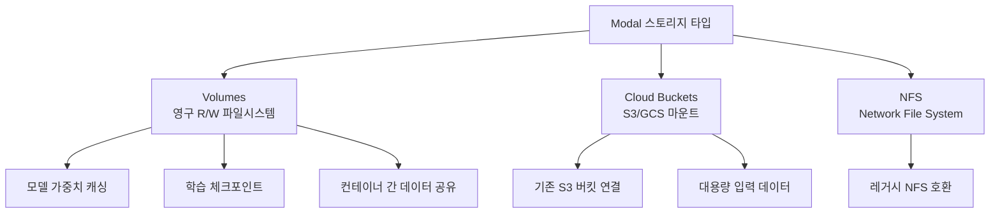
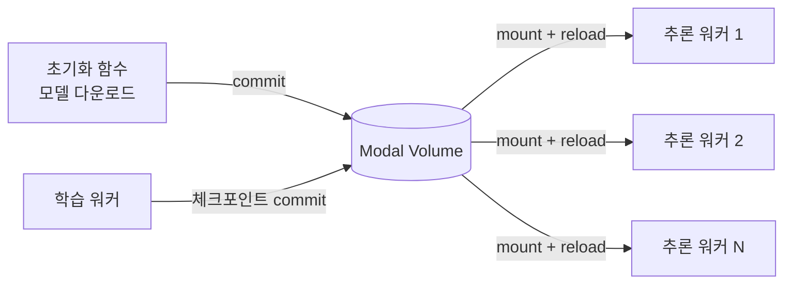

# Modal Volumes - 영구 스토리지

Modal Volumes는 [[modal-com-runtime]] 플랫폼의 영구 파일시스템 솔루션이다. Modal 함수(Function)와 컨테이너 실행 환경에 마운트 가능한 분산 스토리지로, 모델 가중치 캐싱(caching), 대용량 데이터셋 공유, 체크포인트 저장 등 ML 워크플로우의 핵심 스토리지 패턴을 지원한다. 컨테이너가 종료되어도 데이터가 보존되며, 여러 컨테이너에서 동시 접근이 가능하다.

## 정체성

| 항목 | 내용 |
|------|------|
| 공식 명칭 | Modal Volumes |
| 회사 | Modal Labs, Inc. |
| 플랫폼 | Modal (클라우드 ML 런타임) |
| 분류 | Persistent Network Filesystem (영구 네트워크 파일시스템) |
| 공식 문서 | https://modal.com/docs/reference/modal.Volume |
| 가격 | Modal 플랫폼 종속 (스토리지 GB + 전송량 과금) |

## Modal 스토리지 타입 비교

Modal은 스토리지 목적에 따라 3가지 타입을 제공한다:



Volumes는 Modal 네이티브 스토리지로, S3 없이 빠른 로컬 마운트를 제공한다. Cloud Buckets는 기존 S3/GCS 버킷을 Modal 함수에 마운트하는 방식이다.

## 핵심 기능

### 1. 영구 파일시스템 마운트
Modal Volumes는 일반 디렉토리처럼 컨테이너에 마운트된다. 컨테이너가 종료된 후에도 데이터가 유지되며, 다음 실행 시 동일한 데이터를 그대로 사용할 수 있다.

```python
import modal

# Volume 생성 (처음 한 번)
볼륨 = modal.Volume.from_name("모델캐시", create_if_missing=True)

앱 = modal.App("ml-pipeline")

@앱.function(
    volumes={"/models": 볼륨},   # /models 경로에 마운트
    gpu="A10G"
)
def 모델_추론(입력_텍스트: str) -> str:
    import os
    from transformers import pipeline
    
    모델_경로 = "/models/llama-3-8b"
    
    # 캐시된 모델이 없으면 다운로드
    if not os.path.exists(모델_경로):
        from huggingface_hub import snapshot_download
        snapshot_download("meta-llama/Meta-Llama-3-8B", local_dir=모델_경로)
        # 명시적 커밋으로 영구 저장
        볼륨.commit()
    
    pipe = pipeline("text-generation", model=모델_경로)
    return pipe(입력_텍스트, max_new_tokens=200)[0]["generated_text"]
```

### 2. 모델 가중치 캐싱 패턴

Hugging Face 모델을 Volume에 캐싱하는 것이 가장 일반적인 사용 패턴이다. 매 실행마다 수 GB 모델을 다운로드하는 낭비를 없애고, 추론 워커 시작 시간을 대폭 단축한다.

```python
import modal

볼륨 = modal.Volume.from_name("hf-model-cache", create_if_missing=True)

이미지 = (
    modal.Image.debian_slim(python_version="3.11")
    .pip_install("transformers", "torch", "huggingface_hub")
)

앱 = modal.App("model-cache-demo", image=이미지)

@앱.function(
    volumes={"/cache/huggingface": 볼륨},
    secrets=[modal.Secret.from_name("huggingface-secret")],
)
def 모델_다운로드_및_캐싱(모델명: str) -> None:
    """모델을 Volume에 캐싱하는 초기화 함수"""
    import os
    from huggingface_hub import snapshot_download
    
    # HF_HOME을 Volume 경로로 설정 - 이후 모든 모델이 여기 캐싱됨
    os.environ["HF_HOME"] = "/cache/huggingface"
    
    print(f"{모델명} 다운로드 시작...")
    snapshot_download(모델명)
    볼륨.commit()
    print(f"{모델명} 캐싱 완료")

@앱.function(
    volumes={"/cache/huggingface": 볼륨},
    gpu="A10G",
)
def 캐시된_모델_추론(프롬프트: str) -> str:
    """캐싱된 모델로 추론"""
    import os
    from transformers import AutoModelForCausalLM, AutoTokenizer
    
    os.environ["HF_HOME"] = "/cache/huggingface"
    
    # Volume에서 즉시 로드 (네트워크 다운로드 없음)
    tokenizer = AutoTokenizer.from_pretrained("mistralai/Mistral-7B-Instruct-v0.2")
    model = AutoModelForCausalLM.from_pretrained("mistralai/Mistral-7B-Instruct-v0.2")
    
    입력 = tokenizer(프롬프트, return_tensors="pt")
    출력 = model.generate(**입력, max_new_tokens=200)
    return tokenizer.decode(출력[0])
```

### 3. 커밋(Commit)과 리로드(Reload) 모델

Volume 쓰기는 **명시적 커밋** 이전까지는 임시 상태이다. 이는 다른 컨테이너에서 아직 새 파일을 볼 수 없음을 의미한다. `volume.commit()`을 호출해야 다른 실행에서도 접근 가능해진다.

```python
# 쓰기 컨테이너
def 데이터_저장(데이터: bytes) -> None:
    with open("/data/result.bin", "wb") as f:
        f.write(데이터)
    볼륨.commit()  # 반드시 커밋해야 다른 컨테이너에서 보임

# 읽기 컨테이너
def 데이터_읽기() -> bytes:
    볼륨.reload()  # 최신 상태로 동기화
    with open("/data/result.bin", "rb") as f:
        return f.read()
```

### 4. 데이터셋 공유

대용량 학습 데이터셋을 여러 학습 워커에 공유할 때 유용하다:

```python
@앱.function(
    volumes={"/datasets": 볼륨},
    cpu=8,
)
def 데이터셋_전처리() -> None:
    """한 번만 실행하는 전처리 작업"""
    from datasets import load_dataset
    
    ds = load_dataset("allenai/dolmino-mix-1124", split="train[:10%]")
    ds.save_to_disk("/datasets/dolmino-10pct")
    볼륨.commit()

@앱.function(
    volumes={"/datasets": 볼륨},
    gpu="H100",
)
def 학습_워커(워커_id: int) -> None:
    """전처리된 데이터셋으로 학습"""
    from datasets import load_from_disk
    
    볼륨.reload()
    ds = load_from_disk("/datasets/dolmino-10pct")
    # ... 학습 로직
```

### 5. 체크포인트 저장

장시간 학습의 중간 체크포인트를 Volume에 저장하면 실패 시 재시작이 가능하다:

```python
@앱.function(
    volumes={"/checkpoints": 체크포인트_볼륨},
    gpu="A100-80GB",
    timeout=86400,  # 24시간
)
def 학습(재시작_여부: bool = False) -> None:
    import torch
    import os
    
    시작_에폭 = 0
    
    if 재시작_여부:
        체크포인트_볼륨.reload()
        최신_체크포인트 = sorted(
            os.listdir("/checkpoints"),
            key=lambda x: int(x.split("_")[1])
        )[-1]
        체크포인트 = torch.load(f"/checkpoints/{최신_체크포인트}")
        시작_에폭 = 체크포인트["epoch"] + 1
        print(f"에폭 {시작_에폭}부터 재개")
    
    for 에폭 in range(시작_에폭, 100):
        # ... 학습 로직
        
        # 매 10에폭마다 체크포인트 저장
        if 에폭 % 10 == 0:
            torch.save({"epoch": 에폭, "model_state": model.state_dict()},
                      f"/checkpoints/epoch_{에폭}.pt")
            체크포인트_볼륨.commit()
```

## Volume CLI 관리

Modal CLI로 Volume 파일을 관리할 수 있다:

```bash
# Volume 목록 조회
modal volume list

# Volume 내 파일 목록
modal volume ls 모델캐시

# 로컬에서 Volume으로 파일 업로드
modal volume put 모델캐시 ./local_model.pt /models/local_model.pt

# Volume에서 로컬로 파일 다운로드
modal volume get 모델캐시 /models/model.pt ./downloaded_model.pt

# Volume 파일 삭제
modal volume rm 모델캐시 /models/old_model.pt
```

## 차별점 - 경쟁 스토리지 비교

| 항목 | Modal Volumes | AWS EFS | S3 | Cloud Buckets(Modal) |
|------|--------------|---------|----|-----------------------|
| 마운트 방식 | 네이티브 마운트 | NFS 마운트 | boto3 API | 마운트 |
| 지연시간 | 낮음 | 낮음 | 높음 (API) | 중간 |
| 동시 접근 | 지원 | 지원 | 지원 | 지원 |
| Modal 통합 | 네이티브 | 별도 설정 | 별도 설정 | 통합 |
| 가격 | Modal 과금 포함 | 별도 과금 | 별도 과금 | S3 요금 |
| 기존 데이터 | 새로 저장 | 새로 저장 | 기존 활용 | 기존 활용 |

기존 S3 버킷에 대용량 데이터셋이 이미 있다면 Cloud Buckets가 더 적합하고, Modal 환경 내에서 새로 만드는 캐시/체크포인트는 Volumes가 자연스럽다.

## 실무 패턴 정리



이 다이어그램은 "초기화 한 번 - 추론 여러 번"의 전형적인 ML 서빙 패턴을 보여준다. 모델 초기화 함수에서 Volume에 모델을 저장하면, 이후 수십 개의 병렬 추론 워커가 네트워크 다운로드 없이 동일한 모델을 사용한다.

## 한계 및 트레이드오프

### 동시 쓰기 주의
여러 컨테이너가 동시에 같은 파일에 쓰면 충돌이 발생할 수 있다. 쓰기는 단일 컨테이너에서, 읽기는 다수 컨테이너에서 하는 패턴을 권장한다.

### 커밋 누락
`volume.commit()` 호출을 잊으면 파일은 임시 상태로만 존재하며 컨테이너 종료 시 소실된다. 쓰기 후 반드시 커밋.

### 비용
스토리지 용량과 전송량에 따라 비용이 발생한다. 대용량 LLM 가중치(수십 GB)를 여러 개 저장하면 비용이 상당할 수 있다. 불필요한 모델은 정기적으로 정리.

### Modal 종속
Modal Volumes는 Modal 플랫폼에 종속된다. 다른 클라우드나 온프레미스로 이전 시 S3/GCS 마이그레이션이 필요.

## 관련 문서

- [[modal-com-runtime]] - Modal 플랫폼 전체 개요
- [[e2b-ai-sandbox]] - E2B 코드 실행 샌드박스 (임시 스토리지 방식)
- [[inferless-deployment]] - Inferless 서버리스 GPU (유사 플랫폼 비교)
- [[docker-for-ml]] - 컨테이너 기반 ML 환경
- [[dvc]] - ML 데이터 버전 관리 도구
