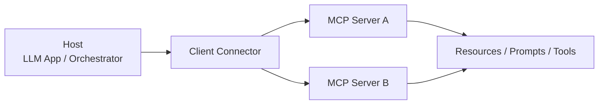

# Model Context Protocol (MCP)

LLM 애플리케이션과 외부 데이터/도구를 연결하기 위한 개방형 프로토콜의 허브 페이지다. 특정 릴리스 노트나 로드맵이 아니라, MCP 자체를 하나의 장기 추적 대상(entity)로 다룬다.

## 개요

MCP는 호스트, 클라이언트, 서버 사이의 상호작용을 표준화해:

- 컨텍스트 공유
- 도구 노출
- 프롬프트/리소스/샘플링 연결
- 에이전트 워크플로우 확장

을 일관된 방식으로 가능하게 하려는 시도다.

## 왜 중요한가

에이전트 시스템이 로컬 도구 몇 개를 넘어서, 원격 서버·권한 모델·레지스트리·조직 단위 배포로 확장되면서 “어떻게 연결할 것인가”가 독립 문제로 떠올랐다. MCP는 이 문제를 푸는 사실상의 표준화 시도라는 점에서 중요하다.

## 구성 요소

### Hosts
LLM 앱이나 오케스트레이터처럼 연결을 시작하는 주체.

### Clients
호스트 내부에서 MCP 서버와 대화하는 연결 계층.

### Servers
리소스, 도구, 프롬프트 같은 기능을 외부에 제공하는 측.

## 구조 한눈에 보기

이 구조의 핵심은 host가 모든 기능을 직접 구현하지 않고, **연결 계층(client)과 외부 capability(server)를 분리**한다는 점이다.

## 문서 읽기 순서

1. [[what-is-mcp|What is the Model Context Protocol (MCP)?]] — 입문
2. [[mcp-specification-2025-11-25|MCP Specification 2025-11-25]] — 규약
3. [[mcp-authorization|MCP OAuth 2.1 + PKCE Authorization]] — 보안 경계
4. [[model-context-protocol|MCP 2026 Roadmap & Enterprise Readiness]] — 발전 방향
5. [[mcp-roadmap-development|MCP Roadmap (Development)]] — 거버넌스/참여

이 순서로 읽으면 “무엇인가 → 어떻게 구현하는가 → 어디로 가는가”의 흐름이 자연스럽다.

## 실무 적용 관점

MCP는 단순히 “툴을 붙이는 방법”이 아니라, **에이전트 생태계의 인터페이스 계약**이다. 그래서 도입 시에는 기능 목록보다도:

- 인증/권한
- 원격 서버 운영
- 메타데이터 discoverability
- registry / governance

같은 운영 문제를 같이 봐야 한다.

## 구현 체크포인트

| 체크포인트 | 왜 중요한가 |
|---|---|
| capability negotiation | 클라이언트/서버 호환성 결정 |
| authorization | 원격 서버 배포와 보안 경계 핵심 |
| transport 선택 | local / remote 운영 모델 차이 |
| metadata / registry | discoverability와 운영 자동화에 영향 |

## 관련 문서
- [[function-calling-tool-use]] -- 함수 호출과 도구 사용 (Function Calling)

- [[model-context-protocol|MCP 2026 Roadmap & Enterprise Readiness]]
- [[mcp-authorization|MCP OAuth 2.1 + PKCE Authorization]]
- [[claude-code-hooks-system|Claude Code Hooks System]]
- [[mcp-authorization-draft|MCP Authorization Draft]] — MCP authorization security boundary 요약
- [[tool-calling-optimization]] -- MCP 도구 호출 최적화 개념
- [[agentic-ai-foundation]] -- MCP가 지탱하는 에이전트 AI 인프라 기반

허브 문서는 하위 경로와 source 경계를 함께 검증한다.

공식 문서와 구현체를 교차 확인한다.

공식 문서와 구현체를 교차 확인한다.

공식 문서와 구현체를 교차 확인한다.

공식 문서와 구현체를 교차 확인한다.

공식 문서와 구현체를 교차 확인한다.

공식 문서와 구현체를 교차 확인한다.

공식 문서와 구현체를 교차 확인한다.

공식 문서와 구현체를 교차 확인한다.

공식 문서와 구현체를 교차 확인한다.

공식 문서와 구현체를 교차 확인한다.

관련 허브와 다시 연결한다.

관련 허브와 다시 연결한다.

관련 허브와 다시 연결한다.

관련 허브와 다시 연결한다.

관련 허브와 다시 연결한다.

관련 허브와 다시 연결한다.

source 경계 유지.

