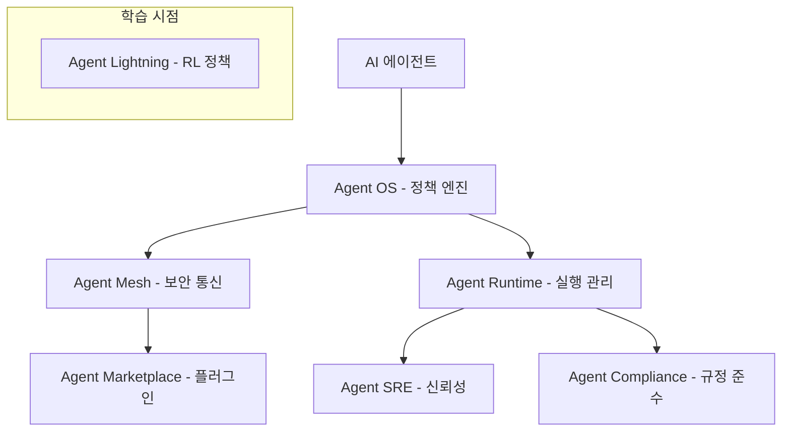

# Microsoft Agent Governance Toolkit

오픈소스 에이전트 런타임 보안 프레임워크. OS 커널, 서비스 메시, SRE 관행에서 영감을 받아 자율 AI 에이전트의 행동 거버넌스, 감사, 정책 적용을 수행한다. 에이전트 AI 시스템의 보안이 "더 이상 선택이 아닌 인프라"가 된 시점에 등장한 최초의 포괄적 오픈소스 거버넌스 솔루션이다.

## 개요

Microsoft가 2026년 4월 공개한 Agent Governance Toolkit은 자율 AI 에이전트의 런타임 보안을 위한 오픈소스 프레임워크다. 7개의 통합 패키지로 구성되며, 정책 엔진부터 규정 준수까지 에이전트 라이프사이클 전반을 아우른다. MIT 라이선스로 공개되었으며, LangChain, CrewAI, LlamaIndex 등 주요 에이전트 프레임워크와 호환되는 프레임워크 무관(framework-agnostic) 설계가 특징이다. Python, TypeScript, Rust, Go, .NET 다섯 개 언어를 지원한다.

## 핵심 특징

### 7개 통합 패키지

| 패키지 | 역할 | 핵심 기능 |
|--------|------|-----------|
| **Agent OS** | 상태 비저장 정책 엔진 | YAML/OPA Rego/Cedar 정책, p99 지연시간 <0.1ms |
| **Agent Mesh** | 에이전트 간 보안 통신 | DID 기반 암호화 신원, Ed25519, 에이전트 간 신뢰 프로토콜 |
| **Agent Runtime** | 동적 실행 관리 | 실행 링, 사가 오케스트레이션, 긴급 종료 |
| **Agent SRE** | 프로덕션 신뢰성 | SLO, 에러 버짓, 서킷 브레이커 |
| **Agent Compliance** | 규정 준수 자동화 | EU AI Act/HIPAA/SOC2 매핑, OWASP 증거 수집 |
| **Agent Marketplace** | 플러그인 라이프사이클 | Ed25519 서명, 공급망 보안 |
| **Agent Lightning** | RL 학습 중 정책 적용 | 강화학습 훈련 시점 거버넌스 |

### OWASP Agentic AI Top 10 전면 대응

2025년 12월 OWASP가 식별한 10대 에이전트 AI 리스크 전체를 커버한다:

| 리스크 | 대응 메커니즘 |
|--------|-------------|
| 목표 하이재킹(Goal Hijacking) | 시맨틱 의도 분류기(Semantic Intent Classifier) |
| 도구 오용(Tool Misuse) | 기능 샌드박싱, MCP 보안 게이트웨이 |
| 신원/권한 남용(Identity Abuse) | DID 기반 신원 + 행동 신뢰 점수 |
| 공급망 리스크(Supply Chain) | Ed25519 플러그인 서명 |
| 코드 실행(Code Execution) | 실행 링 + 리소스 제한 |
| 메모리 오염(Memory Poisoning) | 교차 모델 검증 커널(다수결 투표) |
| 비보안 통신(Insecure Communications) | IATP 암호화 |
| 연쇄 장애(Cascading Failures) | 서킷 브레이커, SLO 강제 |
| 인간-에이전트 신뢰 악용(Trust Exploitation) | 승인 워크플로 + 정족수 로직 |
| 불량 에이전트(Rogue Agents) | 링 격리, 신뢰 감쇠, 자동 킬 스위치 |

## 기술 상세

### 아키텍처



### 정책 엔진 설계

Agent OS는 에이전트의 모든 행동(action)을 인터셉트하는 상태 비저장(stateless) 정책 엔진이다. 상태 비저장 설계로 수평 확장(horizontal scaling)과 컨테이너 배포가 용이하다. 서브밀리초 지연시간(<0.1ms p99)으로 운영 오버헤드를 최소화하면서, 세 가지 정책 언어(YAML, OPA Rego, Cedar)를 지원하여 조직의 기존 정책 인프라와 통합이 용이하다. 심층 방어(defense in depth) 원칙에 따라 여러 독립 레이어가 서로 다른 위협 범주를 동시에 처리한다.

### 암호화 신원 체계

Agent Mesh는 분산 식별자(DID)와 Ed25519 서명을 활용한 에이전트 간 신뢰 프로토콜(Inter-Agent Trust Protocol, IATP)을 구현한다. 0~1000 스케일의 동적 신뢰 점수를 5개 행동 계층(behavioral tier)으로 분류하여, 에이전트 간 통신에서 신원 위조와 메시지 변조를 방지한다.

### 실행 링 (Execution Rings)

Agent Runtime은 CPU 특권 레벨에서 영감을 받은 동적 실행 링을 구현한다. 에이전트의 행동을 권한 수준별로 격리하며, 다단계 트랜잭션을 위한 사가 오케스트레이션(Saga Orchestration)과 긴급 종료(Emergency Termination) 기능을 제공한다.

### 프레임워크 통합

프레임워크 무관(framework-agnostic) 설계로 주요 에이전트 프레임워크와 통합된다:

| 프레임워크 | 통합 방식 |
|-----------|----------|
| LangChain | 콜백 핸들러 |
| CrewAI | 태스크 데코레이터 |
| Google ADK | 네이티브 통합 |
| OpenAI Agents SDK | 네이티브 통합 |
| LangGraph | 네이티브 통합 |
| PydanticAI | 네이티브 통합 |

### 배포 및 설치

```bash
pip install agent-governance-toolkit[full]
```

패키지 배포: Python(PyPI), TypeScript(npm `@microsoft/agentmesh-sdk`), .NET(NuGet `Microsoft.AgentGovernance`).

Azure 서비스: AKS(Azure Kubernetes Service), Azure Foundry Agent Service, Azure Container Apps와 연동.

### 품질 보증

9,500개 이상의 테스트와 ClusterFuzzLite를 통한 지속적 퍼징(continuous fuzzing)으로 보안 결함을 사전에 탐지한다. SLSA 호환 빌드 출처 추적(build provenance)을 구현하며, 점진적 도입(incremental adoption)이 가능한 모노레포 구조다. MIT 라이선스로 공개되었으며, 향후 재단(foundation)으로 거버넌스 이관을 목표로 한다.

## 관련 문서

- [[llm-security-owasp|LLM 보안 (OWASP / 적대적 공격)]]
- [[ai-red-teaming|AI 레드팀 & LLM 취약점 스캐닝]]
- [[agentic-ai-production|Agentic AI in Production]]
- [[agent-prompt-injection-defense|Agent Prompt Injection Defense]]
