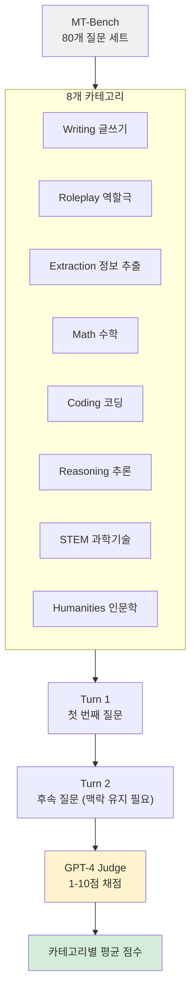

# MT-Bench + LLM-as-Judge

MT-Bench(Multi-Turn Benchmark)는 LLM의 멀티턴 대화 능력과 지시 수행 능력을 평가하기 위해 개발된 벤치마크다. Zheng et al. (2023, UC Berkeley LMSYS)이 제안했으며, 인간 평가의 비용 문제를 해결하기 위해 **GPT-4를 자동 심사관(LLM-as-Judge)으로 활용**하는 방법론을 함께 도입했다. [[lmsys-chatbot-arena|LMSYS Chatbot Arena]]와 함께 LLM 대화 능력 평가의 표준으로 자리잡았다.

## MT-Bench 구조



80개 질문을 8개 카테고리로 나누며, 각 질문은 2턴으로 구성된다. 총 160번의 모델 응답이 평가된다.

## LLM-as-Judge 방법론

MT-Bench의 핵심 혁신은 **GPT-4를 자동 심사관으로 사용**한다는 점이다. 기존 벤치마크(MMLU, HumanEval 등)는 정답이 명확한 객관식이나 코드 실행 결과를 기준으로 삼지만, 대화 품질은 사람이 직접 평가해야 했다.

### 채점 방식

**단일 응답 채점 (Single-answer grading)**:

```
[프롬프트 구조]
[System Prompt: 당신은 공정한 평가관입니다...]
[원본 질문]
[AI 응답]
[평가 지시: 아래 기준으로 1-10점 채점하고 이유를 설명하세요]
```

GPT-4는 응답의 유용성, 관련성, 정확성, 깊이, 창의성, 세부 수준을 종합해 1-10점을 부여한다.

**쌍 비교 채점 (Pairwise comparison)**:
두 모델의 응답을 동시에 제시하고 어느 쪽이 더 나은지 판단. 순서 편향(position bias)을 줄이기 위해 순서를 바꿔 두 번 평가 후 일치 여부 확인.

### LLM-as-Judge의 편향 문제

- **자기 편향(Self-preference bias)**: GPT-4로 채점하면 GPT-4 스타일의 응답이 유리해질 수 있음
- **순서 편향(Position bias)**: 쌍 비교 시 먼저 제시된 응답에 더 높은 점수를 주는 경향
- **긴 응답 편향(Verbosity bias)**: 더 긴 응답이 더 좋다고 평가하는 경향

이를 완화하기 위해 MT-Bench는 순서 교체, 다중 샘플링 평균화 등을 적용한다.

## 주요 모델 성능 (MT-Bench 평균 점수)

| 모델 | MT-Bench 점수 |
|------|--------------|
| GPT-4 (2023) | 8.99 |
| GPT-3.5 Turbo | 7.94 |
| Claude 2 | 8.06 |
| Llama-2-70B-Chat | 6.27 |
| Vicuna-13B | 6.57 |

10점 만점 기준이며, 수학과 코딩 카테고리에서 오픈소스 모델들이 GPT 계열과 가장 큰 차이를 보인다.

## [[lmsys-chatbot-arena]]와의 관계

MT-Bench는 고정된 80개 질문을 사용하는 **오프라인 벤치마크**인 반면, [[lmsys-chatbot-arena|LMSYS Chatbot Arena]]는 실제 사용자가 두 모델에 동시에 질문하고 더 나은 응답을 선택하는 **온라인 엘로 레이팅 시스템**이다.

| 비교 항목 | MT-Bench | Chatbot Arena |
|-----------|----------|---------------|
| 평가 방식 | LLM-as-Judge 자동화 | 인간 선호도 투표 |
| 질문 풀 | 80개 고정 | 실제 사용자 질문 (무제한) |
| 결과 | 절대 점수 (1-10) | 상대 엘로 레이팅 |
| 비용 | API 비용 | 자원봉사 평가자 |
| 업데이트 주기 | 정적 | 실시간 |

두 벤치마크의 결과가 대체로 상관관계를 보이며, MT-Bench 고점수 모델이 Arena에서도 높은 엘로를 기록하는 경향이 있다.

## FastChat 통합

MT-Bench는 UC Berkeley의 FastChat 프레임워크에 통합되어 있다. 오픈소스 모델을 평가하려면:

```bash
# 모델 응답 생성
python gen_model_answer.py --model-path lmsys/vicuna-13b-v1.5 --model-id vicuna-13b

# GPT-4로 채점
python gen_judgment.py --model-list vicuna-13b --judge-model gpt-4

# 결과 확인
python show_result.py
```

## LLM-as-Judge의 확장

MT-Bench에서 도입한 LLM-as-Judge 방법론은 이후 다양한 자동 평가 파이프라인에 채택됐다:

- **Alpaca Eval**: Alpaca 모델 평가에 GPT-4 판단 적용
- **Arena-Hard**: 경쟁이 어려운 사용자 질문 500개 + GPT-4 judge
- **RLAIF**: 강화학습 피드백으로 LLM 판단 신호 활용
- **Constitutional AI**: 자기 비판과 개정에 LLM judge 원리 적용

## 관련 문서

- [[mt-bench]] - MT-Bench 개념 상위 노드
- [[lmsys-chatbot-arena]] - 인간 선호도 기반 상호 보완 벤치마크
- [[evaluation-harness]] - 자동화 평가 프레임워크 생태계
- [[mmlu-benchmark-details]] - 지식 평가 영역의 대표 벤치마크
