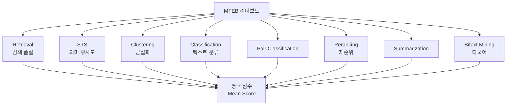

# MTEB (Massive Text Embedding Benchmark)

텍스트 임베딩 모델을 평가하기 위한 대규모 벤치마크. 2022년에 발표된 논문 "MTEB: Massive Text Embedding Benchmark"에서 시작되었으며, HuggingFace에서 리더보드를 운영한다. 56개 이상의 데이터셋과 8개 태스크 유형으로 임베딩 모델의 다차원적 성능을 측정한다.

## 프로젝트 개요

| 항목 | 내용 |
|---|---|
| 이름 | MTEB (Massive Text Embedding Benchmark) |
| 최초 발표 | 2022년 (Muennighoff et al.) |
| 운영 | HuggingFace (리더보드), MTEB 팀 |
| 논문 | arXiv:2210.07316 |
| 리더보드 | huggingface.co/spaces/mteb/leaderboard |
| 라이브러리 | pip install mteb |
| 데이터셋 | 56개+ (지속 추가) |

## 8가지 태스크 유형

MTEB는 임베딩 모델이 잘해야 하는 실제 사용 사례를 8가지 태스크로 분류한다.

| 태스크 | 설명 | 대표 데이터셋 |
|---|---|---|
| Retrieval | 쿼리 - 문서 검색 | BEIR 벤치마크 15개 데이터셋 |
| Clustering | 텍스트 군집화 | ArXiv, Reddit |
| Classification | 텍스트 분류 | Banking77, Emotion |
| Pair Classification | 두 텍스트 유사도 판단 | TwitterSemEval |
| Reranking | 검색 결과 재순위 | MindSmallReranking |
| STS (Semantic Textual Similarity) | 의미적 유사도 점수 | STS12~22 시리즈 |
| Summarization | 요약문 - 원문 유사도 | SummEval |
| Bitext Mining | 다국어 병렬 문장 추출 | BUCC, Tatoeba |



8가지 태스크의 점수를 평균 낸 것이 MTEB 리더보드의 종합 점수가 된다.

## MTEB 리더보드 구조

HuggingFace에서 운영하는 MTEB 리더보드는 수백 개의 임베딩 모델 결과를 비교할 수 있다.

- **Overall 탭**: 8개 태스크 전체 평균 점수로 종합 순위 제공
- **태스크별 탭**: 특정 태스크(예: Retrieval만)의 성능 비교
- **언어별 필터**: 영어, 다국어(Multilingual), 중국어 등으로 필터링
- **모델 크기 필터**: 파라미터 수 기준으로 경량/대형 모델 분리 비교 가능

## 주요 리더보드 모델 (2024~2025년 기준)

| 모델 | 특징 |
|---|---|
| text-embedding-3-large (OpenAI) | 상용 API, 높은 종합 성능 |
| Voyage-3 (Voyage AI) | RAG 최적화, 상용 |
| GTE-Qwen2-7B (Alibaba) | 오픈소스 상위권 |
| gte-large-en-v1.5 | 중간 크기 오픈소스 |
| BGE 시리즈 (BAAI) | 중국어/다국어 강점 |
| E5-mistral-7b | Mistral 기반 강력한 검색 성능 |

## [[embedding-layers]]와의 관계

MTEB는 [[embedding-layers]]의 실제 성능을 측정하는 표준 도구다. 임베딩 레이어 설계에서 중요한 질문인 "어떤 차원 수가 최적인가", "풀링 방식이 성능에 미치는 영향" 등을 MTEB 태스크 결과로 실증한다.

RAG 시스템 구축 시 임베딩 모델 선택은 MTEB Retrieval 탭의 순위를 먼저 참고하는 것이 관례가 되었다.

## MTEB 직접 실행

```python
import mteb

# 단일 모델 평가
model = mteb.get_model("intfloat/e5-large-v2")
evaluation = mteb.MTEB(tasks=["NFCorpus", "TRECCOVID"])
results = evaluation.run(model)
```

커스텀 임베딩 모델도 `mteb.Encoder` 인터페이스를 구현하면 동일하게 평가할 수 있다.

## [[evaluation-harness]]와의 차이

[[evaluation-harness]](EleutherAI의 lm-evaluation-harness)가 LLM의 언어 이해/생성 능력을 다지선다/생성 과제로 측정한다면, MTEB는 임베딩 벡터 자체의 표현 품질을 측정한다. 대상과 측정 방식이 완전히 다르다. 둘 다 HuggingFace 생태계에서 표준 벤치마크로 쓰이지만 서로 보완적인 관계다.

## 한계 및 비판

- **오염 위험(Data Contamination)**: 대형 모델들이 훈련 시 MTEB 데이터셋을 포함했을 가능성이 있어 점수가 부풀려질 수 있다.
- **태스크 편중**: Retrieval 태스크가 실무에서 가장 중요하지만 8개 태스크 평균에서는 동등하게 반영된다.
- **도메인 특수성**: 일반 벤치마크에서 높은 점수를 받아도 특정 도메인(의료, 법률 등)에서는 다를 수 있다.

## 관련 문서

- [[embedding-layers]] - 임베딩 레이어 구조와 학습 원리
- [[evaluation-harness]] - LLM 언어 능력 평가 도구
- [[rag-pipeline]] - 검색 증강 생성에서 임베딩의 역할
- [[chroma-db]] - 벡터 저장소 (임베딩 모델과 함께 사용)
