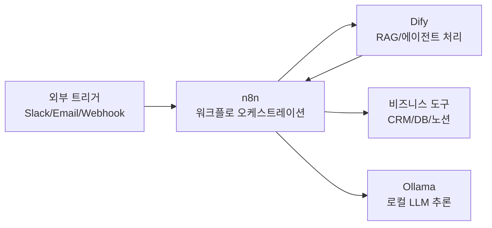

## 개요

n8n과 Dify는 2026년 대표 오픈소스 AI 자동화 스택이다. n8n은 400개 이상의 통합을 제공하는 워크플로 자동화 플랫폼이고, Dify는 [[agentic-rag|RAG]]/에이전트/프롬프트 관리를 내장한 [[context-engineering|LLM]] 애플리케이션 빌더다. 두 도구는 상호 보완적으로 결합하여, 비즈니스 프로세스 자동화와 AI 앱 구축을 동시에 달성하는 스택으로 주목받고 있다.

n8n은 GitHub 스타 18만 이상, Dify는 10만 이상을 기록하며 오픈소스 AI 자동화 영역에서 가장 활발한 프로젝트에 속한다.

## 핵심 특징

### n8n - 워크플로 자동화

- **400+ 네이티브 통합**: CRM, Slack, 데이터베이스, 이메일 등 비즈니스 도구 연결
- **비주얼 워크플로 빌더**: 드래그 앤 드롭 방식의 자동화 파이프라인 구성
- **AI 에이전트 패턴 지원**: Sequential 에이전트, 멀티 에이전트 대화, Orchestrator-Worker 모델, 서브에이전트 스포닝(컨텍스트 윈도우 한계 회피)
- **결정론적 로직 + AI 추론 결합**: AI가 "추론으로 해결"하는 대신 사전 정의된 보안 검사를 강제하는 패턴 -- 엔터프라이즈 보안 운영에서 핵심
- **프로덕션 기능**: 재시도, 조건 분기, 실패 알림, 멱등성 보장
- **셀프호스팅**: Docker/K8s 지원, 데이터 주권 확보 가능
- **GitHub 스타 180K+**, 기업 가치 $1B (Series B/C)

### Dify - AI 앱 빌더

- **비주얼 AI 워크플로 캔버스**: 드래그 앤 드롭으로 AI 워크플로 구축
- **내장 RAG 파이프라인**: 문서 수집, 청킹, 임베딩, 검색을 out-of-the-box 지원 (PDF, PPTX 등 일반 파일 포맷)
- **에이전트 프레임워크**: 도구 호출, 멀티스텝 추론 지원
- **100+ LLM 프로바이더**: 로컬 추론 서버(Ollama) 포함, 클라우드와 로컬 모델 혼합 사용 가능
- **프롬프트 엔지니어링 UI**: 프롬프트 버전 관리, A/B 테스트 -- 비개발자도 프롬프트/지식 기반 반복 가능
- **앱 배포**: 챗봇, API 엔드포인트 즉시 배포
- **비용 추적**: LLM API 호출 비용 모니터링
- **GitHub 스타 100K+**, Apache 2.0 라이선스

### 결합 활용

n8n에서 HTTP 요청 노드로 Dify 워크플로를 트리거하면, Dify의 AI 처리 능력과 n8n의 비즈니스 도구 통합을 결합할 수 있다. 예를 들어, 고객 문의가 Slack에 들어오면 n8n이 이를 감지하고 Dify RAG 에이전트로 전달하여 응답을 생성한 뒤, 다시 n8n이 CRM에 기록하는 플로우를 구성할 수 있다.

## 기술 상세

### 선택 기준

| 기준 | n8n | Dify |
|------|-----|------|
| 핵심 역할 | 멀티앱 워크플로 자동화 | LLM 앱 개발 플랫폼 |
| AI 위치 | 워크플로의 한 단계 | 플랫폼의 핵심 |
| 적합 대상 | 비즈니스 프로세스 자동화 | 독립형 AI 앱/챗봇 구축 |
| 셀프호스팅 | Docker/K8s 지원 | Docker/K8s 지원 |
| 라이선스 | 페어코드 (n8n License) | Apache 2.0 |

### 보완 스택 구성

n8n + Dify + Ollama 조합은 완전 셀프호스팅 AI 자동화 스택으로, 클라우드 의존 없이 프라이버시를 확보하면서도 엔터프라이즈급 자동화를 구현할 수 있다.

### 하드웨어 요구사항

| 모델 규모 | 최소 VRAM | 권장 양자화 | 비고 |
|---|---|---|---|
| 7B-8B | 8GB | 4-bit (Q4_K_M) | 대부분 로컬 GPU에서 실행 가능 |
| 70B급 | 24GB+ | 4-bit | NVIDIA RTX 4090 / A6000 권장 |
| CPU 전용 | - | - | 가능하지만 지연시간 크게 증가 |

### 단계적 도입 전략

1. **n8n + Ollama 기초**: Docker Compose로 워크플로 자동화 + 로컬 LLM 기반 구축
2. **Dify 추가**: 지식 기반(RAG)과 채팅 애플리케이션 레이어 도입
3. **n8n 수집 워크플로**: 문서 갱신, 데이터 파이프라인 오케스트레이션
4. **강화**: 백업, 속도 제한, 옵저버빌리티, 클라우드 API 폴백 정책

### 활용 사례

- 클라우드 API 노출 없이 로그 자동 분석
- 민감 문서 처리를 위한 내부 리서치 어시스턴트
- CVE 취약점 분석 워크플로
- 계약서 준수 비교 분석
- 코드 리뷰 요약 자동화

### 비용 구조

셀프호스팅은 비용을 "API 요금에서 인프라/하드웨어/엔지니어링 시간"으로 전환한다. 데이터 프라이버시 우선, 고빈도 추론, 인프라 제어가 핵심인 팀에 적합하며, 관리형 서비스의 편의성과 트레이드오프가 존재한다.

## 경쟁 스택 비교

| 항목 | n8n + Dify + Ollama | Zapier + ChatGPT | Make + Langflow | Flowise + Ollama |
|---|---|---|---|---|
| 배포 | 완전 셀프호스팅 | SaaS 전용 | SaaS + 셀프호스팅 | 셀프호스팅 |
| AI 중심성 | n8n(오케스트레이션) + Dify(AI 핵심) | AI는 보조 기능 | Langflow가 AI 담당 | AI 전용 |
| 데이터 프라이버시 | 완전 제어 | 클라우드 전송 필수 | 혼합 | 완전 제어 |
| 가격 | 인프라 비용만 | 작업당 과금 | 혼합 | 인프라 비용만 |
| 비즈니스 통합 | 400+ 네이티브 | 7,000+ | 1,500+ | 제한적 |
| RAG 내장 | Dify 내장 | X | Langflow 내장 | Flowise 내장 |

## 관련 문서

- [[model-context-protocol]] - MCP를 통한 도구 통합
- [[vibe-coding-platforms]] - Low-Code AI 앱 빌더 비교
- [[ollama]] - 로컬 LLM 런타임
