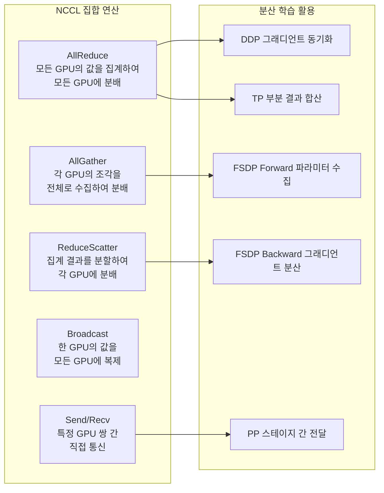
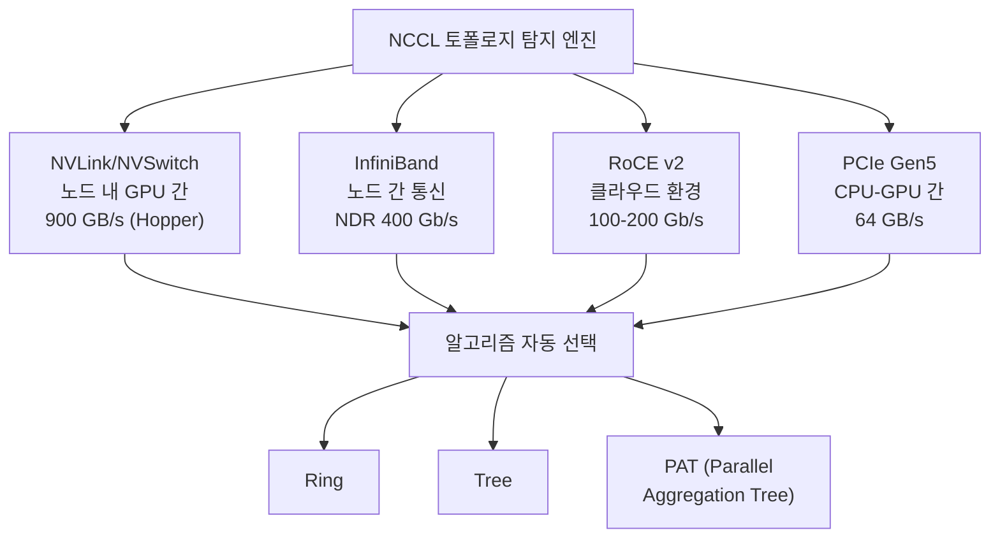

# NCCL (NVIDIA Collective Communications Library)

## 개요

NCCL(NVIDIA Collective Communications Library, "니클"로 발음)은 NVIDIA GPU 간 집합 통신(collective communication)에 최적화된 오픈소스 라이브러리다. AllReduce, AllGather, Broadcast, Reduce, ReduceScatter, Point-to-Point(Send/Recv) 등의 집합 연산을 제공하며, PCIe, NVLink, NVSwitch, InfiniBand, RoCE 등 다양한 인터커넥트에서 최적의 통신 경로를 자동으로 탐지하고 선택한다.

2026년 현재 PyTorch `torch.distributed`의 GPU 통신 기본 백엔드이며, [[data-parallelism-fsdp]]의 DDP/FSDP, [[tensor-pipeline-parallelism]]의 TP/PP, [[deepspeed-zero]]의 ZeRO 등 거의 모든 분산 학습 기법이 NCCL 위에서 동작한다. 최신 버전은 NCCL 2.29.7(2026년 3월)이다.

## 핵심 집합 연산

NCCL이 제공하는 집합 연산은 분산 학습의 각 단계에서 특정 역할을 수행한다.

| 연산 | 동작 | 분산 학습 적용 |
|------|------|--------------|
| AllReduce | 모든 GPU의 텐서를 집계(합/평균)하여 결과를 전 GPU에 분배 | DDP 그래디언트 동기화, TP 부분 결과 합산 |
| AllGather | 각 GPU의 텐서 조각을 수집하여 전체 텐서를 모든 GPU에 구성 | FSDP forward 시 샤딩된 파라미터 수집 |
| ReduceScatter | 집계 결과를 분할하여 각 GPU가 결과의 한 조각만 수신 | FSDP backward 시 그래디언트 분산 |
| Broadcast | 한 GPU의 텐서를 모든 GPU에 복제 | 모델 초기화 시 가중치 동기화 |
| Reduce | 모든 GPU의 텐서를 집계하여 루트 GPU에만 저장 | 평가 메트릭 수집 |
| Send/Recv | 특정 GPU 쌍 간 직접 통신 | PP 파이프라인 스테이지 간 활성값 전달 |

## 토폴로지 자동 감지

NCCL의 핵심 강점은 하드웨어 토폴로지를 자동으로 탐지하여 최적의 통신 알고리즘을 선택하는 것이다.

**탐지 과정**: NCCL 초기화 시 GPU 간 연결 관계(NVLink 토폴로지, NVSwitch 유무, PCIe 스위치 구조, 네트워크 인터페이스)를 자동으로 스캔한다. 예를 들어 8개 GPU가 NVSwitch로 연결된 것을 감지하면 노드 내 통신에 NVSwitch 경로를 우선 사용하고, 노드 간 통신에는 InfiniBand를 선택한다.

**알고리즘 선택**: 메시지 크기, GPU 수, 토폴로지에 따라 Ring, Tree, Recursive Halving-Doubling, PAT(Parallel Aggregation Tree) 등의 알고리즘을 자동으로 선택한다. 소량 메시지에는 Tree 알고리즘이, 대용량 메시지에는 Ring 알고리즘이 일반적으로 유리하다.

## 분산 학습에서의 위치

NCCL은 분산 학습 스택의 통신 계층에 위치하며, 상위 프레임워크들이 이를 기반으로 동작한다.

| 계층 | 구성요소 | 역할 |
|------|---------|------|
| 학습 프레임워크 | [[megatron-lm]], DeepSpeed, TorchTitan | 병렬화 전략 구현 |
| 분산 통신 API | `torch.distributed`, Gloo | 추상화 인터페이스 |
| **통신 백엔드** | **NCCL** | GPU 간 실제 데이터 전송 |
| 하드웨어 | NVLink, NVSwitch, InfiniBand | 물리적 인터커넥트 |

PyTorch에서는 `torch.distributed.init_process_group(backend="nccl")`로 NCCL 백엔드를 지정한다. GPU 텐서 통신에는 NCCL이 유일한 실용적 선택지이며, CPU 텐서 통신에는 Gloo를 사용한다. 하나의 프로세스 그룹 내에서 GPU와 CPU 통신을 분리하여 이중 백엔드 구성도 가능하다.

## 최신 버전 주요 업데이트

### NCCL 2.26 (2025년 6월)

- **PAT 최적화**: 연산과 실행을 별도 워프(warp)로 분리하여 병렬성 향상. 다수의 병렬 트리와 소규모 연산에서 성능 개선
- **Implicit Launch Order**: 단일 디바이스에서 복수의 NCCL 커뮤니케이터 사용 시 데드락을 방지하는 커널 간 의존성 자동 추가
- **모니터링 강화**: GPU 커널 및 네트워크 프로파일러 지원, 네트워크 플러그인 QoS(Quality of Service) 지원

### NCCL 2.27 (2025년)

- 추론(inference) 워크로드에 최적화된 빠른 통신 경로
- 학습 시 복원력(resilience) 향상

### NCCL 2.29.7 (2026년 3월, 최신)

- CUDA 13.2 지원

## 성능 특성

### 인터커넥트별 대역폭 활용

| 인터커넥트 | 이론 대역폭 | NCCL 효율 | 주요 적용 |
|-----------|-----------|----------|----------|
| NVLink (Hopper) | 900 GB/s | >95% | TP (노드 내) |
| InfiniBand NDR | 400 Gb/s | >90% | DP, PP (노드 간) |
| InfiniBand HDR | 200 Gb/s | >90% | DP, PP (노드 간) |
| RoCE v2 | 100-200 Gb/s | 80-90% | 클라우드 환경 |
| PCIe Gen5 | 64 GB/s | ~85% | CPU-GPU 간 |

NCCL은 GPU-GPU 직접 통신(GPUDirect RDMA)을 지원하여 CPU를 경유하지 않고 데이터를 전송한다. 대용량 텐서 통신에서 MPI, Gloo 대비 최대 3배 이상 빠른 성능을 달성한다.

### 통신-연산 오버랩

[[distributed-communication]]에서 설명하는 것처럼, NCCL의 비동기 집합 연산은 GPU 연산과 시간적으로 겹쳐 실행할 수 있다. DDP의 버킷 기반 AllReduce가 대표적이며, backward 연산과 그래디언트 통신이 동시에 진행되어 학습 처리량 저하를 최소화한다. [[training-profiling]]의 Nsight Systems 타임라인에서 NCCL 커널(예: `ncclAllReduceRingLLKernel`)과 학습 커널이 시간적으로 겹치는지 확인할 수 있다.

## 실전 디버깅 가이드

### 환경 변수

| 환경 변수 | 용도 | 예시 |
|----------|------|------|
| `NCCL_DEBUG=INFO` | 토폴로지 탐색, 알고리즘 선택 로그 출력 | 통신 경로 확인 |
| `NCCL_DEBUG_SUBSYS=INIT,GRAPH` | 특정 서브시스템만 로그 출력 | 초기화 문제 격리 |
| `NCCL_IB_DISABLE=1` | InfiniBand 비활성화 | 네트워크 문제 격리 |
| `NCCL_P2P_DISABLE=1` | GPU 간 P2P 비활성화 | NVLink 문제 격리 |
| `NCCL_SOCKET_IFNAME=eth0` | 통신용 네트워크 인터페이스 지정 | 다중 NIC 환경 |

### 흔한 문제와 해결

- **NCCL 버전 불일치**: 클러스터 내 모든 노드에서 동일한 NCCL 버전 필수. `ncclGetVersion()`으로 확인
- **방화벽 포트 미개방**: NCCL은 동적 포트를 사용하므로 노드 간 포트 범위 개방 필요
- **CPU 텐서에 NCCL 사용 시도**: NCCL은 CUDA 텐서만 지원. CPU 텐서에는 Gloo 백엔드 사용
- **Hang(멈춤) 현상**: `torch.distributed.barrier()` 타임아웃 설정으로 디버깅. 랭크 간 집합 연산 호출 순서 불일치가 주원인
- **[[gpu-cluster-scheduling]] 토폴로지 미스매치**: TP 그룹이 NVLink 범위를 벗어나면 심각한 병목. 스케줄러의 토폴로지 인식 배치 활용 필수

## 관련 문서

- [[distributed-communication]] -- NCCL 포함 분산 통신 백엔드 상세 비교
- [[data-parallelism-fsdp]] -- NCCL AllReduce/AllGather 기반 DDP/FSDP
- [[tensor-pipeline-parallelism]] -- NCCL AllReduce(TP), Send/Recv(PP)
- [[deepspeed-zero]] -- NCCL ReduceScatter 기반 메모리 최적화
- [[megatron-lm]] -- NCCL 위에서 3D/5D 병렬화 구현
- [[gpu-cluster-scheduling]] -- 토폴로지 인식 GPU 스케줄링
- [[training-profiling]] -- NCCL 통신 병목 프로파일링
