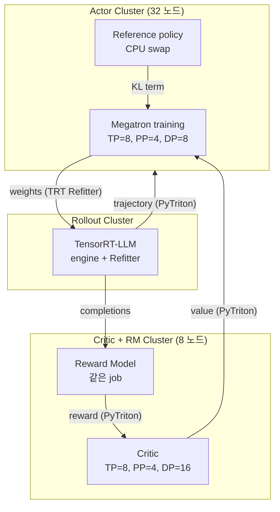

# NVIDIA NeMo-Aligner - Megatron 기반 alignment 툴킷

## 개요

NeMo-Aligner는 NVIDIA가 NeMo Framework + Megatron-LM Core 위에 구축한 distributed model alignment 툴킷이다. RLHF의 4-모델 구조(actor / critic / reward / reference)를 PyTriton 서버로 decouple하여 cluster 단위로 분리 운영하고, **TensorRT-LLM rollout**으로 generation phase를 6.96x 가속한 것이 핵심 기여다. 64+32 노드(H100 768개)까지 확장 데모를 보였다.

> **상태 안내**: 공식 repo는 **2025-11-19에 archive** 되었고, 후속 프로젝트는 **NeMo-RL** (vLLM/SGLang 추가 통합 + agentic RL 강화). NeMo-Aligner 자체는 여전히 reference 구현체로 활용된다.

- 공식 repo: [NVIDIA/NeMo-Aligner](https://github.com/NVIDIA/NeMo-Aligner) (archived)
- 논문: [NeMo-Aligner: Scalable Toolkit for Efficient Model Alignment (2405.01481)](https://arxiv.org/abs/2405.01481)
- 저자: Gerald Shen 외 (NVIDIA)
- 기반: Megatron-LM Core + NeMo Framework
- 가속화: TensorRT-LLM (rollout)

## 핵심 기여

1. **Megatron-Core 위에 3D parallelism (TP + PP + DP)** alignment 풀스택
2. **분산 PPO**: actor / critic / RM / reference 모델을 PyTriton 서버로 decouple
3. **TensorRT-LLM rollout**: weight refit으로 **6.96x speedup** (단일 최대 contributor)
4. **64+32 노드 (768 H100)** 까지 scale 데모

## 지원 알고리즘

- **SteerLM**: attribute-conditioned SFT — RLHF 없이 user-steerable 모델
- **DPO** (Direct Preference Optimization)
- **RLHF**: PPO 및 REINFORCE 변형
- **SPIN** (Self-Play Fine-Tuning) — weak → strong
- **Reward Model Training**
- SFT (foundation)

## 분산 토폴로지 - PPO 사례

- **3D parallelism 구성** 예시: actor 32 노드 (TP=8, PP=4, DP=8), critic 8 노드 (TP=8, PP=4, DP=16)
- **모델 합성**: SFT 모델 + actor를 같은 job에 → reference policy weight를 CPU로 swap; reward + critic을 같은 job에 → 메모리 절약
- **PyTriton 서버**: 각 component가 별도 cluster, async pipeline으로 통신
- **TensorRT 엔진 컴파일**: rollout 단계에서 모델을 TRT 엔진으로 컴파일, **TensorRT Refitter**로 weight in-place 갱신 (재컴파일 X)

## 통신 패턴

- intra-node / intra-cluster: Megatron-LM의 NCCL collective (TP, PP, DP all-reduce / all-gather)
- inter-cluster (actor cluster ↔ critic cluster ↔ reward cluster): **PyTriton HTTP/gRPC**
- weight sync (training → TRT rollout): **TensorRT Refitter API**

## rollout vs policy update

- TRT-LLM rollout(inference)과 Megatron training이 별도 cluster 또는 별도 GPU 그룹
- Async generation: rollout cluster가 끊임없이 trajectory 생성 → critic + actor cluster가 비동기 학습
- KL term 계산은 reference model이 actor와 동일 cluster에서 swap-in/out

## 메모리 / 처리량 최적화

- Megatron-Core의 selective activation checkpointing
- Reference policy CPU swap → VRAM 절약
- TensorRT-LLM custom kernel + paged KV cache
- **6.96x rollout speedup**이 전체 throughput에 가장 크게 기여

## 모델 / 처리량

- Llama 2 70B actor + 13B/70B critic 데모
- MT-Bench: NeMo-Aligner-aligned 70B = **7.59** vs baseline 6.86
- 768 H100에서 1.63x scale-up speedup

## 핵심 인용

> "NeMo-Aligner addresses scalability challenges by (I) building upon Megatron-LM with 3D (data, tensor, and pipeline)-parallelism training, (II) having a distributed approach to Proximal Policy Optimization (PPO) training in RLHF and (III) integrating PPO inference optimizations based on TensorRT-LLM during rollout stage." — paper §1

> "TensorRT-LLM during rollout stage ... delivers 6.96x speedup" — paper §5.2

## 운영 사례

- NVIDIA Nemotron 시리즈 (Llama-3.1-Nemotron-70B-Instruct 등) post-training
- AWS, Azure 위 NVIDIA H100 클러스터 reference architecture
- 후속 NeMo-RL이 vLLM/SGLang 추가 통합 + agentic RL 강화

## 다른 RLHF 프레임워크와 비교

| 시스템 | 컨트롤러 | 학습 backend | rollout backend | 비고 |
|--------|---------|--------------|----------------|------|
| NeMo-Aligner | multi (PyTriton) | Megatron-LM | TensorRT-LLM | NVIDIA stack 최적화 |
| [[verl-bytedance]] | hybrid | FSDP/Megatron | vLLM/SGLang | 3D-HybridEngine |
| [[openrlhf]] | hybrid (Ray) | DeepSpeed/FSDP | vLLM | 가장 빠른 대중화 |
| [[deepspeed-chat]] | single | DeepSpeed ZeRO | DeepSpeed-Inference | Hybrid Engine 원조 |

## 관련 문서

- [[megatron-lm]] - training core
- [[verl-bytedance]], [[openrlhf]], [[deepspeed-chat]] - 경쟁 프레임워크
- [[direct-preference-optimization]], [[rlhf-pipeline]] - 알고리즘
- [[rl-harness-frameworks-comparison]] - RL harness 통합 비교
