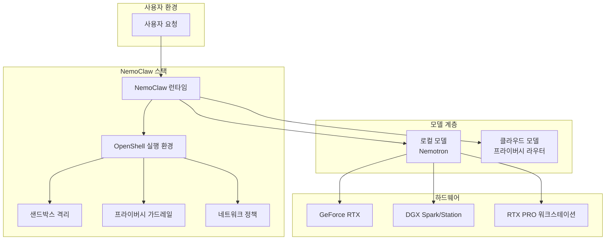
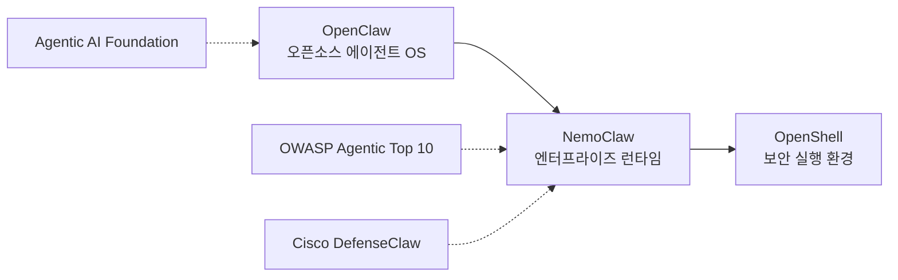

# NemoClaw + OpenShell

NemoClaw는 NVIDIA가 GTC 2026(2026년 3월 16일)에서 발표한 에이전틱 AI 런타임 소프트웨어 스택이다. 오픈소스 에이전트 플랫폼 OpenClaw 위에 프라이버시/보안 제어와 커널 레벨 샌드박싱을 추가한 엔터프라이즈급 런타임이며, 함께 발표된 OpenShell은 에이전트가 시스템 리소스에 접근하면서도 보안 정책을 준수하도록 하는 자율 에이전트 실행 환경이다.

## 왜 지금 중요한가

2026년 에이전틱 AI가 급속 확산되면서 에이전트의 보안/프라이버시가 최대 현안이 되었다. OWASP Top 10 for Agentic Applications가 발표되고, Cisco DefenseClaw 같은 보안 프레임워크가 잇따르는 가운데, NVIDIA는 하드웨어-소프트웨어 통합 관점에서 에이전트 보안 문제를 런타임 레벨에서 해결하려는 접근을 제시했다. Jensen Huang CEO는 "OpenClaw는 개인용 AI의 운영체제"라고 규정하며 에이전트 인프라의 표준화를 선언했다.

## 아키텍처

NemoClaw는 OpenClaw 플랫폼 위에서 보안/격리/정책 계층을 추가하고, OpenShell이 에이전트의 실제 실행 환경을 제공하는 3계층 구조다.

## 핵심 구성 요소

### NemoClaw 런타임

OpenClaw 플랫폼용 인프라 소프트웨어 스택으로, 단일 명령 설치를 지원한다. NVIDIA Nemotron 모델과 OpenShell 런타임을 한 번에 배포할 수 있으며, NVIDIA Agent Toolkit과 통합되어 에이전트 최적화를 수행한다.

### OpenShell

자율 에이전트가 파일 시스템, 네트워크, 실행 환경 등 시스템 리소스에 접근할 때 보안 정책을 시행하는 실행 환경이다. 핵심 기능:

- **격리된 샌드박스**: 에이전트별 독립 실행 환경 제공
- **정책 기반 보안**: 에이전트의 리소스 접근을 정책으로 세밀하게 제어
- **네트워크 가드레일**: 외부 통신 범위를 제한하여 데이터 유출 방지
- **프라이버시 라우터**: 민감 데이터가 클라우드로 전송될 때 자동 필터링

### 하이브리드 모델 실행

NemoClaw는 로컬과 클라우드 모델을 결합하는 하이브리드 실행을 지원한다:

- **로컬**: RTX PC, DGX Station, [[dgx-spark]] 등에서 Nemotron 오픈 모델 실행
- **클라우드**: 프라이버시 라우터를 통해 클라우드 기반 고급 모델 활용
- 에이전트가 새로운 기술을 습득하면서도 데이터 주권을 유지

## 지원 플랫폼

| 플랫폼 | 설명 |
|--------|------|
| GeForce RTX PC/노트북 | 소비자급 로컬 실행 |
| RTX PRO 워크스테이션 | 전문가급 워크로드 |
| DGX Spark | 개인용 AI 슈퍼컴퓨터 |
| DGX Station | 팀 레벨 AI 워크스테이션 |

## 생태계 위치

NemoClaw는 OpenClaw(에이전트 OS) - NemoClaw(엔터프라이즈 런타임) - OpenShell(보안 실행) 계층 구조에서 중간 인프라 역할을 한다. OWASP Agentic Top 10이 제시한 Agent Goal Hijack, Tool Misuse 같은 위협에 대해 런타임 레벨에서 방어를 제공하려는 설계 의도가 명확하다.

## 실무 관점

- 에이전트 보안을 애플리케이션 레벨이 아닌 런타임/커널 레벨에서 해결하려는 접근으로, 개별 에이전트 프레임워크마다 보안을 구현할 필요가 줄어든다
- NVIDIA 하드웨어 생태계(RTX, DGX)에 강하게 결합되어 있어 범용성은 제한적이다
- 하이브리드 모델 실행은 데이터 주권이 중요한 헬스케어/금융/공공 분야에서 핵심 요구사항이다
- OpenClaw가 AAIF(Agentic AI Foundation)의 거버넌스 범위에 들어올 가능성이 있어 표준화 동향을 주시해야 한다

## 관련 문서

- [[dgx-spark]] - NVIDIA 개인용 AI 슈퍼컴퓨터
- [[blackwell-ultra-b300]] - NemoClaw가 실행되는 GPU 하드웨어
