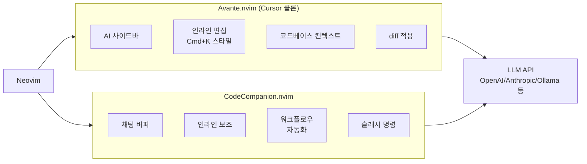
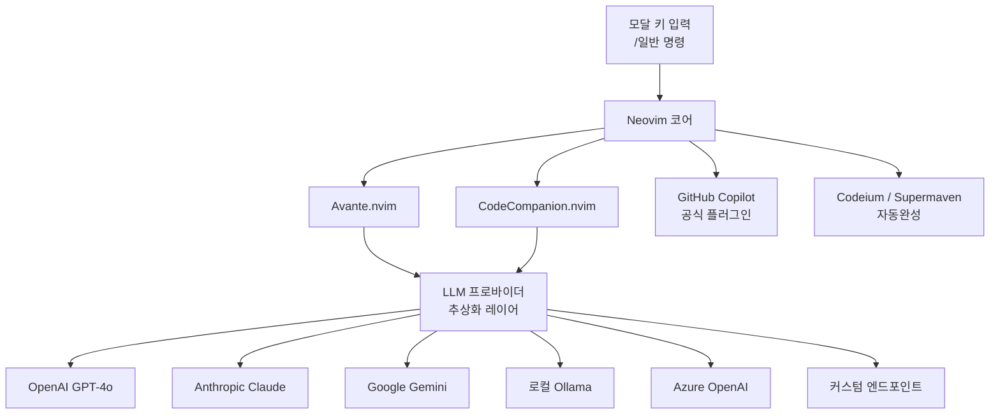
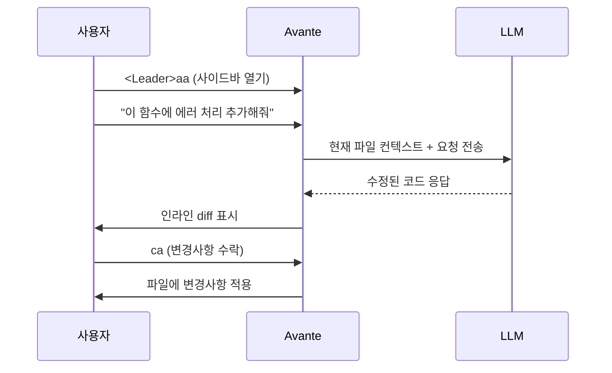
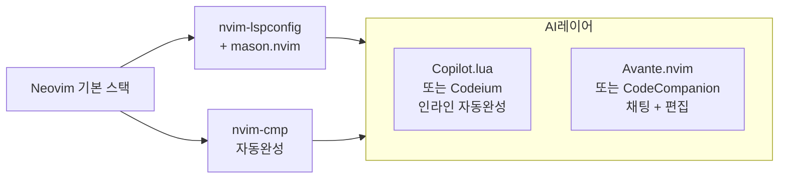

# Neovim AI 코딩 - Avante.nvim / CodeCompanion

## 정체성

Neovim은 Vim에서 파생된 터미널 기반 모달 에디터로, Lua 기반 플러그인 시스템 덕분에 VSCode 수준의 AI 코딩 통합이 가능한 몇 안 되는 터미널 에디터다. **Avante.nvim**과 **CodeCompanion.nvim**은 Cursor 스타일의 AI 사이드바, 인라인 편집, 멀티 LLM 지원을 Neovim 안에 구현한 대표 플러그인이다.

| 속성 | 값 |
|------|-----|
| 에디터 | Neovim 0.9+ |
| 핵심 플러그인 | Avante.nvim, CodeCompanion.nvim |
| 언어 | Lua (플러그인), C (Neovim 코어) |
| 라이선스 | MIT (두 플러그인 모두) |
| LLM 지원 | OpenAI, Anthropic, Gemini, Ollama, Azure 등 |

---

## 주요 플러그인 비교



### Avante.nvim

GitHub에서 Cursor 경험을 Neovim에 재현하는 것을 명시적 목표로 삼은 플러그인. 오른쪽 사이드바에 AI 채팅 패널이 열리고, 코드 변경사항은 인라인 diff로 표시된다.

- Cursor의 `Cmd+K` 인라인 편집을 재현: `<Leader>aa`
- AI 사이드바 토글: `<Leader>aa` 또는 설정 키
- 파일 참조: `@파일명` 문법
- 변경사항 수락/거절: `ca` / `cr`

### CodeCompanion.nvim

채팅 버퍼(chat buffer) 패러다임을 중심으로 설계된 플러그인. Neovim 버퍼 자체가 채팅 인터페이스가 되므로 모달 편집 문법이 그대로 적용된다.

- 채팅 버퍼 열기: `:CodeCompanionChat`
- 인라인 보조: `:CodeCompanionInlineAssist`
- 빠른 질의: `:CodeCompanion "질문"`
- 슬래시 명령: `/explain`, `/tests`, `/fix`, `/buffer` 등

---

## 아키텍처



Neovim의 AI 생태계는 단일 플러그인보다 여러 플러그인의 조합으로 구성되는 경우가 많다. 자동완성(Codeium/Copilot)과 채팅/에이전트(Avante/CodeCompanion)를 분리하여 사용하는 패턴이 일반적이다.

---

## Avante.nvim 상세

### 설치 (lazy.nvim)

```lua
-- lazy.nvim 플러그인 스펙
{
  "yetone/avante.nvim",
  event = "VeryLazy",
  lazy = false,
  version = false,
  opts = {
    provider = "claude",
    claude = {
      endpoint = "https://api.anthropic.com",
      model = "claude-sonnet-4-5",
      timeout = 30000,
      temperature = 0,
      max_tokens = 4096,
    },
  },
  build = "make",
  dependencies = {
    "stevearc/dressing.nvim",
    "nvim-lua/plenary.nvim",
    "MunifTanjim/nui.nvim",
    "hrsh7th/nvim-cmp",
    "nvim-tree/nvim-web-devicons",
    "zbirenbaum/copilot.lua",
    {
      "HakonHarnes/img-clip.nvim",
      event = "VeryLazy",
      opts = {
        default = { embed_image_as_base64 = false, prompt_for_file_name = false },
      },
    },
    {
      "MeanderingProgrammer/render-markdown.nvim",
      opts = { file_types = { "markdown", "Avante" } },
      ft = { "markdown", "Avante" },
    },
  },
}
```

### 핵심 워크플로우



### 멀티 LLM 전환

```lua
-- 런타임 중 LLM 전환
:AvanteSwitchProvider claude
:AvanteSwitchProvider openai
:AvanteSwitchProvider ollama
```

---

## CodeCompanion.nvim 상세

### 설치

```lua
{
  "olimorris/codecompanion.nvim",
  config = function()
    require("codecompanion").setup({
      strategies = {
        chat = { adapter = "anthropic" },
        inline = { adapter = "anthropic" },
      },
      adapters = {
        anthropic = function()
          return require("codecompanion.adapters").extend("anthropic", {
            env = { api_key = "ANTHROPIC_API_KEY" },
            schema = {
              model = { default = "claude-sonnet-4-5" },
            },
          })
        end,
        ollama = function()
          return require("codecompanion.adapters").extend("ollama", {
            schema = {
              model = { default = "codellama:13b" },
            },
          })
        end,
      },
    })
  end,
  dependencies = {
    "nvim-lua/plenary.nvim",
    "nvim-treesitter/nvim-treesitter",
  },
}
```

### 슬래시 명령

CodeCompanion의 강점 중 하나는 채팅 버퍼 내 슬래시 명령이다.

| 명령 | 기능 |
|------|------|
| `/buffer` | 현재 버퍼 내용을 컨텍스트에 추가 |
| `/file` | 특정 파일을 컨텍스트에 추가 |
| `/help` | Neovim `:help` 페이지 참조 |
| `/symbols` | LSP 심볼 목록 참조 |
| `/terminal` | 마지막 터미널 출력 포함 |
| `/now` | 현재 날짜/시간 삽입 |

### 워크플로우 자동화

CodeCompanion은 반복적인 AI 작업을 워크플로우로 정의할 수 있다.

```lua
-- 커스텀 워크플로우: 테스트 작성 + 실행
require("codecompanion").setup({
  strategies = {
    workflow = {
      adapter = "anthropic",
      roles = {
        llm = "You are a TDD expert. Write tests first, then implementation.",
        user = "Developer following TDD",
      },
    },
  },
})
```

---

## GitHub Copilot (공식 플러그인)

[[github-copilot|GitHub Copilot]]은 공식 Neovim 플러그인(`github/copilot.vim` 또는 `zbirenbaum/copilot.lua`)을 통해 인라인 자동완성을 제공한다. Copilot 자동완성을 베이스로 깔고 Avante/CodeCompanion으로 채팅/편집을 보완하는 조합이 인기 있다.

```lua
-- copilot.lua (Lua 기반 Copilot 클라이언트)
{
  "zbirenbaum/copilot.lua",
  cmd = "Copilot",
  event = "InsertEnter",
  config = function()
    require("copilot").setup({
      suggestion = {
        enabled = true,
        auto_trigger = true,
        keymap = {
          accept = "<Tab>",
          next = "<M-]>",
          prev = "<M-[>",
        },
      },
    })
  end,
}
```

---

## 권장 스택 조합



| 역할 | 추천 도구 | 대안 |
|------|-----------|------|
| 인라인 자동완성 | `copilot.lua` | `codeium.nvim`, `supermaven-nvim` |
| AI 채팅/편집 | `avante.nvim` (Cursor 유사) | `codecompanion.nvim` |
| 로컬 LLM | Ollama 연동 | LM Studio |

---

## 실무 사용 가이드

### 키 바인딩 설정 (init.lua)

```lua
-- Avante 키 바인딩
vim.keymap.set("n", "<leader>aa", "<cmd>AvanteAsk<cr>", { desc = "Avante AI 요청" })
vim.keymap.set("v", "<leader>ae", "<cmd>AvanteEdit<cr>", { desc = "선택 영역 편집" })
vim.keymap.set("n", "<leader>ar", "<cmd>AvanteRefresh<cr>", { desc = "Avante 새로고침" })

-- CodeCompanion 키 바인딩
vim.keymap.set("n", "<leader>cc", "<cmd>CodeCompanionChat Toggle<cr>", { desc = "AI 채팅" })
vim.keymap.set("v", "<leader>ci", "<cmd>CodeCompanionInline<cr>", { desc = "인라인 편집" })
```

### 로컬 LLM 연동 (Ollama)

```lua
-- CodeCompanion + Ollama 설정
adapters = {
  ollama = function()
    return require("codecompanion.adapters").extend("ollama", {
      schema = {
        model = { default = "deepseek-coder:6.7b" },
        num_ctx = { default = 16384 },
      },
    })
  end,
},
```

---

## 한계 / 트레이드오프

### 설정 복잡도

Neovim AI 스택은 강력하지만 초기 설정이 복잡하다. lazy.nvim, mason.nvim, nvim-lspconfig, cmp, Copilot, Avante 등을 올바르게 조합하려면 상당한 학습이 필요하다. Cursor나 [[void-editor-ai|Void]]는 설치 즉시 작동한다.

### GUI 부재

인라인 diff, AI 응답 렌더링, 이미지 삽입 등이 터미널 제약으로 GUI 에디터보다 불편하다. 특히 멀티모달(이미지 입력) 지원이 제한적이다.

### 플러그인 조각화

커뮤니티가 분산되어 있어 Avante와 CodeCompanion 중 어느 쪽이 더 발전할지 불확실하다. 두 플러그인이 비슷한 기능을 다르게 구현하여 통일된 경험이 없다.

### 서버 환경 강점

반대로, GUI가 없는 서버 SSH 환경에서 AI 코딩을 해야 한다면 Neovim이 사실상 유일한 선택지다. 이 점이 Neovim AI 플러그인 생태계가 유지되는 핵심 이유다.

---

## 왜 중요한가

Neovim AI 통합은 다음 사용자에게 중요하다:

1. **서버 전용 개발자**: SSH로 원격 서버에 접속해 작업하는 경우 GUI 에디터를 쓸 수 없다.
2. **Vim 마이그레이션**: 수년간 Vim 키 바인딩에 익숙해진 개발자가 AI 기능을 포기하지 않으려 할 때.
3. **완전 커스터마이징**: 에디터의 모든 측면을 Lua로 제어하고 싶은 파워유저.
4. **저사양 환경**: Electron 기반 VSCode/Cursor보다 메모리 사용량이 훨씬 낮다.

---

## 관련 문서

- [[helix-editor-ai]] - 비슷한 모달 에디터 계열 (AI 통합은 더 제한적)
- [[github-copilot]] - Neovim 공식 Copilot 플러그인 제공
- [[continue-vscode-extension]] - VSCode 기반의 유사 AI 코딩 도구
- [[ollama]] - 로컬 LLM (Neovim AI 플러그인과 연동)
- [[void-editor-ai]] - GUI 기반 Cursor 대안 (설정 없이 바로 사용)
