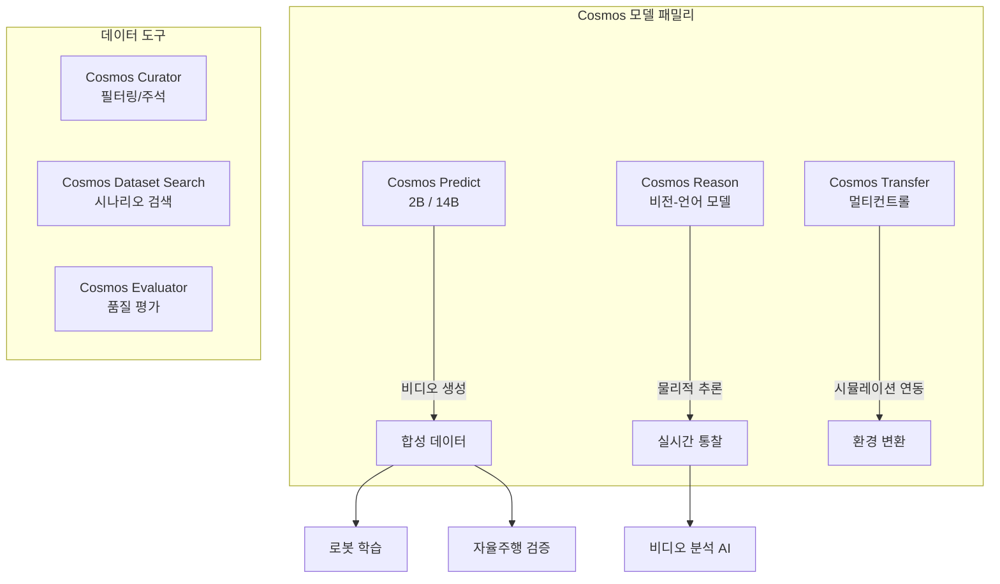

## 개요

NVIDIA Cosmos는 로봇, 자율주행, 산업 AI를 위한 물리 세계 기초 모델(World Foundation Model) 플랫폼이다. 약 9,000조 토큰 규모의 데이터로 학습되었으며, 물리 법칙을 이해하는 비디오 생성/예측/추론 능력을 제공한다. Cosmos Predict, Cosmos Reason, Cosmos Transfer 세 가지 모델 패밀리로 구성되어, 합성 데이터 생성부터 물리적 추론까지 포괄한다. GitHub과 Hugging Face에서 오픈 플랫폼으로 제공되며, 40개 이상의 주요 로봇/자율주행 기업이 채택했다. [[ai-scientific-discovery|AI 과학 발견]] 맥락에서 물리 시뮬레이션 기반 데이터 증강의 대표 사례이며, [[ai-robotics-physical-ai|AI 로봇공학 및 피지컬 AI]] 영역에서 합성 훈련 데이터 병목을 해소하는 핵심 인프라다.

## 핵심 특징

- **물리 법칙 이해**: 중력, 충돌, 마찰 등 물리적 상호작용을 반영한 비디오 예측
- **멀티모달 입력**: 텍스트, 이미지, 비디오에서 최대 30초의 예측 비디오 생성
- **합성 데이터 파이프라인**: 로봇/자율주행 훈련용 고충실도 합성 데이터 대량 생성
- **오픈 플랫폼**: 모델, 가드레일, 토크나이저 공개
- **NVIDIA Blackwell GB200 최적화**: 최신 하드웨어에서 최고 성능 지원

## 기술 상세

### 모델 패밀리

### Cosmos Predict 2.5

텍스트, 이미지, 비디오 입력으로부터 물리적으로 타당한 미래 비디오를 생성하는 핵심 모델이다. 2B와 14B 두 가지 크기로 제공된다.

- **최대 30초** 길이의 롱테일 시나리오 생성 지원
- 사용자 데이터로 후학습(post-training) 시 **최대 10배 높은 정확도** 달성
- 멀티뷰 출력 및 커스텀 카메라 레이아웃 지원
- 특정 도메인의 엣지 케이스와 로봇 중심 시뮬레이션 생성에 최적화

### Cosmos Reason 2

비전-언어 모델(Vision Transformer 기반) 기반으로 물리학, 상식 추론을 수행한다.

- **시공간 이해력 및 타임스탬프 정밀도** 향상
- **256K 입력 토큰**까지 확장된 장문 컨텍스트 지원
- ViT 기반 프리트레이닝 -> 지도학습 미세조정 -> 강화학습(규칙 기반 보상: 엔티티 인식, 공간 제약, 시간 추론) 3단계 파이프라인
- 로봇과 비전 AI 에이전트가 실시간 경고와 실행 가능한 통찰을 제공하도록 설계

### Cosmos Transfer 2.5

시뮬레이션 및 3D 공간 입력에서 더 빠르고 확장 가능한 데이터 증강을 위한 모델이다.

- ControlNet 아키텍처 기반으로 **spatiotemporal control maps** 활용
- CARLA, Isaac Sim 등 시뮬레이션 프레임워크와 연동
- 다양한 환경 조건(날씨, 조명, 시간대)에서의 합성 데이터 생성 가속화
- 구조화된 출력 생성으로 자율주행 시뮬레이션-실제 간 도메인 갭 최소화

### 활용 영역

| 영역 | 활용 방식 | Cosmos 모델 |
|------|----------|------------|
| 로봇 학습 | 로봇별 뷰, 제어 정책, VLA 모델 구축용 합성 데이터 | Predict 2.5 |
| 자율주행 | 고충실도 센서 데이터 생성, 훈련/테스트/검증 | Predict 2.5 + Transfer 2.5 |
| 산업 비디오 분석 | 안전/자동화/효율성 강화, 실시간 질의응답 | Reason 2 |
| 시뮬레이션-실제 전환 | 시뮬레이션 데이터를 실제 환경에 가까운 영상으로 변환 | Transfer 2.5 |
| 엣지 케이스 생성 | 실제 수집이 어려운 희귀 시나리오의 합성 데이터 생성 | Predict 2.5 |

### 학습 파이프라인

Cosmos의 학습은 세 단계로 구성된다:

1. **프리트레이닝**: Vision Transformer(ViT)를 사용하여 비디오 프레임을 구조화된 임베딩으로 처리. 약 9,000조 토큰 규모의 물리 시뮬레이션 데이터로 학습
2. **지도학습 미세조정(SFT)**: 물리 추론에 특화된 일반 및 도메인별 데이터로 세분화
3. **강화학습**: 규칙 기반 보상 신호(엔티티 인식, 공간 제약, 시간 추론)로 물리적 일관성 강화

### 데이터 처리 도구

- **Cosmos Curator**: 대규모 센서 데이터 필터링, 주석 처리, 중복 제거
- **Cosmos Dataset Search**: 데이터셋 쿼리 및 시나리오 검색
- **Cosmos Evaluator**: 생성된 비디오 출력 품질 평가

### 배포 및 채택

- GitHub과 Hugging Face에서 오픈 플랫폼으로 공개
- NVIDIA NIM 마이크로서비스로 배포 가능
- **40개 이상의 주요 로봇/자율주행 기업**이 채택
- NVIDIA Blackwell GB200 및 Vera Rubin GPU 아키텍처에 최적화
- Omniverse 플랫폼에서 수십억 개의 물리 정확 합성 상호작용 생성

## 관련 문서
- [[synthetic-data-tools]] -- 합성 데이터 생성 도구

- [[ai-reasoning-models]] - AI 추론 모델 패러다임
- [[test-time-compute-scaling]] - 추론 시 계산 확장
- [[open-source-ai-movement-2026]] - 2026 오픈소스 AI 생태계
