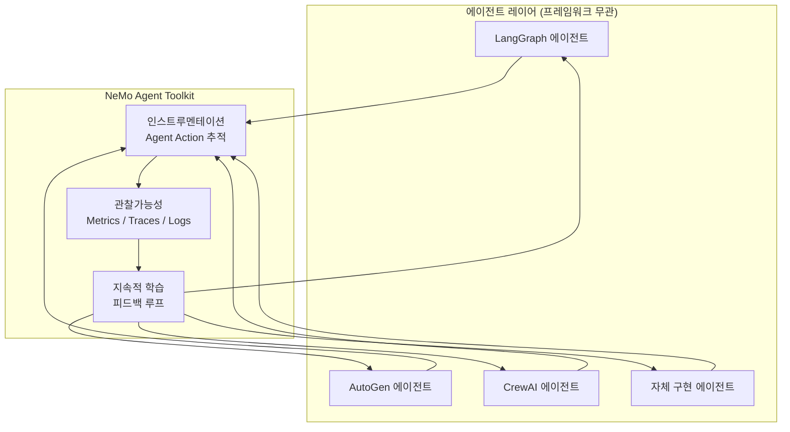
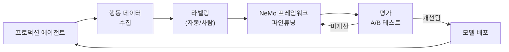
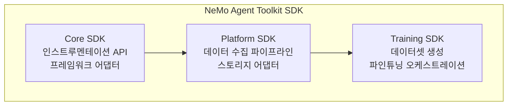
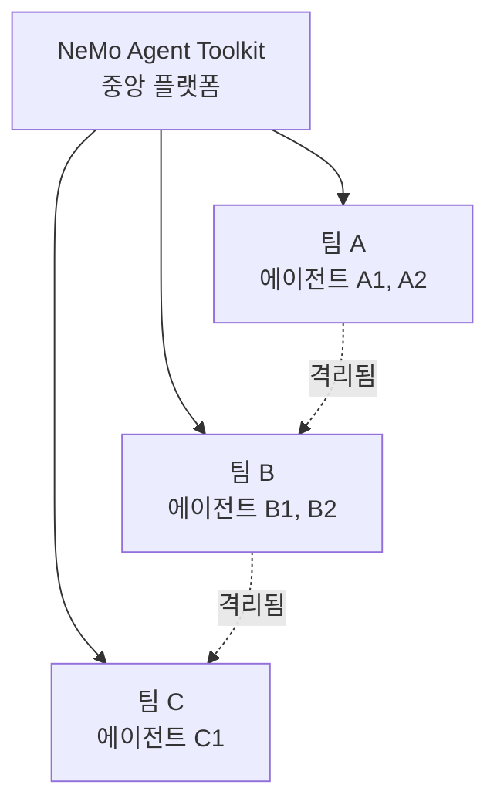
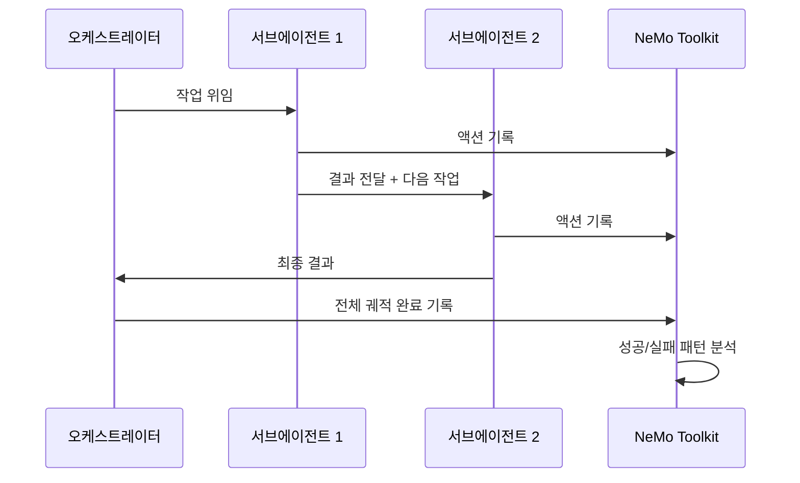

# NVIDIA NeMo Agent Toolkit

NVIDIA가 GTC 2026과 함께 공개한 오픈소스 에이전트 AI 라이브러리다. 특정 AI 프레임워크에 종속되지 않고 어떤 에이전트에도 지능을 추가할 수 있는 엔터프라이즈 도구로, 속도·정확도·의사결정 향상을 위한 인스트루멘테이션, 관찰가능성(observability), 지속적 학습 기능을 제공한다. Google Cloud Gemini Enterprise Agent Platform과의 통합이 2026년 4월 공동 발표됐다.

## 개요

NeMo Agent Toolkit은 기존 NeMo 프레임워크(학습 중심)와 달리 **에이전트 런타임 계층**에 집중한다. 프레임워크 종류(LangGraph, AutoGen, CrewAI, 사내 자체 구현 등)에 관계없이 에이전트의 행동을 모니터링하고, 문제를 발견하고, 개선하는 도구다.



에이전트 프레임워크들은 NeMo Toolkit의 인스트루멘테이션 레이어에 연결되고, 수집된 데이터는 관찰가능성 파이프라인을 통해 지속적 학습 루프로 피드백된다.

## 핵심 기능

### 1. 인스트루멘테이션 (Instrumentation)

에이전트의 모든 액션을 구조화된 이벤트로 기록한다.

- **도구 호출 추적**: 어떤 도구를 언제, 어떤 인자로, 어떤 결과와 함께 호출했는지
- **LLM 호출 로깅**: 프롬프트/응답/토큰 사용량/지연 시간 전체 캡처
- **에이전트 루프 분석**: 에이전트가 어떤 단계를 거쳐 최종 답변에 도달했는지 경로 추적
- **오류 및 재시도**: 실패한 도구 호출, 파싱 오류, 재시도 패턴 기록

```python
# NeMo Agent Toolkit 인스트루멘테이션 예시 (개념적)
from nemo_agent_toolkit import instrument  # [교차검증 필요] - 실제 임포트 경로 확인 필요

@instrument.agent
class MyAgent:
    def run(self, task: str):
        # 모든 LLM 호출, 도구 사용이 자동으로 추적됨
        result = self.llm.invoke(task)
        return result
```

### 2. 관찰가능성 (Observability)

수집된 인스트루멘테이션 데이터를 의미 있는 메트릭으로 변환한다.

| 메트릭 유형 | 측정 항목 | 활용 |
|-----------|---------|------|
| 성능 메트릭 | 응답 시간, 토큰 처리량, 도구 호출 지연 | 병목 식별 |
| 품질 메트릭 | 도구 호출 성공률, 작업 완료율 | 에이전트 신뢰도 측정 |
| 비용 메트릭 | LLM 호출당 비용, 총 토큰 사용량 | 비용 최적화 |
| 행동 메트릭 | 추론 단계 수, 루프 패턴 | 에이전트 설계 개선 |

NVIDIA는 NeMo Agent Toolkit의 관찰가능성 출력을 표준 OpenTelemetry 형식으로 내보내 Grafana, Prometheus, Jaeger 등 기존 모니터링 인프라와 통합할 수 있다고 발표했다. [교차검증 필요]

### 3. 지속적 학습 (Continuous Learning)

프로덕션 에이전트의 실제 행동 데이터로 모델을 지속적으로 개선하는 파이프라인이다.



이 파이프라인은 다음을 자동화한다.

- **데이터 큐레이션**: 성공/실패 에이전트 궤적을 자동으로 필터링
- **선호도 학습 데이터셋 생성**: 성공한 경로와 실패한 경로를 DPO/RLHF 학습 데이터로 변환
- **온라인 평가**: 새 모델이 기존 모델보다 나은지 자동 평가

## 아키텍처 상세

### SDK 구조

NeMo Agent Toolkit은 세 가지 SDK 컴포넌트로 구성된다.



### 프레임워크 어댑터

특정 에이전트 프레임워크를 NeMo Toolkit에 연결하는 어댑터 패턴을 사용한다.

| 프레임워크 | 어댑터 상태 |
|-----------|-----------|
| LangGraph | 공식 지원 |
| AutoGen | 공식 지원 |
| CrewAI | 공식 지원 |
| Semantic Kernel | 지원 예정 |
| 자체 구현 | SDK 직접 호출 |

## [[nvidia-nim-2026|NIM]]과의 통합

NeMo Agent Toolkit은 [[nvidia-nim-2026|NVIDIA NIM]]과 긴밀하게 통합된다.

- NIM을 통해 배포된 모델(Nemotron 3 등)의 추론 호출이 Toolkit에 자동으로 기록됨
- NIM 메트릭(처리량, 지연 시간, GPU 사용률)과 에이전트 메트릭을 단일 대시보드로 통합
- 파인튜닝된 새 모델을 NIM으로 즉시 배포하는 원클릭 파이프라인

## Google Cloud 통합

NVIDIA와 Google의 파트너십에 따라 NeMo Agent Toolkit은 Google Cloud Gemini Enterprise Agent Platform에 통합됐다.

구체적인 통합 내용:

1. **Vertex AI 에이전트 관찰가능성**: Google Cloud의 에이전트가 NeMo Toolkit 인스트루멘테이션을 통해 모니터링됨
2. **Nemotron 3 + NeMo Toolkit 번들**: Google Cloud에서 Nemotron 3를 사용하는 에이전트에 Toolkit이 자동 포함
3. **Google Cloud Monitoring 연동**: Toolkit 메트릭이 Google Cloud Operations Suite로 내보내짐

## 엔터프라이즈 기능

### 거버넌스 및 감사

- 모든 에이전트 액션의 불변 로그(immutable audit log)
- 규정 준수(HIPAA, GDPR) 요건에 맞는 PII 마스킹
- 역할 기반 접근 제어(RBAC)로 에이전트 데이터 접근 제한

### 멀티테넌시

여러 팀/조직이 동일 Toolkit 인프라를 격리된 형태로 공유할 수 있다.



### NemoClaw 보안

[[nvidia-nim-2026|NIM]] 섹션에서 언급된 NemoClaw(알파 프리뷰)는 NeMo Agent Toolkit과 연동되어 에이전트 AI 보안 및 거버넌스를 제공한다. 구체적으로는 프롬프트 인젝션 탐지, 민감 데이터 유출 방지, 에이전트 액션 화이트리스트 등이 포함된다.

## [[multi-agent-orchestration|멀티에이전트]] 시나리오

NeMo Agent Toolkit은 단일 에이전트보다 멀티에이전트 시스템에서 더 큰 가치를 발휘한다.



멀티에이전트 환경에서 어느 에이전트에서 오류가 발생했는지, 어떤 에이전트 간 통신이 병목인지를 추적하는 것이 핵심 가치다.

## 오픈소스 접근성

NeMo Agent Toolkit은 Apache 2.0 라이선스로 GitHub에 공개됐다. 엔터프라이즈 기능(멀티테넌시, 고급 보안, 클라우드 통합)은 별도 상업 라이선스로 제공될 수 있다. [교차검증 필요]

GitHub: `https://github.com/NVIDIA/NeMo-Agent-Toolkit`

## 관련 문서

- [[nvidia-nemotron-3-family]] - NeMo Agent Toolkit과 함께 사용하는 NVIDIA 오픈 모델 패밀리
- [[nvidia-nim-2026]] - NeMo Agent Toolkit이 통합되는 NIM 마이크로서비스 플랫폼
- [[multi-agent-orchestration]] - 멀티에이전트 시스템 설계 패턴
- [[agent-evaluation-framework]] - 에이전트 평가 방법론
- [[agent-debugging-techniques]] - 에이전트 디버깅 접근법
