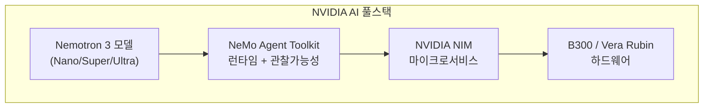
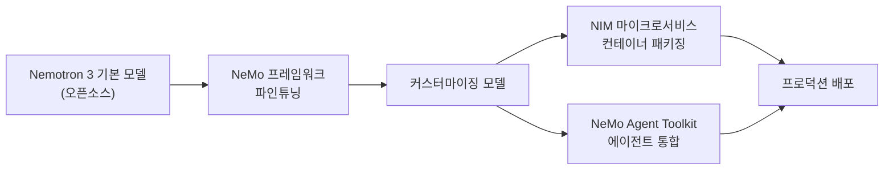
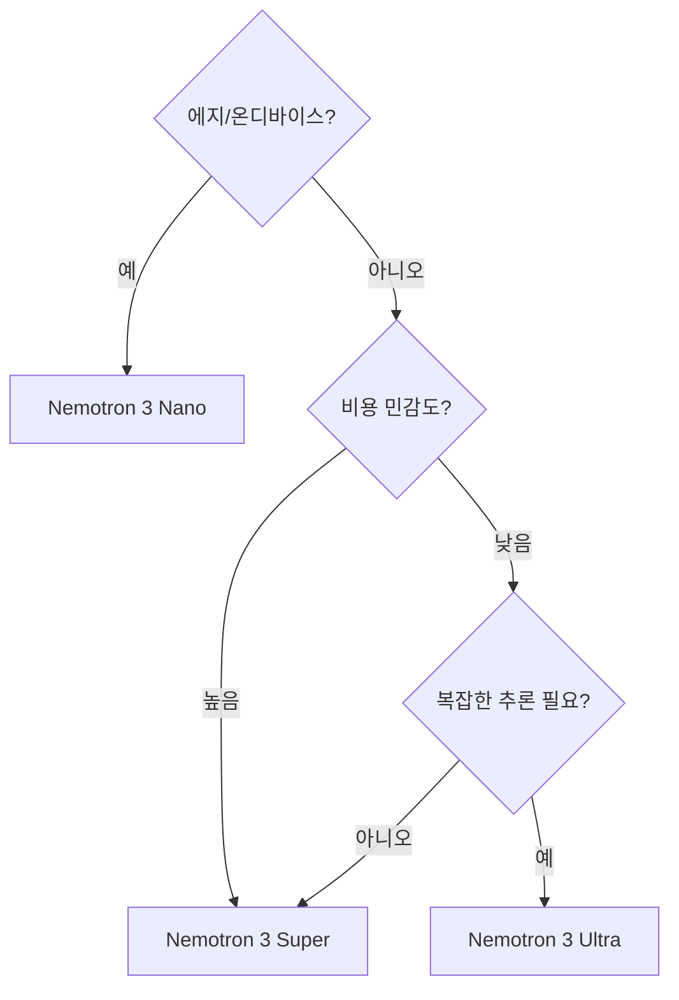

# NVIDIA Nemotron 3 오픈 모델 패밀리

NVIDIA가 GTC 2026(2026년 3월)에서 발표한 에이전틱 AI 특화 오픈 모델 패밀리다. Nano/Super/Ultra 세 가지 크기로 구성되며, NVIDIA는 "에이전틱 AI 애플리케이션 구축에 최적화된 가장 효율적인 오픈 모델 패밀리"라고 주장한다. [[meta-llama|Meta Llama]]와 경쟁하는 포지셔닝이며, Google Cloud의 Gemini Enterprise Agent Platform에도 탑재된다.

## 왜 중요한가

Nemotron 3 패밀리는 NVIDIA의 전략적 전환을 보여준다. NVIDIA는 더 이상 하드웨어와 CUDA 에코시스템만 파는 회사가 아니라, **모델 → 런타임 → 하드웨어** 수직 통합 스택을 제공하는 AI 인프라 기업으로 자리매김하려 한다.



이 수직 통합이 완성되면 고객은 NVIDIA 스택만으로 모델 선택부터 배포까지 해결하게 된다. Nemotron 3는 그 스택의 최상단, 즉 모델 계층을 오픈소스로 제공해 에코시스템 형성을 유도하는 전략이다.

## 모델 구성

### Nano / Super / Ultra 계층

| 티어 | 대상 사용 사례 | 파라미터 규모 (추정) | 출시 상태 |
|------|-------------|-------------------|---------|
| Nano | 온디바이스, 엣지 추론, 저지연 에이전트 | ~8B 이하 | GTC 2026 발표 |
| Super | 중간 규모 에이전트, 균형 성능/비용 | ~50-70B | 2026년 상반기 예정 |
| Ultra | 최고 성능, 복잡한 추론 에이전트 | ~400B+ | 2026년 상반기 예정 |

*파라미터 규모는 공식 발표가 없으므로 [교차검증 필요]. GTC 2026 발표 당시 Nano만 구체적 사양이 공개됐다.*

### 에이전틱 AI 특화 설계

Nemotron 3는 일반 목적 LLM과 달리 에이전트 워크플로에 최적화된 것이 차별점이다.

- **도구 호출 정확성**: ReAct, Function Calling 패턴에서 높은 신뢰도
- **지시 추종**: 복잡한 다단계 지시를 정확히 이행하는 능력
- **컨텍스트 관리**: 장기 에이전트 루프에서 컨텍스트를 효율적으로 활용
- **코드 생성**: 에이전트가 코드를 작성하고 실행하는 시나리오 최적화

## NeMo 프레임워크와의 통합

Nemotron 3는 NVIDIA NeMo 프레임워크로 파인튜닝하고, [[nvidia-nemo-agent-toolkit|NeMo Agent Toolkit]]으로 에이전트 애플리케이션에 통합하도록 설계됐다.



### NeMo 프레임워크 연계

- **Supervised Fine-Tuning (SFT)**: 도메인 특화 데이터로 Nemotron 3를 파인튜닝
- **RLHF/DPO**: 선호도 학습으로 에이전트 동작 정렬
- **Distillation**: Ultra 모델을 교사로 Nano 모델을 개선하는 지식 증류

## Google Cloud 파트너십

NVIDIA와 Google은 2026년 4월 Cloud Next에서 Nemotron 3 모델이 Google Cloud Gemini Enterprise Agent Platform에 통합된다고 공동 발표했다.

이 파트너십의 의미는 다음과 같다.

1. **Vertex AI에서 Nemotron 접근**: Google Cloud 고객이 Vertex AI를 통해 Nemotron 3 Nano/Super/Ultra를 사용 가능
2. **NeMo Agent Toolkit + Gemini 플랫폼**: NVIDIA의 에이전트 관찰가능성 도구가 Google의 에이전트 플랫폼에 내장
3. **경쟁 관계의 협력**: Gemini와 Nemotron은 직접 경쟁 모델이지만, 인프라 계층에서는 협력하는 "코피티션(coopetition)" 전략

## build.nvidia.com에서의 접근

Nemotron 3는 NVIDIA의 API 플랫폼 `build.nvidia.com`에서 무료 추론 API로 제공된다. OpenAI 호환 REST API로 접근하며, 상업적 배포를 위해서는 [[nvidia-nim-2026|NIM 마이크로서비스]]를 자체 인프라에 배포한다.

```python
# Nemotron 3 API 호출 예시 (OpenAI 호환)
from openai import OpenAI

client = OpenAI(
    base_url="https://integrate.api.nvidia.com/v1",
    api_key="<NVIDIA API KEY>"
)

completion = client.chat.completions.create(
    model="nvidia/nemotron-3-ultra",  # [교차검증 필요] - 실제 모델 ID 확인 필요
    messages=[
        {"role": "user", "content": "에이전트 플래닝 작업을 수행해줘"}
    ]
)
```

## [[reasoning-llm|추론 모델]] 역량

Nemotron 3 Ultra는 [[reasoning-llm|추론 강화 LLM]] 패러다임을 채용해, 복잡한 다단계 문제에서 chain-of-thought를 자동으로 활성화한다. 이는 에이전트가 복잡한 계획을 수립하거나 디버깅할 때 특히 중요하다.

- **Self-consistency**: 동일 문제를 여러 방식으로 풀어 최적 답변 선택
- **Tree-of-Thought**: 분기 탐색으로 복잡한 에이전트 계획 수립
- **Reflexion**: 실패한 시도에서 학습해 재시도

## 이전 Nemotron 버전과의 비교

| 버전 | 특징 | 출시 |
|------|------|------|
| Nemotron-3 8B | 첫 공개 8B 모델 | 2024년 |
| Nemotron-4 15B | 코드/수학 특화 | 2024년 |
| Nemotron-4 340B | 대형 오픈 모델 | 2024년 |
| Nemotron-3 패밀리 | Nano/Super/Ultra 에이전틱 특화 | 2026년 GTC |

버전 번호가 "Nemotron-3"으로 돌아간 것은 이전 Nemotron-4 시리즈와 명확히 구분되는 새로운 아키텍처/트레이닝 패러다임임을 시사한다.

## 오픈소스 전략

NVIDIA는 Nemotron 3를 오픈소스(또는 오픈 가중치)로 공개해 개발자 커뮤니티를 유입시키는 전략을 취한다. 이는 [[meta-llama|Meta Llama 4]]와 유사한 접근법이다.

- **Hugging Face 배포**: 모델 가중치를 Hugging Face Hub에서 무료 다운로드 가능
- **상업적 이용**: 일정 규모 이하 기업은 무료 상업 이용 허용 (라이선스 세부사항 [교차검증 필요])
- **NIM 배포**: 상업적 대규모 배포는 NIM 마이크로서비스를 통해

## 실무 활용 가이드

### 에이전트 시스템 구축 시 모델 선택



### 파인튜닝 권장 시나리오

1. **도메인 특화 도구 호출**: 의료/법률/금융 등 특수 API 호출 정확도 향상
2. **다국어 에이전트**: 한국어 등 비영어권 에이전트 성능 개선
3. **코드 에이전트**: 특정 프레임워크/언어 전문 에이전트

## 관련 문서

- [[nvidia-nemo-agent-toolkit]] - Nemotron 3를 에이전트에 통합하는 NVIDIA 런타임
- [[nvidia-nim-2026]] - Nemotron 3 배포를 위한 NIM 마이크로서비스
- [[meta-llama]] - Nemotron 3의 경쟁 오픈 모델 패밀리
- [[reasoning-llm]] - 추론 강화 LLM 패러다임
- [[multi-agent-orchestration]] - Nemotron 3를 활용한 멀티에이전트 시스템
