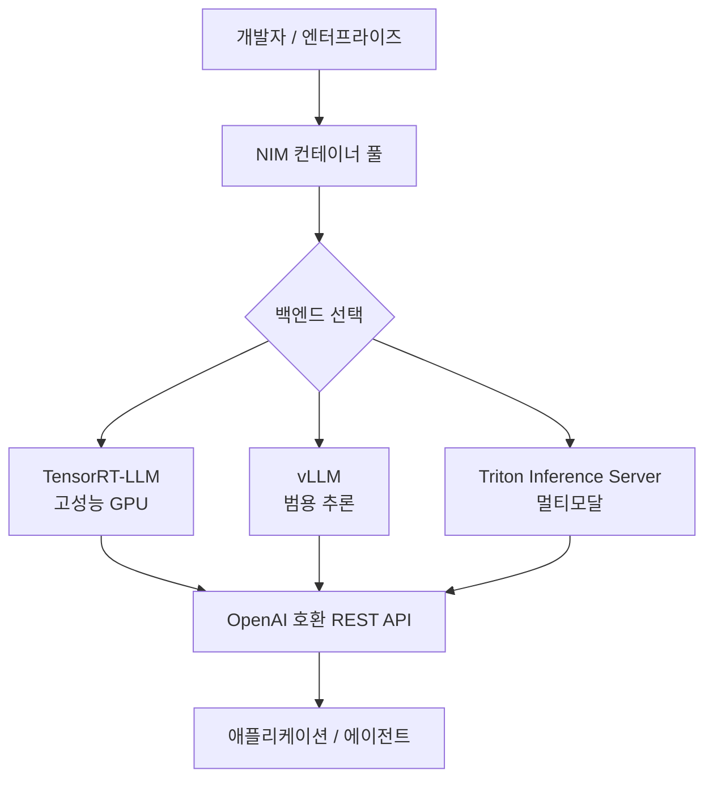
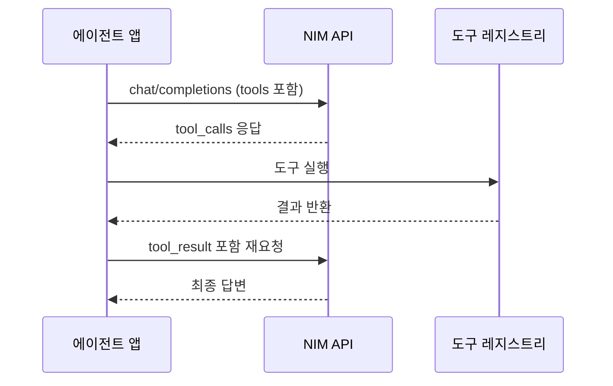
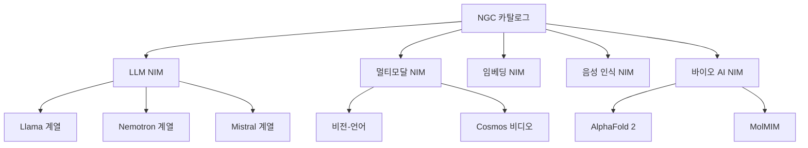

# NVIDIA NIM 마이크로서비스 2026 업데이트

NVIDIA NIM(NVIDIA Inference Microservices)은 사전 최적화된 LLM 및 AI 모델을 컨테이너 형태로 배포하는 엔터프라이즈 추론 플랫폼이다. 2026년에는 모델 패밀리 확장, 에이전트 파이프라인 통합, 엣지 추론 지원 등 대규모 업데이트가 이루어졌다.

## 개요

NIM은 "모델을 API로"라는 단일 목표를 중심으로 설계된 마이크로서비스 컨테이너다. 개발자는 복잡한 추론 스택 설정 없이 도커 명령 하나로 프로덕션 수준의 LLM API를 띄울 수 있다. 내부적으로는 TensorRT-LLM, vLLM, Triton Inference Server를 상황에 맞게 선택해 최적화된 추론을 제공한다.



위 다이어그램은 NIM이 다양한 백엔드를 추상화하고 단일 OpenAI 호환 API로 노출하는 구조를 보여준다.

## 핵심 아키텍처

### 컨테이너 구조

NIM 컨테이너는 다음 세 레이어로 구성된다:

- **모델 레이어**: 사전 최적화된 엔진 파일 (TensorRT 엔진, GGUF, 또는 원본 가중치)
- **런타임 레이어**: TensorRT-LLM / vLLM / Triton 중 모델에 최적화된 백엔드 자동 선택
- **서빙 레이어**: OpenAI 호환 `/v1/chat/completions`, `/v1/embeddings` 등 표준 엔드포인트

### 최적화 파이프라인


NIM은 GPU 아키텍처(Hopper, Ada, Ampere)를 자동 감지하고 해당 GPU에 최적화된 엔진을 로딩한다. 개발자가 직접 컴파일할 필요가 없다.

## 2026년 주요 업데이트

### 1. 모델 패밀리 대폭 확장

2026년 기준 NIM에서 지원하는 주요 모델 패밀리:

| 카테고리 | 모델 |
|----------|------|
| 텍스트 생성 | [[nvidia-nemotron-3-family]], Llama 3.x 패밀리, Mistral 계열 |
| 멀티모달 | Llama 3.2 Vision, NVILA, Cosmos |
| 임베딩 | NV-Embed-v2, E5 계열 |
| 리랭킹 | NV-RerankQA-Mistral-4B |
| 음성 | Parakeet TDT, Canary |
| 코드 | Codestral, DeepSeek-Coder-V2 |

[[nvidia-nemotron-3-family]]는 NVIDIA가 직접 학습한 오픈 모델 패밀리로, NIM에서 가장 최적화된 성능을 보인다.

### 2. 에이전트 파이프라인 네이티브 통합

[[nvidia-nemo-agent-toolkit]]과의 통합으로 NIM이 단순 추론 엔드포인트를 넘어 에이전트 파이프라인의 구성 요소로 동작한다:

- **도구 호출(function calling)**: OpenAI 호환 방식 + NVIDIA 확장 스키마
- **구조화 출력(structured output)**: JSON Schema 강제 적용, 오류율 대폭 감소
- **멀티모달 체인**: 이미지 → 텍스트 → 코드 생성을 단일 NIM 파이프라인으로



### 3. 엣지/온프레미스 배포 강화

2026년에는 데이터센터 외에도 엣지 환경을 위한 경량 NIM 프로파일이 추가됐다:

- **NIM Lite**: RTX 4090급 소비자 GPU에서도 동작하는 경량 프로파일
- **NIM Air-Gap**: 인터넷 단절 환경(의료, 국방)용 완전 자가포함 패키지
- **NIM on Jetson**: NVIDIA Jetson Orin을 위한 ARM 최적화 빌드

이는 [[ai-accelerators]] 생태계가 데이터센터에서 엣지로 확장되는 트렌드와 맞닿아 있다.

### 4. 성능 지표 (2026 기준 대표값)

다음 수치는 공개 벤치마크 기반 참고값이다. 실제 환경에 따라 달라질 수 있다.

| 모델 | GPU | 처리량(tok/s) | 첫 토큰 지연 |
|------|-----|--------------|------------|
| Llama 3.1 70B (FP8) | H100 x2 | ~4,000 | ~50ms |
| Llama 3.1 8B (FP8) | H100 x1 | ~12,000 | ~15ms |
| Nemotron-4 340B | H100 x8 | ~1,200 | ~200ms |

### 5. 보안 및 거버넌스

엔터프라이즈 배포를 위한 보안 기능이 강화됐다:

- **NVIDIA AI Enterprise 라이선스**: 상업적 사용 지원, SLA 보장
- **프라이빗 레지스트리 지원**: NGC 대신 사내 레지스트리에서 이미지 관리
- **감사 로깅**: 모든 추론 요청에 대한 메타데이터 기록 (프롬프트 내용 제외 옵션)
- **네트워크 격리**: 에어갭 환경에서 NGC 접근 없이 동작 가능

## 배포 패턴

### 기본 단일 NIM 배포

```bash
# NGC API 키 설정 후
docker run --gpus all \
  -e NGC_API_KEY=$NGC_API_KEY \
  -p 8000:8000 \
  nvcr.io/nim/meta/llama-3.1-8b-instruct:latest
```

### 쿠버네티스 환경 (Helm)

NIM Operator를 통해 쿠버네티스 클러스터에서 자동 스케일링 및 멀티 NIM 오케스트레이션이 가능하다.

```yaml
# 간략화된 NIMService CRD 예시
apiVersion: apps.nvidia.com/v1alpha1
kind: NIMService
metadata:
  name: llama-8b
spec:
  model:
    name: meta/llama-3.1-8b-instruct
  replicas: 2
  resources:
    gpu: 1
```

### LangChain / LlamaIndex 통합

NIM은 OpenAI 호환 API를 제공하므로 기존 LangChain 코드에서 `base_url`만 변경하면 즉시 연동된다:

```python
from langchain_openai import ChatOpenAI

llm = ChatOpenAI(
    base_url="http://0.0.0.0:8000/v1",
    api_key="not-needed",
    model="meta/llama-3.1-8b-instruct",
)
```

## NIM 카탈로그 구조



NVIDIA는 NIM을 LLM에 국한하지 않고 생명과학, 기후 모델 등 도메인별 AI 서비스로 확장하고 있다.

## 경쟁 포지셔닝

| 솔루션 | 특징 | NIM 대비 차이점 |
|--------|------|----------------|
| vLLM (자체 운영) | 오픈소스, 유연성 높음 | NIM은 사전 최적화 + 엔터프라이즈 지원 제공 |
| Ollama | 개발자 친화적, 경량 | NIM은 프로덕션 스케일, GPU 군집 지원 |
| TGI (HuggingFace) | 다양한 모델 지원 | NIM은 NVIDIA GPU 특화 최적화 우위 |
| Together AI / Anyscale | 완관리형 클라우드 | NIM은 온프레미스/하이브리드 배포 가능 |

## 실무 활용 포인트

- **프로토타입 → 프로덕션 전환**: 개발 시 Ollama를 사용하다 프로덕션에서 NIM으로 전환 시 API가 동일해 코드 변경 최소화
- **비용 최적화**: TensorRT-LLM 기반 NIM은 동일 GPU에서 vLLM 대비 30-50% 높은 처리량을 보고하는 경우가 있음 [교차검증 필요]
- **모델 업데이트**: NGC에서 새 버전 태그를 pull하는 것만으로 모델 업데이트 완료

## 관련 문서

- [[nvidia-nemotron-3-family]] - NIM에서 가장 최적화된 NVIDIA 자체 모델 패밀리
- [[nvidia-nemo-agent-toolkit]] - NIM과 연동되는 에이전트 파이프라인 빌더
- [[ai-accelerators]] - NIM이 활용하는 GPU/가속기 하드웨어 생태계
