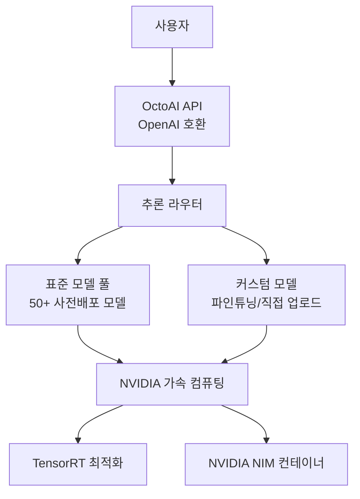
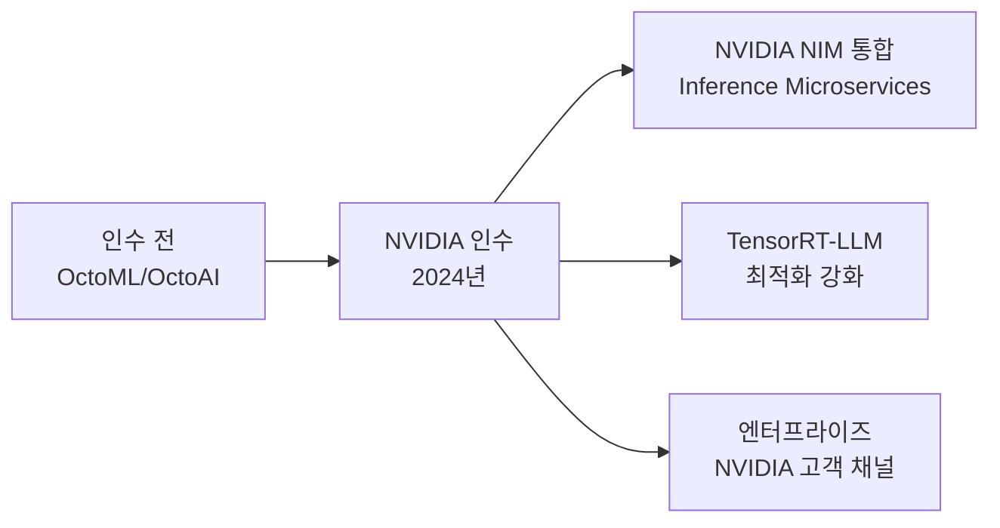

# OctoAI - 모델 호스팅 및 추론 플랫폼

OctoAI는 오픈소스 및 커스텀 AI 모델을 위한 클라우드 추론 플랫폼이다. 원래 Octoml이라는 이름으로 ML 모델 최적화·배포 도구로 시작했으나 이후 생성형 AI 추론 서비스로 피벗하였고, 2024년 NVIDIA에 인수되었다. 50개 이상의 사전 배포된 오픈소스 모델과 커스텀 모델 파인튜닝·배포 기능을 제공하며, NVIDIA의 가속 컴퓨팅 기술과 통합을 통해 높은 추론 성능을 제공한다.

## 정체성

| 항목 | 내용 |
|------|------|
| 공식 명칭 | OctoAI |
| 구 명칭 | OctoML |
| 회사 | OctoAI (NVIDIA 인수, 2024년) |
| 설립 | 2019년 (OctoML로 시작) |
| 피벗 | 2023년 ML 최적화 → 생성형 AI 추론 |
| 인수 | NVIDIA, 2024년 |
| 공식 문서 | https://octoai.cloud/docs |
| 가격 모델 | 토큰/이미지/초당 과금, 커스텀 엔터프라이즈 계약 |

> **주의:** NVIDIA 인수 이후 서비스 통합 및 브랜딩이 변경 중일 수 있다. 최신 서비스 상태는 공식 문서에서 확인 필요. [교차검증 필요]

## 핵심 아키텍처



위 다이어그램은 OctoAI 플랫폼의 추론 경로를 개략적으로 보여준다. NVIDIA 인수 이후 NIM(NVIDIA Inference Microservices) 통합이 강화되었다.

## 제공 모델 카탈로그

OctoAI는 주요 오픈소스 모델을 즉시 사용 가능한 API 엔드포인트로 제공한다:

### 텍스트 생성 (LLM)
- **Llama 3** 계열 (8B, 70B, 405B Instruct)
- **Mistral/Mixtral** 계열 (7B, 8x7B, 8x22B)
- **Qwen** 계열
- **Code Llama** (코드 특화)
- **Gemma** 계열

### 이미지 생성
- **SDXL** (Stable Diffusion XL)
- **SDXL Turbo**
- **ControlNet** 계열
- **IP-Adapter**

### 멀티모달
- **LLaVA** 계열 (이미지+텍스트)

## 핵심 기능

### 1. OpenAI 호환 API

기존 OpenAI API를 사용하는 코드를 최소 수정으로 OctoAI로 마이그레이션할 수 있다:

```python
from openai import OpenAI

# OctoAI 엔드포인트로 교체 (OpenAI SDK 그대로 사용)
client = OpenAI(
    base_url="https://text.octoai.run/v1",
    api_key="OCTOAI_API_KEY"  # OctoAI API 키
)

응답 = client.chat.completions.create(
    model="meta-llama-3-8b-instruct",  # OctoAI 모델명
    messages=[
        {"role": "system", "content": "당신은 도움이 되는 AI 어시스턴트입니다."},
        {"role": "user", "content": "파이썬에서 데코레이터를 설명해줘"}
    ],
    max_tokens=1000,
    temperature=0.7
)

print(응답.choices[0].message.content)
```

### 2. 커스텀 모델 파인튜닝

OctoAI는 자체 플랫폼 내에서 모델 파인튜닝을 지원한다. 특히 이미지 생성 모델의 커스텀 LoRA(Low-Rank Adaptation) 학습이 강점이었다:

```python
import octoai

client = octoai.Client()

# 이미지 생성 LoRA 파인튜닝 작업 제출
파인튜닝_작업 = client.fine_tuning.create(
    name="custom-product-style",
    model_type="sdxl",
    training_data_url="s3://my-bucket/training-images/",
    hyperparameters={
        "learning_rate": 1e-4,
        "num_train_epochs": 100,
    }
)

print(f"작업 ID: {파인튜닝_작업.id}")
```

### 3. 고성능 이미지 생성

OctoAI는 SDXL 기반 이미지 생성을 특히 빠른 속도로 제공한다. 다양한 LoRA와 ControlNet을 파라미터로 조합 가능:

```python
import octoai
import base64
from PIL import Image
import io

client = octoai.Client()

이미지_응답 = client.image_gen.generate(
    prompt="한국 전통 한복을 입은 AI 로봇, 디지털 아트, 하이퍼리얼",
    negative_prompt="흐림, 저해상도",
    model="sdxl",
    width=1024,
    height=1024,
    num_images=1,
    steps=30,
    cfg_scale=7.5
)

# base64 이미지 저장
이미지_데이터 = base64.b64decode(이미지_응답.images[0].image_b64)
이미지 = Image.open(io.BytesIO(이미지_데이터))
이미지.save("generated.png")
```

### 4. 커스텀 엔드포인트 (Custom Endpoints)

Docker 이미지를 OctoAI에 업로드하여 자체 모델을 서비스할 수 있다:

```python
# 커스텀 컨테이너 배포
엔드포인트 = client.endpoints.create(
    name="my-custom-model",
    hardware="a10g-large",
    image="my-registry.io/my-model:latest",
    env_vars={"MODEL_PATH": "/models/custom"},
    min_replicas=1,
    max_replicas=5
)
```

## NVIDIA 인수 이후 변화

2024년 NVIDIA 인수는 OctoAI에 여러 기술적 변화를 가져왔다:



- **NVIDIA NIM 통합:** NIM(NVIDIA Inference Microservices) 컨테이너 기반으로 서비스 재구성 중
- **TensorRT-LLM 최적화:** NVIDIA GPU에서 최대 성능을 내는 TensorRT 커널 자동 적용
- **엔터프라이즈 포지셔닝:** NVIDIA 클라우드 파트너사와 협력 확대

## 차별점 - 경쟁 서비스 비교

| 항목 | OctoAI | Together AI | Fireworks AI | Replicate |
|------|--------|-------------|--------------|-----------|
| NVIDIA 통합 | 매우 강함 (인수) | 보통 | 보통 | 보통 |
| 모델 수 | 50+ | 100+ | 50+ | 수천 (커뮤니티) |
| 이미지 생성 | 강점 | 약 | 보통 | 강점 |
| 커스텀 배포 | 지원 | 제한적 | 지원 | 지원 (cog) |
| OpenAI 호환 | 네 | 네 | 네 | 부분 |
| 파인튜닝 | 지원 | 제한적 | 제한적 | 지원 |

OctoAI(NVIDIA)의 가장 강력한 포지션은 엔터프라이즈 NVIDIA 고객에게 검증된 추론 성능을 제공하는 것이다. 개인 개발자 생태계보다는 기업 계약 채널에서 강하다.

## 실무 활용 패턴

### LLM + 이미지 생성 멀티모달 파이프라인

```python
from openai import OpenAI
import octoai

텍스트_클라이언트 = OpenAI(
    base_url="https://text.octoai.run/v1",
    api_key="OCTOAI_API_KEY"
)
이미지_클라이언트 = octoai.Client()

def 텍스트_to_이미지_파이프라인(사용자_아이디어: str) -> bytes:
    """LLM으로 프롬프트 강화 후 이미지 생성"""
    
    # 1단계: LLM으로 이미지 프롬프트 강화
    프롬프트_강화_응답 = 텍스트_클라이언트.chat.completions.create(
        model="meta-llama-3-70b-instruct",
        messages=[{
            "role": "user",
            "content": f"다음 아이디어를 Stable Diffusion에 적합한 상세한 영문 이미지 프롬프트로 변환해줘: {사용자_아이디어}"
        }],
        max_tokens=200
    )
    강화된_프롬프트 = 프롬프트_강화_응답.choices[0].message.content
    
    # 2단계: 강화된 프롬프트로 이미지 생성
    이미지_응답 = 이미지_클라이언트.image_gen.generate(
        prompt=강화된_프롬프트,
        model="sdxl",
        width=1024,
        height=1024,
    )
    
    import base64
    return base64.b64decode(이미지_응답.images[0].image_b64)

# 사용 예시
이미지_데이터 = 텍스트_to_이미지_파이프라인("미래 서울의 야경, 사이버펑크 스타일")
with open("output.png", "wb") as f:
    f.write(이미지_데이터)
```

## 한계 및 트레이드오프

### NVIDIA 인수 이후 불확실성
NVIDIA 인수 이후 OctoAI의 독립적인 제품 로드맵과 가격 정책이 변동 중이다. 장기적으로 NVIDIA Cloud(NGC) 또는 NIM 마켓플레이스로 통합될 가능성이 있다. [교차검증 필요: 2024년 이후 최신 서비스 상태 직접 확인 권장]

### 개발자 생태계
Together AI, Fireworks AI 등에 비해 개발자 커뮤니티와 오픈소스 통합 예제가 적다.

### 모델 다양성
Replicate(수천 개 커뮤니티 모델)에 비해 공식 지원 모델 수가 제한적이다. 실험적이거나 특수 목적 모델은 직접 배포해야 한다.

### 가격 투명성
엔터프라이즈 플랜 가격이 공개되지 않는 경우가 많다.

## 관련 문서

- [[together-ai-inference]] - Together AI 추론 플랫폼 (경쟁 서비스)
- [[fireworks-ai-platform]] - Fireworks AI 추론 플랫폼 (경쟁 서비스)
- [[nvidia-nim]] - NVIDIA NIM 추론 마이크로서비스
- [[inferless-deployment]] - Inferless 서버리스 GPU (비교 대상)
- [[groq-cloud-api]] - Groq LPU 추론 클라우드
- [[openrouter]] - OpenRouter 멀티모델 라우팅
