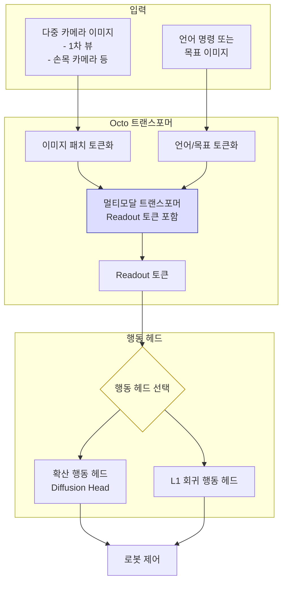

# Octo 로봇 정책 모델

## 개요

Octo는 UC Berkeley, Stanford, CMU 등 여러 대학 연구팀이 공동 개발한 **범용 로봇 조작 파운데이션 모델(robot manipulation foundation model)**이다. 2024년에 공개된 이 모델은 [[open-x-embodiment]] 데이터셋을 포함한 다양한 로봇 데이터로 사전학습되어, 새로운 로봇이나 태스크에 소량의 데이터만으로 파인튜닝(fine-tuning)할 수 있도록 설계되었다.

특히 Octo는 완전 오픈소스로 공개되어, 커뮤니티가 직접 파인튜닝하거나 새로운 로봇 플랫폼에 적용할 수 있다는 점에서 실용적 의의가 크다.

## 아키텍처

Octo의 핵심 설계는 **Readout 토큰**이다. 트랜스포머가 관찰 토큰들을 처리하는 과정에서 학습 가능한 readout 토큰들이 멀티모달 컨텍스트를 집약하고, 이를 행동 헤드가 소비해 실제 제어값을 출력한다.

행동 헤드는 [[diffusion-policy]] 방식(확산 기반)과 단순 L1 회귀 방식 두 가지를 모두 지원하며, 태스크와 계산 예산에 따라 선택한다.

## 주요 특징

### 범용 임베디먼트 지원

Octo는 다양한 로봇 형태(embodiment)를 단일 모델로 지원하도록 설계되었다. 7-DoF 로봇 팔, 쌍팔 로봇, 이동 조작 로봇 등 다른 형태의 로봇을 동일한 가중치로 구동할 수 있다.

### 유연한 입력 모달리티

- 언어 명령: 자연어로 태스크 지시
- 목표 이미지: 도달해야 할 최종 상태 이미지 제공
- 다중 카메라: 1차 뷰 + 손목 카메라 등 여러 시점 동시 처리

### 파인튜닝 친화 설계

새 로봇 플랫폼 적응에 필요한 데이터가 적다. 새로운 카메라 뷰나 행동 공간을 도입할 때 모델 전체를 재학습하지 않고, 입력/출력 어댑터만 추가해 파인튜닝할 수 있다.

## 훈련 데이터

Octo는 [[open-x-embodiment]] 데이터셋의 일부를 포함한 약 80만 개의 로봇 조작 궤적(trajectory)으로 사전학습되었다. 데이터는 다음을 포함한다.

| 데이터 유형 | 규모 |
|-------------|------|
| 픽-앤-플레이스 | 다수 환경, 다수 물체 |
| 서랍/문 열기 | 다양한 가구 유형 |
| 도구 사용 | 국자, 집게 등 |
| 정밀 조작 | 블록 쌓기, 조립 등 |

## VLA 모델과의 비교

| 측면 | Octo | RT-2 ([[rt-2-vision-language-action]]) |
|------|------|-----------------------------------------|
| 오픈소스 여부 | 완전 공개 | 비공개 |
| 규모 | 93M 파라미터 | 55B 파라미터 |
| 파인튜닝 용이성 | 높음 | 낮음 (접근 불가) |
| 언어 추론 | 제한적 | 강함 (VLM 기반) |
| 행동 헤드 | 확산/L1 선택 가능 | 이산 토큰 |

## 실무 적용

Octo는 [[lerobot-framework]] 등 오픈소스 로봇 프레임워크와 함께 사용될 수 있으며, 로봇 연구자들이 자체 하드웨어에 파인튜닝해 사용하는 기반 모델로 활용된다.

## 관련 문서

- [[vla-models]] - 비전-언어-행동 모델 일반 개념
- [[diffusion-policy]] - Octo 행동 헤드에서 사용하는 확산 기반 정책
- [[open-x-embodiment]] - 사전학습 데이터 출처
- [[rt-2-vision-language-action]] - Google의 대형 VLA 모델 (비교 대상)
- [[lerobot-framework]] - 오픈소스 로봇 학습 프레임워크
