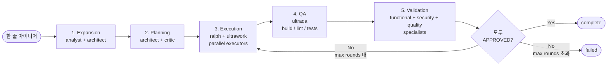

# OMC Autopilot

> 아이디어 한 줄에서 검증된 동작 코드까지. 5-Phase 자율 실행 파이프라인.

## 개요

Autopilot은 OMC의 **end-to-end 자율 실행 모드**다. 사용자가 아이디어를 주면, 에이전트가 요구사항을 확장하고, 플랜을 짜고, 코드를 작성하고, QA를 돌리고, 최종 검증까지 마친 후 완료를 보고한다. 사람 개입 없이 전체 개발 라이프사이클을 커버한다.

## 호출 방법

```bash
# 슬래시 명령
/autopilot "build a REST API for managing tasks"

# 매직 키워드 트리거
autopilot build me a todo app
autopilot: implement user authentication with OAuth
```

활성 키워드: `autopilot`, `build me`, `I want a`, `handle it all`, `end to end`, `auto-pilot`, `full auto`, `fullsend`, `e2e this`

## 5-Phase 파이프라인



각 페이즈는 자신의 산출물을 `.omc/autopilot/` 또는 `.omc/state/autopilot-state.json`에 저장하고 다음 페이즈로 전이된다. Validation에서 reject되면 Execution으로 돌아가는 피드백 루프가 있다.

### Phase 1: Expansion (확장)

`analyst` + `architect` 에이전트가 사용자의 한 줄 아이디어를 **기술 스펙**으로 확장.

- 요구사항 명확화
- 숨은 제약 식별
- 수용 기준 정의
- 기술 스펙 문서를 `.omc/autopilot/spec.md`에 저장
- 최대 반복: `maxExpansionIterations` (기본 2)

### Phase 2: Planning (기획)

`architect`가 실행 플랜을 작성, `critic`이 검증.

- 태스크 분해
- 의존성 플래그
- 리스크 식별
- 플랜 문서를 `.omc/plans/autopilot-impl.md`에 저장
- 최대 반복: `maxArchitectIterations` (기본 5)

### Phase 3: Execution (실행)

`ralph` + `ultrawork` 조합으로 플랜을 병렬 구현.

- 여러 executor 에이전트가 동시 작업
- `parallelExecutors` 기본 5개
- 상태는 실시간으로 `.omc/state/autopilot-state.json`에 기록

### Phase 4: QA (품질 보증)

`ultraqa` 스킬이 build/lint/tests 통과 보장.

- 실패 시 자동 수정 후 재검증
- 최대 사이클: `maxQaCycles` (기본 5)
- 테스트 실패가 지속되면 executor에 fix 요청

### Phase 5: Validation (최종 검증)

전문 architect들이 3가지 측면 리뷰:

- **Functional**: 기능이 스펙대로 동작하는가
- **Security**: 보안 취약점 없는가
- **Quality**: 코드 품질 기준 충족하는가

각 architect는 verdict를 내린다: `APPROVED` | `REJECTED` | `NEEDS_FIX`.

모두 APPROVED → `complete`. 하나라도 아니면 다시 Execution으로.

- 최대 라운드: `maxValidationRounds` (기본 3)

## 상태 구조

```typescript
interface AutopilotState {
  active: boolean;
  phase: AutopilotPhase;        // expansion|planning|execution|qa|validation|complete|failed
  iteration: number;
  max_iterations: number;
  originalIdea: string;

  expansion: AutopilotExpansion;
  planning: AutopilotPlanning;
  execution: AutopilotExecution;
  qa: AutopilotQA;
  validation: AutopilotValidation;

  started_at: string;
  completed_at: string | null;
  phase_durations: Record<string, number>;
  total_agents_spawned: number;
  wisdom_entries: number;
  session_id?: string;
}
```

상태는 `.omc/state/autopilot-state.json`에 지속 저장된다.

## 설정

```typescript
interface AutopilotConfig {
  maxIterations?: number;              // 기본: 10
  maxExpansionIterations?: number;     // 기본: 2
  maxArchitectIterations?: number;     // 기본: 5
  maxQaCycles?: number;                // 기본: 5
  maxValidationRounds?: number;        // 기본: 3
  parallelExecutors?: number;          // 기본: 5
  pauseAfterExpansion?: boolean;       // 기본: false
  pauseAfterPlanning?: boolean;        // 기본: false
  skipQa?: boolean;                    // 기본: false
  skipValidation?: boolean;            // 기본: false
  autoCommit?: boolean;                // 기본: false
  validationArchitects?: ValidationVerdictType[];
}
```

## API (개발자 관점)

### 초기화 & 상태

```typescript
initAutopilot(directory, idea, sessionId?, config?): AutopilotState
readAutopilotState(directory): AutopilotState | null
writeAutopilotState(directory, state): boolean
clearAutopilotState(directory): boolean
isAutopilotActive(directory): boolean
```

### 단계 전환

```typescript
transitionPhase(directory, newPhase): AutopilotState | null
transitionRalphToUltraQA(directory, sessionId): TransitionResult
transitionUltraQAToValidation(directory): TransitionResult
transitionToComplete(directory): TransitionResult
transitionToFailed(directory, error): TransitionResult
```

### 프롬프트 생성

```typescript
getExpansionPrompt(idea): string
getDirectPlanningPrompt(specPath): string
getExecutionPrompt(planPath): string
getQAPrompt(): string
getValidationPrompt(specPath): string
getPhasePrompt(phase, context): string
getTransitionPrompt(fromPhase, toPhase): string
```

### 검증 조율

```typescript
type ValidationVerdictType = 'functional' | 'security' | 'quality';
type ValidationVerdict = 'APPROVED' | 'REJECTED' | 'NEEDS_FIX';

recordValidationVerdict(directory, type, verdict, issues?): boolean
getValidationStatus(directory): ValidationCoordinatorResult | null
startValidationRound(directory): boolean
shouldRetryValidation(directory, maxRounds?): boolean
getIssuesToFix(directory): string[]
```

### 취소 & 재개

```typescript
cancelAutopilot(directory): CancelResult
clearAutopilot(directory): CancelResult
canResumeAutopilot(directory): { canResume, state?, resumePhase? }
resumeAutopilot(directory): { success, message, state? }
```

## 사용 예 (개발자)

```typescript
import {
  initAutopilot,
  readAutopilotState,
  transitionRalphToUltraQA,
  getValidationStatus,
  generateSummary,
  formatSummary
} from '@/hooks/autopilot';

// 세션 초기화
const idea = 'Create a REST API for todo management with authentication';
const state = initAutopilot(process.cwd(), idea, 'ses_abc123');

// 진행 상황 조회
const current = readAutopilotState(process.cwd());
console.log(`Phase: ${current?.phase}`);
console.log(`Agents spawned: ${current?.total_agents_spawned}`);

// 단계 전환
if (current?.phase === 'execution' && current.execution.ralph_completed_at) {
  transitionRalphToUltraQA(process.cwd(), 'ses_abc123');
}

// 검증 확인
const v = getValidationStatus(process.cwd());
if (v?.allApproved) {
  console.log(formatSummary(generateSummary(process.cwd())!));
}
```

## HUD 상태 표시

실행 중에는 Claude Code 상태바에서 확인:

```
[OMC] autopilot:execution | agents:3 | todos:2/5 | ctx:45%
```

| 필드 | 의미 |
|---|---|
| `autopilot:execution` | 현재 autopilot 페이즈 |
| `agents:3` | 활성 에이전트 수 |
| `todos:2/5` | 완료/전체 태스크 |
| `ctx:45%` | 컨텍스트 윈도우 사용률 |

## 경로

| 경로 | 용도 |
|---|---|
| `.omc/autopilot/spec.md` | Expansion 단계 기술 스펙 |
| `.omc/plans/autopilot-impl.md` | Planning 단계 실행 플랜 |
| `.omc/state/autopilot-state.json` | 페이즈·이터레이션·메트릭 |

## 실무 고려사항

- **너무 모호한 아이디어는 금물**: "make it faster" 같은 건 Expansion이 빙글빙글 돈다 → `/deep-interview` 먼저
- **autoCommit 주의**: 기본 false. 프로덕션 레포에서 함부로 켜지 말 것
- **예산 관리**: 5-phase × 여러 에이전트 = 토큰 비용 높음. 소규모 작업은 Ultrawork나 Ralph가 더 효율적
- **취소 방법**: `cancelomc` 또는 `/oh-my-claudecode:cancel`
- **재개 가능**: 중단되어도 `.omc/state/autopilot-state.json`이 남아 있어 다음 세션에서 resumable

## 관련 문서

- [[oh-my-claudecode (OMC)]]
- [[OMC Execution Modes]]
- [[OMC Ralph Mode]]
- [[OMC Ultrawork]]
- [[OMC Deep Interview]]
- [[OMC State Management]]
- [[OMC Agent Catalog]]
