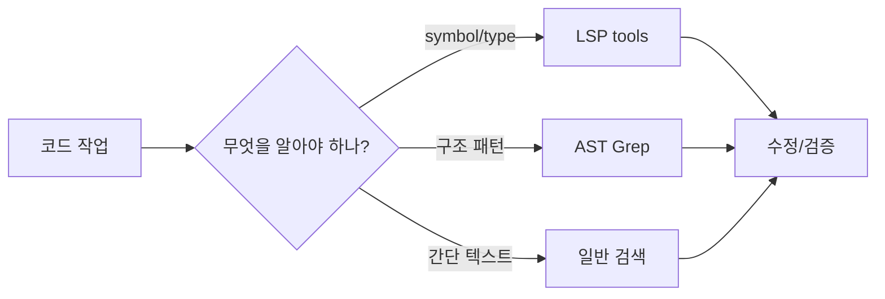

# OMC MCP Tools

OMC MCP Tools는 oh-my-claudecode가 에이전트 내부 실행 중 사용하는 MCP 도구군을 정리한 project-internal 문서다. 사용자가 직접 호출하는 skill과 달리, 이 도구들은 에이전트가 상태를 읽고 쓰고, 작업 기억을 보존하고, 코드 지능을 호출하고, 세션 흔적을 추적하기 위해 쓰인다. 따라서 이 페이지는 일반적인 MCP 설명이 아니라 **OMC 런타임이 장기 작업을 어떻게 안정화하는가**를 보여 주는 내부 스냅샷으로 읽어야 한다.

## 왜 별도 노드로 승격했나

`raw/2026-04-09-omc-TOOLS.md`는 한동안 raw snapshot으로만 남아 있었고, 기존 OMC 허브 문서가 일부 내용을 간접적으로 흡수하고 있었다. 그러나 원문은 State, Notepad, Project Memory, LSP, AST Grep, Python REPL, Session Search, Trace, Shared Memory, Skills, Deepinit Manifest까지 OMC 내부 도구 체계를 한 문서에서 나열한다. 이 정도 범위는 단순 출처 부록이 아니라 독립적인 project-internal 노드로 승격할 가치가 있다.

## 도구군 개요

| 도구군 | 역할 | 위키에서 읽는 관점 |
|---|---|---|
| State | autopilot, ralph, ultrawork 같은 실행 모드의 active/phase/iteration 상태를 관리한다 | 장기 작업을 대화 history가 아니라 파일 상태로 이어가는 핵심 계층 |
| Notepad | context compaction 이후에도 복원될 작업 메모를 저장한다 | 단기 작업 기억과 진행상황 복구 장치 |
| Project Memory | 프로젝트 단위 장기 기억과 지시문을 저장한다 | 세션을 넘어 유지되는 팀/프로젝트 규칙 저장소 |
| LSP | hover, references, symbols, diagnostics 등 언어 서버 기반 코드 지능을 제공한다 | grep보다 구조적인 코드 이해 레이어 |
| AST Grep | AST 패턴 기반 검색과 치환을 제공한다 | 문자열 검색으로 놓치기 쉬운 구조적 리팩터링에 적합 |
| Python REPL | 지속 Python 실행 환경을 제공한다 | 데이터 분석, 임시 계산, 반복 실험을 위한 작업대 |
| Session Search | 이전 세션 기록을 검색한다 | 과거 결정과 맥락 회수 수단 |
| Trace | 에이전트 흐름 타임라인과 요약을 보여준다 | 오케스트레이션 디버깅과 사후 분석 레이어 |
| Shared Memory | 팀/멀티에이전트 간 공유 메모리를 관리한다 | 팀 모드에서 분산 작업 상태를 맞추는 보조 저장소 |
| Skills | OMC skill 목록과 로딩을 지원한다 | 사용자 호출 skill과 내부 도구 연결부 |
| Deepinit Manifest | AGENTS.md 재생성 manifest를 다룬다 | 대형 프로젝트 온보딩과 문서 재생성의 증분 추적 수단 |

## 상태 관리 계층

State 도구군은 `.omc/state/` 아래에 mode별 JSON 상태를 저장한다. 원문은 session-scoped 경로와 legacy fallback 경로를 함께 설명한다. 이는 OMC가 단일 대화에만 의존하지 않고, `sessions/{sessionId}/ralph-state.json`처럼 세션 단위 상태 파일을 진실의 원천으로 삼는다는 뜻이다.

핵심 도구는 다음과 같이 나뉜다.

- `state_read`: 특정 mode의 현재 상태를 읽는다.
- `state_write`: active, current_phase, iteration 같은 값을 저장한다.
- `state_clear`: mode 상태를 지운다.
- `state_list_active`: 현재 활성화된 세션과 mode를 나열한다.
- `state_get_status`: 특정 세션의 mode 상태 요약을 반환한다.

이 계층은 [[ralph-pattern|Ralph Pattern]]과 직접 연결된다. Ralph류 루프가 반복 실행될 수 있는 이유는 “대화가 기억한다”가 아니라 “파일 상태가 기억한다”는 전제 덕분이다.

## 메모리 계층: Notepad와 Project Memory

Notepad와 Project Memory는 둘 다 기억을 다루지만 목적이 다르다. Notepad는 context window compaction 이후에도 되살려야 하는 현재 작업 정보를 저장한다. 예를 들어 “auth module 리팩터링 중이고 3/5 파일 완료” 같은 진행 상태가 여기에 어울린다. Project Memory는 프로젝트 전체에 적용되는 장기 규칙과 지시문을 담는다. 예를 들어 “PostgreSQL에서 MySQL로 바꾸지 말 것” 같은 의사결정은 Project Memory 지시문에 가깝다.

| 비교 축 | Notepad | Project Memory |
|---|---|---|
| 시간 범위 | 현재 세션과 가까운 작업 맥락 | 세션을 넘어 유지되는 프로젝트 규칙 |
| 대표 내용 | 진행상황, 다음 단계, 임시 관찰 | 아키텍처 결정, 금지 사항, 빌드/테스트 규칙 |
| 위험 | 너무 많이 쌓이면 noise가 된다 | 오래된 directive가 현실과 어긋날 수 있다 |
| 사용 기준 | compaction 후 복구가 필요하면 기록 | 다음 세션에도 적용되어야 하면 기록 |

이 구분은 장기 실행 에이전트에서 매우 중요하다. 모든 것을 장기 기억으로 올리면 오래된 정보가 정책처럼 굳어지고, 모든 것을 단기 메모로만 두면 다음 세션이 같은 결정을 다시 탐색한다.

## 코드 지능 계층: LSP와 AST Grep

LSP 도구군은 코드베이스를 “문자열 덩어리”가 아니라 symbol graph로 다루기 위한 계층이다. 원문은 hover, go-to-definition, references, document symbols, workspace symbols, diagnostics, rename, code actions 등을 나열한다. 이 도구들은 단순 검색보다 비용이 크지만, 타입 오류나 symbol 관계를 다룰 때 정확도가 높다.

AST Grep은 또 다른 축이다. LSP가 언어 서버의 의미 정보를 활용한다면, AST Grep은 코드 구조 패턴을 직접 찾고 바꾸는 데 적합하다. 예를 들어 특정 함수 호출 형태를 전역에서 바꾸거나, 같은 구조의 조건문을 찾아 리팩터링할 때 regex보다 안전한 선택지가 된다.

이 다이어그램은 OMC 도구 계층이 단일 검색 명령으로 끝나지 않고, 작업 성격에 따라 code intelligence 도구를 선택하게 만든다는 점을 보여 준다.

## 분석·추적 계층

Python REPL은 일회성 shell 실행보다 길게 유지되는 계산 공간을 제공한다. 원문은 데이터 분석, 임시 실험, 반복 계산 같은 use case를 강조한다. Session Search와 Trace는 현재 작업의 시간적 맥락을 복원하는 데 쓰인다. Session Search는 과거 세션 기록을 찾고, Trace는 에이전트 흐름의 timeline과 summary를 제공한다.

이 계층은 “왜 에이전트가 이런 결정을 했는가”를 나중에 설명하는 데 필요하다. 단순히 테스트가 실패했다는 사실보다, 어떤 mode transition과 어떤 도구 호출 뒤에 실패했는지를 봐야 재발 방지 지침을 만들 수 있기 때문이다.

## 팀 조정 계층

Shared Memory는 team coordination을 위한 cross-agent 메모리다. 원문은 write, read, list, delete, cleanup 계열 도구를 설명한다. 이 기능은 단일 에이전트가 아니라 여러 작업자가 같은 목표를 나누어 수행할 때 의미가 커진다. 다만 공유 메모리는 강력한 만큼 오염 위험도 있다. 공유해야 할 것은 “누가 어떤 파일을 맡았는가”, “공통 결정은 무엇인가”, “어떤 blocker가 있는가” 같은 조정 정보이지, 각 에이전트의 모든 추론 과정은 아니다.

## 관련 문서

- [[oh-my-claudecode|oh-my-claudecode (OMC)]]
- [[omc-state-management|OMC State Management]]
- [[omc-ralph-mode|OMC Ralph Mode]]
- [[omc-autopilot|OMC Autopilot]]
- [[multi-agent-orchestration|Multi-Agent Orchestration]]

## 일반 MCP와 구분되는 점

이 페이지의 도구들은 MCP라는 이름을 공유하지만, 공개 프로토콜 설명서가 아니라 OMC 내부 오케스트레이션을 위한 작업 도구에 가깝다. 따라서 [[model-context-protocol-mcp|Model Context Protocol (MCP)]] 페이지처럼 host/client/server 상호운용성을 설명하는 노드와 섞어 읽으면 안 된다. 여기서 중요한 질문은 “어떤 외부 서버와 연결되는가”가 아니라 “에이전트가 긴 작업 중 자기 상태와 작업 기억을 어떻게 잃지 않는가”다.

후속 편집에서 이 문서를 더 확장한다면 각 도구군별 실패 모드를 따로 분리하는 것이 좋다. 예를 들어 State는 stale active state, Notepad는 오래된 작업 메모, Project Memory는 부정확한 장기 지시문, LSP는 언어 서버 미설치, AST Grep은 잘못된 구조 패턴 같은 위험을 갖는다. 이 위험 목록을 운영 runbook으로 만들면 OMC 사용자가 문제 발생 시 어떤 도구 계층을 먼저 점검해야 하는지 빠르게 찾을 수 있다.

