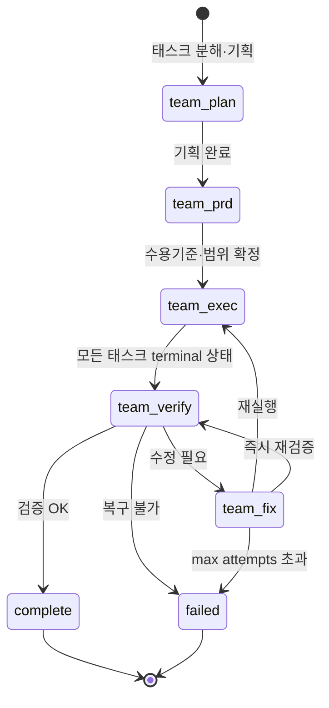

# OMC Team Mode

> OMC v4.1.7부터의 **canonical 오케스트레이션 표면**. `swarm` 키워드를 대체한 공식 다중 에이전트 표준.

## 개요

Team 모드는 여러 Claude 에이전트가 **공유 태스크 리스트**를 가지고 staged 파이프라인으로 협업하는 방식이다. 복잡한 기능 개발처럼 체계적 조율이 필요한 작업에 적합.

v4.1.7부터 legacy `swarm` 키워드·스킬은 제거됨. `team`만 사용.

## 호출 방법

### In-session ([[claude-code|Claude Code]] 내부)

```bash
/team 3:executor "fix all TypeScript errors"
/oh-my-claudecode:team 3:executor "implement fullstack todo app"
```

### Terminal CLI (tmux 기반)

```bash
omc team 2:codex "review auth module for security issues"
omc team 2:gemini "redesign UI components for accessibility"
omc team 1:claude "implement the payment flow"
omc team status auth-review
omc team shutdown auth-review
```

**주의**: `/team`과 `omc team`은 **다른 런타임**이다:
- `/team`: Claude Code 내부 native team workflow
- `omc team`: tmux 기반 실제 CLI 프로세스 (claude/codex/gemini)

## 왜 팀 키워드는 자동 감지 안 되나

`team` 키워드는 [[omc-magic-keyword]] 감지 대상이 **아니다**. 이유는 **무한 재귀 방지**: 팀 모드 안에서 매직 키워드 감지가 또 `team`을 트리거하면 worker가 계속 spawn되며 폭주한다.

따라서 반드시 `/team` 슬래시 명령이나 `omc team` CLI로 명시 호출해야 한다.

## 활성화

Claude Code 실험 기능 플래그 필요:

```json
// ~/.claude/settings.json
{
  "env": {
    "CLAUDE_CODE_EXPERIMENTAL_AGENT_TEAMS": "1"
  }
}
```

비활성화 상태에서는 OMC가 경고 후 non-team 실행으로 fallback한다.

## Staged Pipeline (5-Stage)



상태 파일은 `.omc/state/team/`에 지속 저장되며, 기존 state가 남아 있으면 마지막 미완료 stage부터 재개 가능하다.

### team-plan

- 태스크 분해 및 기획
- 의존성·리스크 식별
- 다음 단계 진입 조건: 기획/분해 완료

### team-prd

- 수용 기준(acceptance criteria) 명시
- 범위(scope) 확정
- PRD(Product Requirements Document) 작성
- 다음 단계 진입 조건: 수용 기준과 범위가 명시됨

### team-exec

- 여러 executor 에이전트가 공유 태스크 리스트에서 작업을 가져가 수행
- 병렬 실행 가능
- 다음 단계 진입 조건: 모든 실행 태스크가 terminal 상태 도달

### team-verify

- verifier가 완료 근거 수집
- 테스트·빌드·린트·기능 확인
- 다음 단계 분기:
  - 모두 OK → `complete`
  - 수정 필요 → `team-fix`
  - 복구 불가 → `failed`

### team-fix (loop)

- 검증 실패 이슈 수정
- 다시 `team-exec` 또는 `team-verify`로 복귀
- **max attempts 경계**: 초과 시 `failed`로 전이

## Terminal States

- `complete` — 모든 검증 통과, 작업 완료
- `failed` — max attempts 초과 또는 복구 불가 에러
- `cancelled` — 사용자 취소

## Resume

기존 team state가 남아 있으면 마지막 미완료 스테이지부터 재개. 파이프라인 상태는 `.omc/state/team/`에 지속 저장된다.

## 워커 수 지정 문법

```bash
/team <N>:<[[coding-agent|agent]]-type> "<task description>"
```

예:
- `/team 3:executor "fix all TypeScript errors"` → executor 에이전트 3개 동시 실행
- `/team 2:debugger "investigate race condition"` → debugger 2개
- `/team 5:test-engineer "write tests for auth module"` → test-engineer 5개

## omc team CLI (v4.4.0+)

tmux 기반 **실제 워커 프로세스**를 띄운다. Claude Code 세션 안의 native team과는 별개로, 터미널에서 여러 CLI 프로세스를 실행.

```bash
omc team 2:codex "review auth for security"
omc team 3:gemini "improve UI accessibility"
omc team 1:claude "implement payment flow"
```

**워커 종류**:

| Surface | 워커 유형 | 최적 |
|---|---|---|
| `N:claude` | Claude CLI 패널 | 일반 작업, Claude 생태계 |
| `N:codex` | Codex CLI 패널 | 코드 리뷰, 보안, 아키텍처 |
| `N:gemini` | Gemini CLI 패널 | UI/UX, 대용량 컨텍스트(1M), 디자인 |

**특징**:
- **On-demand spawn**: 태스크 시작할 때만 생성
- **Auto-die**: 태스크 완료 시 자동 종료 (idle 리소스 소비 없음)
- **Requires**: `codex`/`gemini` CLI 설치 + 활성 tmux 세션

### 관리 명령

```bash
omc team status <team-name>    # 현재 상태 조회
omc team shutdown <team-name>  # 팀 종료
```

## v4.4.0 주요 변경

- Codex/Gemini **MCP 서버**(`x`, `g` providers) 제거
- 대신 CLI-first Team runtime으로 전환
- `/omc-teams` 스킬은 legacy 호환용으로 유지되며 `omc team ...`으로 라우팅

## 상태 구조

`.omc/state/team/`:

```json
{
  "active": true,
  "current_phase": "team-exec",
  "agent_count": 3,
  "team_name": "auth-review",
  "started_at": "2025-01-15T10:30:00Z",
  "...": "..."
}
```

## Model Resolution

Team/Swarm 워커 시작 시 **shared agentType**과 **shared launch-arg set** 사용. Claude 워커 모델 선정 우선순위 (높음 → 낮음):

1. 워커 launch args의 `--model`
2. 프로바이더 직접 env (`ANTHROPIC_MODEL`, `CLAUDE_MODEL`)
3. 프로바이더 티어 env (`CLAUDE_CODE_BEDROCK_SONNET_MODEL`, `ANTHROPIC_DEFAULT_SONNET_MODEL`)
4. OMC 티어 env (`OMC_MODEL_MEDIUM`)
5. Claude Code 기본값

**플래그 정규화**:
- `--model <value>`와 `--model=<value>` 모두 허용
- 중복/충돌 제거
- 최종 canonical `--model <value>` 하나만 유지
- 관련 없는 워커 launch args는 보존

## 실무 사용 사례

### 좋은 사용 사례

- **풀스택 기능 개발**: 프론트엔드 + 백엔드 + 테스트를 조율해야 함
- **대규모 리팩터링**: 계획 → 수행 → 검증 사이클이 필요
- **여러 도메인 동시 작업**: `omc team 2:codex "backend" + 2:gemini "frontend"`

### 나쁜 사용 사례

- **단순 반복 작업**: Ultrawork가 더 효율적
- **단일 파일 수정**: 직접 실행
- **짧은 질문**: `/ask` 같은 어드바이저 사용

## 실무 고려사항

- **실험 플래그 설정 잊지 말 것**: `CLAUDE_CODE_EXPERIMENTAL_AGENT_TEAMS=1`
- **tmux 필수**: `omc team` 사용 전 tmux 설치
- **team-fix 무한 루프 방지**: max attempts 설정 확인
- **팀 이름 명확히**: 여러 팀을 동시 운영할 때 `team status`/`shutdown`에서 이름으로 구별
- **OMC_TEAM_WORKER 환경변수**: 워커 내부에서 매직 키워드 재감지 방지용 (자동 설정됨)

## 관련 문서

- [[oh-my-claudecode]]
- [[omc-execution-modes]]
- [[omc-ultrawork]]
- [[omc-autopilot]]
- [[omc-magic-keyword]]
- [[multi-agent-orchestration]]

