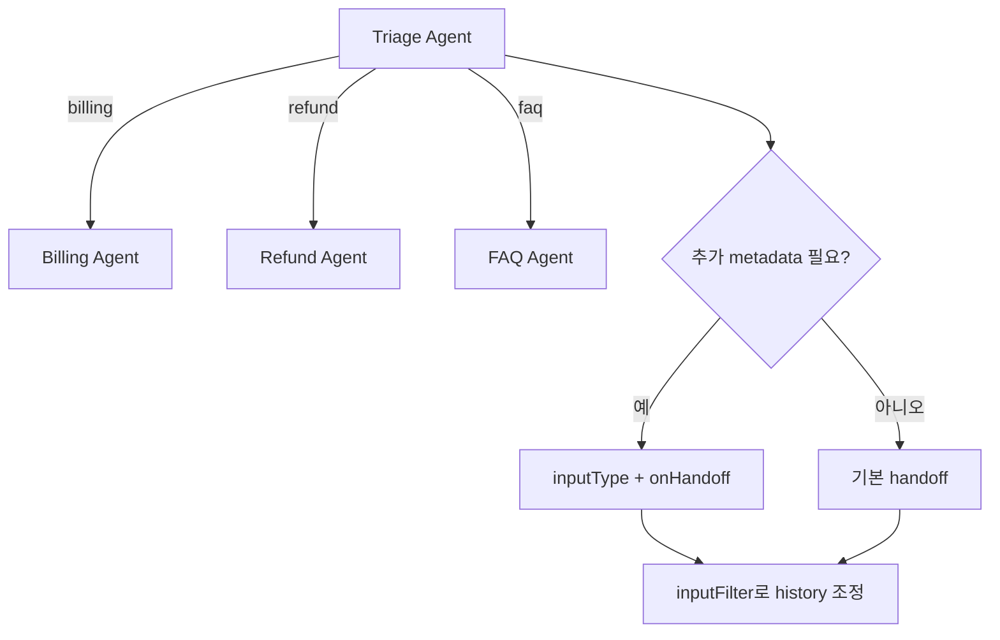

# OpenAI Agents SDK Handoffs

OpenAI Agents SDK에서 handoff를 어떻게 정의하고 언제 써야 하는지 설명하는 공식 가이드 요약이다. specialist agent로 제어권을 넘기는 규칙, payload, history filtering이 핵심이다.

## 구조도

handoff는 단순 함수 호출이 아니라, 어떤 specialist에게 제어권을 넘길지 모델이 선택하게 만드는 routing surface다.

## 핵심 구조

- handoff는 LLM에게는 도구처럼 노출되지만, 실제 의미는 “다음 specialist가 대화를 이어받는다”는 제어권 이전이다.
- 기본 형태는 `handoffs: [agentA, agentB]`처럼 다른 agent를 등록하는 것이고, 세밀한 제어가 필요하면 `handoff()` helper로 tool 이름·설명·payload schema·history filter를 덧붙인다.
- 문서는 “specialist가 대화 전면으로 나와야 하면 handoff, 뒤에서 보조만 하면 agents-as-tools”라는 구분을 강조한다.

## 핵심 옵션 읽기

- `inputType`은 handoff 시점에 모델이 생성하는 작은 구조화 메타데이터(reason, priority, language 등)를 받는 용도다.
- `onHandoff`는 handoff 발생 시 로깅, 감사, 상태 저장 같은 부수 작업을 연결하는 후크다.
- `inputFilter`는 다음 agent에게 어떤 history를 넘길지 조정하는 장치라서, 긴 대화나 민감한 context 정리에 중요하다.

## 비교표

| 선택지 | 언제 적합한가 | 장점 | 주의점 |
| --- | --- | --- | --- |
| handoff | specialist가 이후 턴도 이어받아야 할 때 | 역할 경계가 명확함 | 라우팅 프롬프트 품질이 중요 |
| agents as tools | 원래 agent가 계속 주도해야 할 때 | 호출 구조가 단순함 | specialist의 독립성이 약함 |
| RunContext | 이미 앱이 가진 상태를 넘길 때 | 결정론적 상태 주입 | 모델이 직접 만들 metadata는 아님 |

## 실무 관점

- handoff를 도입하면 multi-agent 구조가 자연스러워지지만, 동시에 라우팅 실패가 새로운 오류 클래스가 된다. 따라서 tool description과 handoff description이 사실상 라우터 규칙이 된다.
- inputFilter를 쓰지 않으면 specialist가 불필요하게 긴 history를 물고 가기 쉽다. 긴 세션에서는 비용·지연·오판이 함께 증가한다.
- 운영 관점에서는 어떤 handoff가 얼마나 자주 발생하는지 tracing하는 것이 중요하다. 그래야 triage agent가 지나치게 많은 결정을 떠안는지 확인할 수 있다.

## 관련 문서

- [[openai-agents-sdk|OpenAI Agents SDK]]
- [[openai-agents-sdk-quickstart|OpenAI Agents SDK Quickstart]]
- [[openai-agents-sdk-sessions|OpenAI Agents SDK Sessions]]
- [[subagents|Subagents]]
