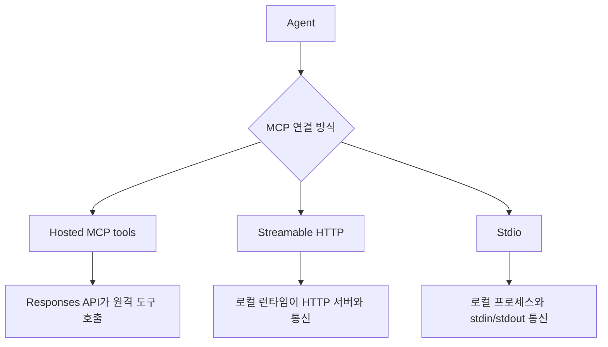

# OpenAI Agents SDK MCP

OpenAI Agents SDK에서 MCP 서버를 붙이는 방법을 설명하는 공식 가이드 요약이다. hosted MCP tools, streamable HTTP, stdio 세 가지 연결 방식과 approval 흐름을 다룬다.

## 구조도

같은 MCP라도 호출 주체가 모델인지, 로컬 런타임인지에 따라 보안 경계와 운영 책임이 크게 달라진다.

## 핵심 구조

- 문서는 OpenAI Agents SDK가 지원하는 MCP 연결을 hosted MCP tools, streamable HTTP, stdio 세 종류로 나눈다.
- hosted MCP tools는 Responses API가 원격 MCP 서버를 직접 호출하므로, 애플리케이션 코드가 전체 왕복을 관리하지 않아도 된다.
- streamable HTTP와 stdio는 SDK 런타임이 직접 서버와 통신하는 방식이라, 로컬 제어권과 커스텀 모델 호환성이 더 높다.

## 선택 기준 표

| 방식 | 적합한 상황 | 장점 | 주의점 |
| --- | --- | --- | --- |
| Hosted MCP tools | 공개 원격 서버 + OpenAI Responses 모델 | 연결이 가장 간단함 | 승인/관측/보안 경계를 모델 호출과 함께 봐야 함 |
| Streamable HTTP | 원격/로컬 HTTP MCP 서버 전반 | 범용성과 현대 transport 호환성 | 서버 lifecycle 관리 필요 |
| Stdio | 로컬 프로세스형 MCP 서버 | 설정이 단순하고 로컬 도구와 잘 맞음 | 프로세스 관리와 샌드박싱 필요 |

## approval와 보안

- 가이드는 민감한 MCP 호출에 대해 `requireApproval`과 interruption 기반 human-in-the-loop를 연결할 수 있음을 강조한다.
- 이 점은 MCP를 단순 tool registry로 보지 말고, **권한 상승이 일어나는 실행 경계**로 보라는 뜻에 가깝다.
- 실제로는 tool 이름별 allow/deny 정책, tracing, 사용자 승인 UI가 함께 설계되어야 운영 가능한 형태가 된다.

## 실무 관점

- MCP 도입 초반에는 hosted 방식이 매력적이지만, 조직 내부 도구나 비공개 네트워크 자원과 연결되면 streamable HTTP 또는 stdio가 더 현실적일 수 있다.
- 중요한 것은 transport가 아니라 책임 분해다. 누가 서버 lifecycle을 관리하고, 누가 tool call을 감사하고, 누가 승인 정책을 바꾸는지 명확해야 한다.
- 따라서 이 문서는 [[model-context-protocol-mcp|Model Context Protocol (MCP)]], [[mcp-architecture|MCP Architecture]], [[mcp-authorization|MCP OAuth 2.1 + PKCE Authorization]]과 함께 읽어야 가치가 커진다.

## 관련 문서

- [[openai-agents-sdk|OpenAI Agents SDK]]
- [[model-context-protocol-mcp|Model Context Protocol (MCP)]]
- [[mcp-architecture|MCP Architecture]]
- [[mcp-authorization|MCP OAuth 2.1 + PKCE Authorization]]

