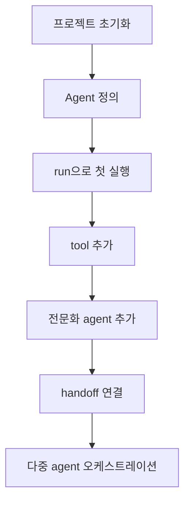

# OpenAI Agents SDK Quickstart

OpenAI Agents SDK를 처음 실행 가능한 상태로 올리는 공식 quickstart 요약이다. 단일 에이전트에서 출발해 도구, 추가 에이전트, handoff까지 확장하는 가장 짧은 경로를 다룬다.

## 구조도

이 quickstart는 단일 agent에서 시작해 다중 agent orchestration으로 확장되는 최소 경로를 보여 준다.

## 핵심 구조

- 문서는 `npm init` → `@openai/agents` 설치 → API key 설정 → `Agent` 정의 → `run()` 호출 순으로 가장 짧은 시작 경로를 제시한다.
- 중반부부터는 단일 agent 예제를 도구(tool) 추가, 전문 agent 분리, handoff 연결로 점진적으로 확장한다.
- 즉 quickstart의 본질은 “첫 성공” 그 자체보다, **언제 단일 agent를 넘어 orchestration으로 올라갈지** 감을 주는 데 있다.

## 무엇을 배우는가

- `Agent`는 이름·지침·도구·handoff를 묶는 가장 작은 실행 단위다.
- `run()`의 결과에는 최종 출력뿐 아니라 중간 동작과 `history`가 남으므로, 후속 턴을 세션/서버 상태/수동 history 중 어떤 방식으로 이어 갈지 결정해야 한다.
- tool은 단일 agent의 능력을 넓히고, handoff는 서로 다른 책임을 가진 agent 사이에 제어권을 넘기는 메커니즘이다.

## 실무 관점

- 팀 도입 초반에는 quickstart 예제를 그대로 복제해 한 번 실행해 보는 것이 가장 중요하다. 이 단계에서 설치, 키 관리, tracing, 모델 접근권 같은 운영 문제가 바로 드러난다.
- 단일 agent로 충분한지, 아니면 triage agent + specialist agent 구조가 필요한지를 구분하는 초기 기준으로도 유용하다.
- 특히 quickstart 마지막 handoff 예제는 이후 [[openai-agents-sdk-handoffs|Handoffs]], [[openai-agents-sdk-sessions|Sessions]], [[openai-agents-sdk-model-context-protocol|OpenAI Agents SDK MCP]]를 읽기 위한 전제 지식 역할을 한다.

## 도입 체크리스트

- 로컬에서 `@openai/agents`와 스키마 라이브러리(Zod)를 함께 설치했는가?
- 후속 턴 상태를 `history`, `session`, `conversationId` 중 무엇으로 이어 갈지 팀 규칙을 정했는가?
- 도구는 “모델이 호출하기 쉬운 인터페이스”로 설명되어 있는가?
- specialist agent 분리 기준과 handoff 기준이 프롬프트에 드러나는가?

## 관련 문서

- [[openai-agents-sdk|OpenAI Agents SDK]]
- [[openai-agents-sdk-handoffs|OpenAI Agents SDK Handoffs]]
- [[openai-agents-sdk-sessions|OpenAI Agents SDK Sessions]]
- [[openai-agents-sdk-model-context-protocol|OpenAI Agents SDK MCP]]
