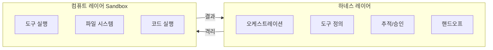

# OpenAI Agents SDK Sandbox

[[openai-agents-sdk|OpenAI Agents SDK]]의 2026년 4월 대규모 업데이트. **에이전트 오케스트레이션(하네스)**과 **실행 환경(샌드박스)**를 분리하여, 간단한 챗봇 프레임워크에서 프로덕션급 에이전트 플랫폼으로 진화했다.

## 핵심 아키텍처: 하네스 vs 컴퓨트

- **하네스**: 오케스트레이션, 의사결정, API 상호작용, 인스트럭션, 도구, 승인, 추적, 핸드오프, 재개 관리
- **컴퓨트**: 비특권(unprivileged) 격리 환경에서 도구 호출과 코드 실행

Steve Coffey(Responses API 테크 리드):
> "이제 모델이 시간 단위, 일 단위, 주 단위로 작업할 수 있다."

이전 SDK는 5-7 단계의 간단한 챗봇 워크플로를 타겟으로 했다면, 이제 **장기 실행(long-horizon) 에이전트**를 지원한다.

## 샌드박스 동작 방식

에이전트는 하나의 샌드박스에서 동작하거나 추가 샌드박스를 스폰할 수 있다. 서브에이전트도 격리된 환경에서 실행 가능하여 계층적 에이전트 아키텍처를 지원한다.

구현 형태: **컨테이너 또는 가상 머신**

전형적 배포:
1. 에이전트 하네스 -> Temporal 잡
2. 에이전트 컴퓨트 -> Modal 샌드박스 또는 Docker 컨테이너
3. 하네스와 실행 환경 간 완전 격리

## 샌드박스 프로바이더 에코시스템

| 프로바이더 | 유형 |
|-----------|------|
| Blaxel | 클라우드 샌드박스 |
| Cloudflare | 엣지 컴퓨트 |
| Daytona | 개발 환경 |
| E2B | 코드 실행 환경 |
| Modal | 서버리스 컨테이너 |
| Runloop | 에이전트 런타임 |
| Vercel | 서버리스 |

**Manifest 추상화**로 이식 가능한 워크스페이스 서술을 지원한다.

## 파일 시스템과 데이터 접근

마운트 가능한 데이터 소스:
- 로컬 파일
- AWS S3
- Google Cloud Storage
- Azure Blob Storage
- Cloudflare R2

텍스트 파일, 이미지, PDF 처리 가능. 컨테이너 스냅샷팅과 재시작 간 파일 시스템 보존으로 상태 유지 에이전트 동작 지원.

## 보안 모델

- 샌드박스는 **비특권(unprivileged)** 실행 -- API 키/시크릿 없음
- **네트워크 격리**로 비인가 외부 통신 차단
- 엔터프라이즈: 엄격한 격리 / 개인 개발자: 완화된 제한

## [[microvm-agent-sandboxes|MicroVM 에이전트 샌드박스]]와의 관계

이 업데이트는 에이전트 샌드박싱의 산업 트렌드를 반영한다. E2B, Modal 등 [[microvm-agent-sandboxes|MicroVM 기반 샌드박스]] 프로바이더들이 공식 통합되어, "가져다 쓰는(bring your own)" 인프라 모델을 지원한다.

## 현재 상태

- **Python 우선**, TypeScript 추후 지원
- SDK 자체 추가 비용 없음 (표준 API 과금)
- Pre-1.0이지만 상당한 성숙
- 구성 가능한 메모리, 파일 지원, 문서 처리 포함

## 관련 문서

- [[openai-agents-sdk]] -- OpenAI Agents SDK 엔티티
- [[openai-agents-sdk-sessions]] -- 세션 관리
- [[openai-agents-sdk-handoffs]] -- 핸드오프 패턴
- [[microvm-agent-sandboxes]] -- MicroVM 에이전트 샌드박스
- [[harness-engineering]] -- 하네스 엔지니어링 개념
