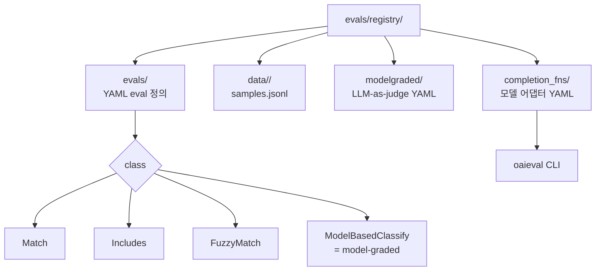

# OpenAI Evals

> "Evals is a framework for evaluating LLMs and LLM systems, and an open-source registry of benchmarks."

OpenAI 가 GPT-4 launch 시점 (2023-03) 에 공개한 LLM eval framework + 커뮤니티 eval registry. **YAML 등록 + JSONL 데이터** 만으로 코드 없이 평가를 만들 수 있고, **model-graded eval** 패턴 (LLM-as-judge) 을 mainstream 화한 계보. 기존 [[evaluation-harness]] 페이지의 OpenAI Evals 섹션을 보강한다.

## 한 줄 정체성

YAML + JSONL 코드-리스 eval, model-graded mainstream 화. 같은 OpenAI 가 [[simple-evals]] 라는 더 가벼운 zero-shot CoT framework 도 별도로 운영 중.

## Eval Registry 구조



- `evals/registry/evals/` -- eval YAML 정의
- `evals/registry/data/<eval_name>/samples.jsonl` -- 데이터 파일
- `evals/registry/modelgraded/` -- model-graded eval YAML
- `evals/registry/completion_fns/` -- completion function YAML

## YAML eval 등록 (basic eval)

```yaml
<eval_name>:
  id: <eval_name>.dev.v0
  description: <description>
  metrics: [accuracy]

<eval_name>.dev.v0:
  class: evals.elsuite.basic.match:Match
  args:
    samples_jsonl: <eval_name>/samples.jsonl
```

Naming convention: `<eval_name>.<split>.<version>`
- split: `dev` / `test` / `val` 그룹
- version: 변경 이력 추적

## JSONL 데이터 포맷

JSON Lines, 1 줄 1 객체. 필수 키:

- `"input"` -- 프롬프트 (chat 포맷 권장)
- 기본 eval (Match/Includes/FuzzyMatch) 일 경우 `"ideal"` -- "a string (or a list of strings) specifying the correct reference answer(s)"

예시:
```json
{"input": [{"role": "system", "content": "..."}, {"role": "user", "content": "..."}], "ideal": "정답"}
```

## 핵심 eval 클래스

| Class | 모듈 | 역할 |
|---|---|---|
| `Match` | `evals.elsuite.basic.match` | exact 정답 일치 |
| `Includes` | `evals.elsuite.basic.includes` | 정답 substring 포함 |
| `FuzzyMatch` | `evals.elsuite.basic.fuzzy_match` | 관용적 일치 |
| `ModelBasedClassify` | model-graded | LLM-as-judge |

> "ModelBasedClassify implements the main logic behind the model-graded eval template—the model's completion to the original prompt is wrapped in an evaluation prompt, and the model's completion to the evaluation prompt is parsed into metrics of interest."

## Model-graded eval 패턴

`evals/registry/modelgraded/` 에 YAML 작성. 기존 정의된 templates: `fact`, `closedqa`, `battle` 등.

워크플로우:
1. `evals/registry/modelgraded/` 에 YAML -- eval prompt + 파싱 규칙
2. 데이터를 `evals/registry/data/` 에 JSONL 로 추가
3. `evals/registry/evals/` 에 eval YAML 등록 (class: model-graded)
4. CLI 실행
5. (권장) human label 과 meta-eval 로 grader 품질 검증

## CompletionFn (모델 추상화)

> "a 'completion' is some text output that would be our answer to the prompt."

표준 인터페이스:
- **input**: text 또는 chat conversation
- **output**: list of text strings

YAML 등록 예 (LangChain 어댑터):
```yaml
langchain/llm/flan-t5-xl:
  class: evals.completion_fns.langchain_llm:LangChainLLMCompletionFn
  args:
    llm: HuggingFaceHub
    llm_kwargs:
      repo_id: google/flan-t5-xl
```

Top-level 키 (`langchain/llm/flan-t5-xl`) 가 `oaieval` CLI 의 model 이름.

External completion fn (외부 레포 사용):
```bash
oaieval my_completion_fn test-match --registry_path ~/my_project
```

## CLI

```bash
oaieval gpt-3.5-turbo <eval_name>
oaieval gpt-3.5-turbo <eval_name> --registry_path ~/my_project   # 외부 registry
```

## 다른 harness 와의 포지셔닝

- **차별점**: code-less eval 작성 (YAML + JSONL), model-graded 패턴 mainstream 화
- **vs [[lm-evaluation-harness]]**: lm-eval 은 학술 academic task 중심, OpenAI Evals 는 customer-facing custom eval 중심
- **vs [[inspect-ai]]**: Inspect 는 Solver/Scorer/Tool/Sandbox 까지 포함하는 후속 세대 (UK AISI). OpenAI Evals 는 단순 prompt-completion-grade 패턴
- **현재 위치**: 2024년 후반부터 OpenAI 공식 `evals.openai.com` 으로 호스팅된 SaaS 와 결합. OSS 레포는 유지보수 강도가 낮음 (커뮤니티 evals 기여는 제한)
- **계보**: [[simple-evals]] 는 OpenAI 가 같은 팀에서 만든 더 가벼운 변형 -- comprehensive evals 의 대체가 아니라 **zero-shot CoT 단순 instruction 기반 평가** 에 집중

## 출처

- README: https://github.com/openai/evals
- build-eval: https://github.com/openai/evals/blob/main/docs/build-eval.md
- completion-fns: https://github.com/openai/evals/blob/main/docs/completion-fns.md
- eval-templates: https://github.com/openai/evals/blob/main/docs/eval-templates.md
- Cookbook: https://github.com/openai/openai-cookbook/blob/main/examples/evaluation/Getting_Started_with_OpenAI_Evals.ipynb
- 공식 SaaS: https://evals.openai.com/

## 관련 문서

- [[evaluation-harness]] -- 평가 harness 허브 페이지
- [[evaluation-harness-comparison]] -- 9개 harness 횡단 비교
- [[simple-evals]] -- 같은 OpenAI 가 만든 가벼운 zero-shot CoT 변형
- [[lm-evaluation-harness]] -- 학술 academic 표준
- [[inspect-ai]] -- Solver/Scorer 차세대 framework
- [[mt-bench]] -- MT-Bench (multi-turn LLM-as-judge)
