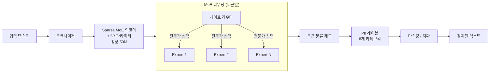
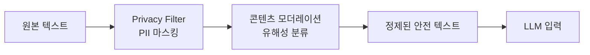

# OpenAI Privacy Filter - 오픈소스 온프레미스 PII 탐지/마스킹 모델

2026년 4월 22일 OpenAI가 Apache 2.0 라이선스로 공개한 PII(개인식별정보, Personally Identifiable Information) 탐지 및 마스킹 모델이다. 1.5B 파라미터(활성 50M) 규모의 Sparse MoE 기반 토큰 분류 모델로, 클라우드 전송 없이 온프레미스에서 실행할 수 있도록 설계됐다. PII-Masking-300k 벤치마크 기준 F1 96%를 달성했다.

## 아키텍처 개요



Sparse MoE 구조를 채택해 1.5B 전체 파라미터 중 추론 시 50M 파라미터만 활성화된다. 이로 인해 추론 비용이 낮고, CPU에서도 실용적인 속도가 나온다.

## PII 탐지 카테고리

총 8개 카테고리의 PII를 탐지한다:

| 카테고리 | 예시 | 설명 |
|----------|------|------|
| `PERSON` | "홍길동", "John Doe" | 인물 이름 |
| `ADDRESS` | "서울시 강남구 테헤란로 123" | 주소 (도로명, 지번 모두) |
| `EMAIL` | "user@example.com" | 이메일 주소 |
| `PHONE` | "010-1234-5678", "+82-10-1234-5678" | 전화번호 (국제 형식 포함) |
| `URL` | "https://example.com/private/profile" | URL (파라미터 포함) |
| `DATE` | "1985년 3월 15일", "1985-03-15" | 생년월일 등 날짜 |
| `ACCOUNT_NUMBER` | "계좌번호: 110-123-456789" | 은행 계좌, 카드 번호 |
| `SECRET` | `sk-abc123...`, API 키, 비밀번호 | 크리덴셜, 토큰, 시크릿 |

## 성능 지표

| 벤치마크 | 점수 | 비교 |
|----------|------|------|
| PII-Masking-300k F1 | 96% | Microsoft Presidio: 82%, spaCy NER: 71% |
| 처리 속도 (CPU, 8코어) | ~1,200 토큰/초 | 실시간 처리 가능 수준 |
| 처리 속도 (A10 GPU) | ~24,000 토큰/초 | 대용량 배치 처리 가능 |
| 모델 크기 | ~3GB (FP16) | 온디바이스 배포 가능 |

## 사용 방법

### HuggingFace Transformers로 직접 사용

```python
from transformers import pipeline, AutoTokenizer, AutoModelForTokenClassification

model_id = "openai/privacy-filter"
tokenizer = AutoTokenizer.from_pretrained(model_id)
model = AutoModelForTokenClassification.from_pretrained(model_id)

pii_detector = pipeline(
    "token-classification",
    model=model,
    tokenizer=tokenizer,
    aggregation_strategy="simple",  # 연속 토큰 합치기
)

text = "홍길동(010-1234-5678, hong@example.com)이 2025년 3월에 신청했습니다."
results = pii_detector(text)

for entity in results:
    print(f"[{entity['entity_group']}] {entity['word']} (신뢰도: {entity['score']:.2f})")
# [PERSON] 홍길동 (신뢰도: 0.99)
# [PHONE] 010-1234-5678 (신뢰도: 0.98)
# [EMAIL] hong@example.com (신뢰도: 0.97)
# [DATE] 2025년 3월 (신뢰도: 0.94)
```

### 마스킹 유틸리티 사용

```python
from openai_privacy_filter import PrivacyFilter

pf = PrivacyFilter()

text = "고객 홍길동의 주민번호는 851234-1234567이고, 이메일은 hong@test.com입니다."

# 탐지만
entities = pf.detect(text)

# 마스킹 (기본: [REDACTED])
masked = pf.mask(text)
# "고객 [PERSON]의 주민번호는 [ACCOUNT_NUMBER]이고, 이메일은 [EMAIL]입니다."

# 커스텀 치환
masked_custom = pf.mask(text, replacements={
    "PERSON": "***",
    "EMAIL": "<이메일 삭제됨>",
})
```

### FastAPI 서버로 배포

```python
from fastapi import FastAPI
from openai_privacy_filter import PrivacyFilter
from pydantic import BaseModel

app = FastAPI()
pf = PrivacyFilter(device="cuda")  # GPU 사용 시

class PIIRequest(BaseModel):
    text: str
    mask: bool = True

class PIIResponse(BaseModel):
    entities: list
    masked_text: str | None

@app.post("/pii/detect", response_model=PIIResponse)
async def detect_pii(request: PIIRequest):
    entities = pf.detect(request.text)
    masked_text = pf.mask(request.text) if request.mask else None
    return PIIResponse(entities=entities, masked_text=masked_text)
```

## 왜 오픈소스로 공개했는가

OpenAI의 Privacy Filter 오픈소스 공개는 다음 맥락에서 이해할 수 있다:

1. **데이터 정제 파이프라인 표준화**: 훈련 데이터에서 PII를 제거하는 것은 책임 있는 AI 개발의 기본 요건. 업계 공통 도구로 만들어 기준을 높이려는 의도
2. **기업 AI 도입 장벽 완화**: 많은 기업이 GPT API 사용 시 민감한 데이터 전송을 꺼린다. 온프레미스 PII 필터를 제공해 "먼저 마스킹하고 전송"하는 워크플로우 가능
3. **경쟁 도구 대비 우위**: Microsoft Presidio, spaCy NER 등 기존 도구보다 F1 96%로 우수한 정확도를 OpenAI 이름으로 제공

## [[ai-content-moderation]]과의 관계

Privacy Filter는 콘텐츠 모더레이션([[ai-content-moderation]])의 하위 영역이다. 콘텐츠 모더레이션이 혐오 발언, 유해 콘텐츠, 스팸 등을 걸러내는 광의의 안전 계층이라면, Privacy Filter는 PII 유출 방지에 특화된 협의의 보안 계층이다.



실제 LLM 기반 서비스에서는 두 계층을 순차 적용하는 파이프라인이 권장된다.

## 활용 시나리오

### 1. 훈련 데이터 정제

```python
from datasets import load_dataset
from openai_privacy_filter import PrivacyFilter

pf = PrivacyFilter(batch_size=64)
dataset = load_dataset("커스텀/내부데이터")

def clean_text(examples):
    masked = pf.mask_batch(examples["text"])
    return {"text": masked}

clean_dataset = dataset.map(clean_text, batched=True)
```

### 2. RAG 파이프라인 입력 정제

문서 청킹 전에 PII를 마스킹해 벡터 DB에 저장. 검색 결과에 민감 정보가 포함되지 않도록 보호한다.

### 3. 로그 익명화

서버 액세스 로그, 사용자 대화 로그에서 실시간으로 PII를 필터링해 GDPR/개인정보보호법 준수를 지원한다.

## 제한사항

- **8개 카테고리 고정**: 국내 주민등록번호, 사업자등록번호 등 한국 특화 PII는 별도 파인튜닝 필요
- **문맥 의존 PII**: "나는 홍 씨야"에서 "홍"이 성인지 일반 명사인지 구분은 문맥 의존적으로 정확도 저하 가능
- **다국어 성능 편차**: 영어 > 중국어 > 기타 언어 순으로 성능 저하 가능 [교차검증 필요]

## 관련 문서

- [[ai-content-moderation]] — AI 콘텐츠 안전 계층 전반
- [[data-privacy-ml]] — 머신러닝에서의 데이터 프라이버시
- [[rag]] — RAG 파이프라인에서의 데이터 정제
- [[openai-agents-sdk]] — OpenAI 에이전트 SDK와 연계 가능
