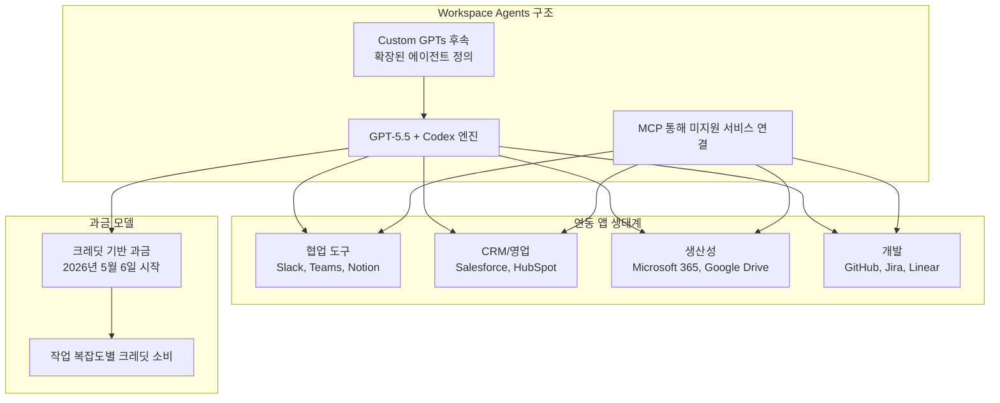
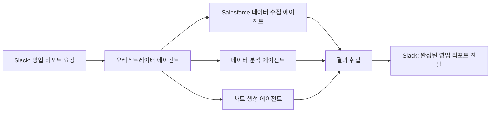

# OpenAI Workspace Agents (2026년 4월 22일 출시)

## 개요

**OpenAI Workspace Agents**는 2026년 4월 22일 OpenAI가 발표한 엔터프라이즈 자동화 플랫폼이다. Custom GPTs의 후속 제품으로, 단순한 챗봇 구성을 넘어 **상시 가동(always-on)되는 클라우드 에이전트**를 기업 업무 시스템과 통합하는 플랫폼이다. 핵심 엔진은 [[gpt-5-5-launch]] 기반의 Codex이며, Slack, Salesforce, Microsoft 365, Google Drive 등 60개 이상의 엔터프라이즈 앱과 연동된다.

위 다이어그램은 Workspace Agents의 기술 스택, 연동 생태계, 과금 모델을 한눈에 보여준다.

---

## Custom GPTs와의 차이

Workspace Agents는 Custom GPTs의 직계 후속이지만 핵심적으로 다른 패러다임이다:

| 비교 항목 | Custom GPTs | Workspace Agents |
|-----------|------------|-----------------|
| 실행 방식 | 사용자가 채팅창에서 호출 시 실행 | 클라우드에서 상시 가동 |
| 트리거 | 수동 (사용자 메시지) | 자동 (이벤트 기반 + 스케줄) |
| 통합 방식 | Actions (API 호출) | 60개+ 네이티브 통합 + MCP |
| 상태 유지 | 세션 내 임시 | 장기 메모리 및 워크플로우 상태 |
| 대상 | 개인/소비자 | 기업 팀/부서 |
| 자율성 | 낮음 (응답 생성) | 높음 (자율적 작업 실행) |

---

## 핵심 기능

### 상시 가동 에이전트 (Always-On Cloud Agents)

Workspace Agents의 가장 중요한 특징은 사용자가 채팅창을 열지 않아도 에이전트가 계속 작동한다는 점이다:

- **이벤트 트리거**: Slack 메시지 수신, Salesforce 리드 업데이트, GitHub PR 등
- **스케줄 실행**: 매일 아침 9시 일일 리포트 생성 등
- **조건부 실행**: 특정 조건 충족 시 자동 액션 수행

### MCP 기반 확장성

60개 이상의 기본 통합 외에 [[mcp]]를 통해 임의의 서비스와 연동 가능하다:

- 기업 내부 시스템(사내 CRM, ERP 등) 연결
- 레거시 API를 MCP 서버로 래핑하여 에이전트와 연동
- 이는 [[openai-stargate]] 인프라와 함께 OpenAI가 엔터프라이즈 시장을 겨냥하는 전략의 일환

### 멀티 에이전트 오케스트레이션

단일 에이전트 실행을 넘어 복수의 에이전트가 협력하는 워크플로우 구성 가능:

이는 [[multi-agent-orchestration]] 에서 다루는 오케스트레이션 패턴의 실제 제품 구현이다.

---

## 과금 모델

2026년 5월 6일부터 **크레딧 기반 과금**이 시작된다:

- 에이전트가 수행하는 각 작업의 복잡도에 따라 크레딧 소비
- 단순 정보 조회 < 복잡한 멀티스텝 워크플로우
- 기업 단위 크레딧 풀 관리
- ChatGPT Enterprise 구독 포함 여부는 미확인 [교차검증 필요]

---

## 60개+ 통합 앱 생태계

주요 카테고리별 통합 앱:

| 카테고리 | 주요 앱 |
|----------|---------|
| 협업/메시지 | Slack, Microsoft Teams |
| CRM/영업 | Salesforce, HubSpot |
| 생산성 스위트 | Microsoft 365 (Word, Excel, Outlook), Google Drive |
| 프로젝트 관리 | Jira, Linear, Asana, Notion |
| 개발 플랫폼 | GitHub, GitLab |
| 문서/지식베이스 | Confluence, SharePoint |
| 기타 | Zendesk, ServiceNow 등 |

미지원 앱은 MCP 서버를 구현해 연동 가능.

---

## 경쟁 구도

### Microsoft 365 Copilot과의 충돌

흥미롭게도 Workspace Agents는 Microsoft 365와 통합하면서도 Microsoft의 Copilot Studio와 직접 경쟁한다:

- 동일한 Microsoft 365 데이터를 GPT-5.5가 처리 vs. Copilot이 처리
- 기업이 두 플랫폼 중 하나를 선택해야 하는 상황 발생 가능
- OpenAI-Microsoft 파트너십의 긴장 관계를 드러내는 지점

### Anthropic Claude Code + MCP

Anthropic의 [[claude-code]]도 MCP를 통한 도구 통합을 제공하지만 포지셔닝이 다르다:

- Claude Code: 개발자 중심, 코드 저장소 및 터미널 작업 특화
- Workspace Agents: 비개발자 포함, 범용 비즈니스 자동화 지향

---

## [[multi-agent-orchestration]] 관점

Workspace Agents는 에이전트 오케스트레이션의 상업적 구현을 보여주는 사례다:

### 오케스트레이션 패턴

- **라우팅**: 요청 유형에 따라 적절한 전문 에이전트에 작업 배분
- **병렬 실행**: 독립적인 서브태스크를 동시에 처리
- **파이프라인**: 이전 에이전트 출력을 다음 에이전트 입력으로 연결
- **인간 개입(Human-in-the-loop)**: 승인 단계에서 사람이 확인 후 진행

### 에이전트 신뢰 및 권한 모델

엔터프라이즈 환경에서 에이전트 보안은 핵심이다:

- 에이전트별 권한 범위 설정 (read-only vs. write 권한)
- 감사 로그(audit log): 모든 에이전트 액션 기록
- 승인 워크플로우: 민감한 작업 전 인간 승인 필수

---

## 관련 문서

- [[gpt-models]] - OpenAI GPT 시리즈 전체 개요
- [[gpt-5-5-launch]] - GPT-5.5 출시 상세
- [[multi-agent-orchestration]] - 멀티 에이전트 오케스트레이션 개념
- [[mcp]] - Model Context Protocol
- [[openai-stargate]] - Project Stargate OpenAI 인프라
- [[codex-cli-april-2026]] - Codex CLI 2026년 4월 업데이트
