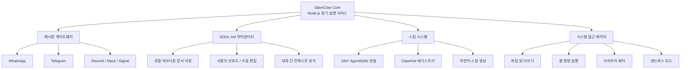

## 개요

OpenClaw는 GitHub 역대 최빠른 성장을 기록한(60일 만에 247K+ 스타) 오픈소스 개인 AI 에이전트다. 로컬 머신에서 실행되며, 메시징 앱 UI를 통해 이메일 관리, 캘린더 조율, 워크플로우 자동화, 스마트 기기 제어 등 실제 작업을 자율적으로 수행한다. "실제로 일을 하는 AI"라는 포지셔닝으로, 단순 챗봇이 아닌 행동 실행형 에이전트를 지향한다.

기술적으로 OpenClaw는 로컬 게이트웨이로 동작하여 AI 모델에 파일 읽기/쓰기, 스크립트 실행, 브라우저 제어 등 직접적인 시스템 접근을 제공한다. 장기 실행(long-running) Node.js 서비스가 채팅 플랫폼과 AI 에이전트 사이에서 메시지를 라우팅하는 구조다.

## 핵심 특징

- **메시징 앱 UI**: WhatsApp, Telegram, Discord, Slack, Signal, iMessage 등 기존 메신저를 인터페이스로 활용. 동료에게 메시지를 보내듯 자연스러운 상호작용
- **SOUL.md 아이덴티티 시스템**: 로컬 마크다운 문서 형태로 데이터를 저장하여 대화 간 사용자 컨텍스트와 선호도를 유지하는 영속적 메모리. 사용자가 직접 마크다운을 편집하여 에이전트의 지시사항과 개인화 설정을 세밀하게 조정할 수 있다
- **자가 설치 스킬 시스템**: 100개 이상의 사전 구성된 AgentSkills 번들 제공. 자연어 요청으로 커스텀 스킬 생성 가능하며 에이전트가 자체 플러그인을 작성할 수 있다. ClawHub 커뮤니티 레지스트리에서 스킬 공유 및 탐색
- **프라이버시 우선**: 모델 불가지론(model-agnostic)이며 프라이버시 중심. 사용자가 클라우드 모델의 자체 API 키를 사용하거나, 로컬 모델을 완전히 자체 인프라에서 실행 가능
- **70+ 사전 통합**: Gmail, GitHub, Spotify, Obsidian, Twitter 등. 스마트 홈 하드웨어, 생산성 도구, 음악 플랫폼 포함 50개 이상의 서드파티 통합

## 기술 상세

### 아키텍처



OpenClaw의 코어는 로컬 게이트웨이로 기능하며, AI 모델에 보안 샌드박스 안에서 직접적인 시스템 접근권을 제공한다. 이 게이트웨이가 채팅 플랫폼의 메시지를 수신하고, 에이전트의 행동 결과를 다시 채팅으로 전달하는 브릿지 역할을 한다.

### 설치

표준 설치는 단일 명령어로 완료된다:

```bash
curl -fsSL https://openclaw.ai/install.sh | bash
```

Mac, Windows, Linux를 모두 지원한다. DigitalOcean은 강화된 1-Click 배포 옵션을 월 $24부터 제공한다.

### 모델 유연성

Claude, GPT, 또는 로컬 모델을 선택적으로 사용할 수 있다. 특정 LLM 프로바이더에 종속되지 않으며, 사용자가 선호하는 모델로 에이전트를 구동할 수 있다. 클라우드 API 키를 가져오거나 완전 로컬 모델만으로 운영하는 것이 모두 가능하다.

### 시스템 접근 모드

| 모드 | 권한 | 용도 |
|---|---|---|
| 풀 접근 | 파일, 셸, 브라우저 전체 | 최대 자율성 작업 |
| 샌드박스 | 제한된 파일/네트워크 접근 | 보안 우선 환경 |

### NanoClaw 대비 포지셔닝

NanoClaw는 OpenClaw의 경량 대안으로, 두 프로젝트는 동일한 개인 AI 에이전트 카테고리에 속하지만 아키텍처와 규모에서 차이를 보인다. OpenClaw는 100+ 스킬 번들과 50+ 통합을 제공하는 풀스택 에이전트인 반면, NanoClaw는 보안과 단순성, 설정 비용 최소화에 초점을 맞춘다.

### 보안 모델

OpenClaw의 보안 설계는 두 가지 축으로 구성된다:

- **샌드박스 격리**: 기본 모드에서 에이전트는 제한된 파일/네트워크 접근만 가능. 파일 시스템, 네트워크, 프로세스 실행이 격리된 환경에서 수행
- **명시적 권한 승격**: 풀 접근 모드로 전환 시 사용자가 명시적으로 승인해야 하며, 셸 명령 실행, 브라우저 제어, 전체 파일 시스템 접근이 활성화
- **로컬 데이터 유지**: 모든 설정, 메모리, 스킬 데이터가 사용자 머신에 로컬로 저장. 클라우드 동기화는 사용자가 명시적으로 선택해야 활성화

### 배포 옵션

| 방식 | 비용 | 특징 |
|------|------|------|
| 로컬 설치 (curl) | 무료 (API 비용만) | Mac/Windows/Linux |
| DigitalOcean 1-Click | $24/월~ | 강화된 보안, 관리형 |
| 자체 서버 | 인프라 비용 | 완전한 통제 |

### 커뮤니티 반응

사용자들은 OpenClaw를 "개인 AI의 iPhone 모먼트"로 평가하며, 자율적 작업 실행과 설치 용이성에 높은 관심을 보이고 있다. 60일 만에 247K+ GitHub 스타를 달성한 것은 오픈소스 프로젝트 역사상 가장 빠른 성장 기록이다. Node.js 기반 아키텍처 덕분에 웹 개발자 커뮤니티의 기여가 활발하며, ClawHub를 통한 커뮤니티 스킬 공유 생태계가 빠르게 확장 중이다.

## 관련 문서

- [[hermes-agent]] - NousResearch의 자기 개선 에이전트
- [[agent-skills]] - 에이전트 스킬 사양
- [[composio]] - AI 에이전트 외부 도구 통합 플랫폼
- [[agent-memory-systems]] - 에이전트 메모리 시스템 패턴
