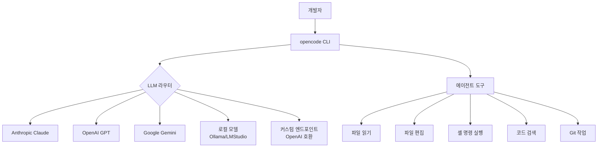
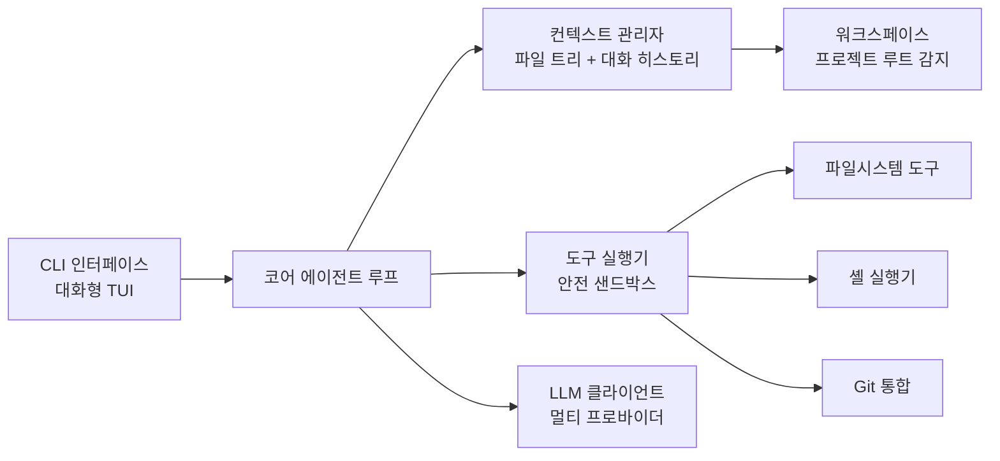

# opencode-cli

## 정체성

| 항목 | 내용 |
|------|------|
| 프로젝트명 | opencode |
| 유형 | 오픈소스 터미널 코딩 에이전트 |
| 라이선스 | MIT |
| 언어 | Go |
| 배포 형태 | CLI 바이너리 (brew, npm, 바이너리 직접) |
| GitHub | github.com/opencode-ai/opencode |
| 주요 경쟁 | Claude Code, Codex CLI, Aider |

opencode는 코드 생성, 파일 편집, 터미널 명령 실행을 대화형으로 수행하는 오픈소스 CLI 코딩 에이전트다. Anthropic의 Claude Code, OpenAI의 Codex CLI와 유사한 포지션이지만, 완전 오픈소스이며 다양한 LLM 프로바이더를 지원하는 것이 핵심 차별점이다.

[교차검증 필요] opencode-cli의 현재 상태, GitHub 스타 수, 최신 기능은 공식 저장소에서 확인하라. 이 분야는 빠르게 변화하고 있다.

## 핵심 기능



위 다이어그램은 opencode가 여러 LLM 백엔드와 다양한 도구를 통합하는 방식을 보여준다. 사용자는 설정 파일에서 선호하는 모델을 선택할 수 있다.

### 다중 LLM 라우팅

opencode의 핵심 가치는 벤더 독립성이다. 단일 도구에서 다음 LLM을 전환해가며 사용할 수 있다:

- Anthropic Claude (claude-opus-4-x, sonnet-4-x 등)
- OpenAI GPT (gpt-4o, gpt-5 등)
- Google Gemini
- Ollama를 통한 로컬 모델 (Llama, Qwen, Mistral 등)
- OpenAI 호환 API 엔드포인트 (Groq, Together AI, Cerebras 등)

## 아키텍처 개요



### 에이전트 루프

opencode의 에이전트 실행 흐름은 다른 코딩 에이전트와 유사하다:

1. 사용자 입력 수신
2. 현재 워크스페이스 컨텍스트 수집 (파일 트리, 최근 변경)
3. LLM에 시스템 프롬프트 + 컨텍스트 + 사용자 메시지 전송
4. LLM 응답에서 도구 호출 파싱
5. 도구 실행 (파일 편집, 명령 실행 등)
6. 결과를 컨텍스트에 추가 후 반복

## 설치 및 시작

### 설치

```bash
# macOS Homebrew
brew install opencode

# npm (Node.js 환경)
npm install -g opencode-ai

# 직접 바이너리 다운로드
# https://github.com/opencode-ai/opencode/releases
```

[교차검증 필요] 설치 명령과 패키지명은 공식 README에서 확인하라.

### 기본 설정

```yaml
# ~/.config/opencode/config.yaml
model: claude-sonnet-4-5        # 기본 사용 모델
fallback_model: gpt-4o          # 실패 시 대안 모델

providers:
  anthropic:
    api_key: ${ANTHROPIC_API_KEY}
  openai:
    api_key: ${OPENAI_API_KEY}
  ollama:
    base_url: http://localhost:11434
```

### 실행

```bash
# 현재 디렉토리에서 시작
opencode

# 특정 작업으로 시작
opencode "현재 프로젝트의 README를 업데이트해줘"

# 특정 모델 선택
opencode --model gpt-4o "코드 리뷰해줘"

# 로컬 모델 사용
opencode --model ollama/llama3.3 "이 함수를 최적화해줘"
```

## 커뮤니티 주도 개발

opencode는 특정 기업이 아닌 커뮤니티 기여자들이 주도하는 프로젝트다. 이로 인해:

- 빠른 이슈 수정과 PR 병합
- 다양한 LLM/도구 통합 기여 활발
- 기업 제품 대비 유연한 실험적 기능 포함
- 사용자 요청 반영 속도가 빠름

반면:
- 안정성과 장기 지원이 불확실할 수 있음
- 문서 품질이 상업 제품 대비 불균일
- 기능 변경이 잦아 스크립트 자동화에 주의 필요

## Claude Code 대비 차이점

| 항목 | opencode | Claude Code |
|------|---------|------------|
| 라이선스 | MIT 오픈소스 | 독점 상용 |
| LLM 지원 | 다중 프로바이더 | 주로 Anthropic |
| 비용 | 사용 LLM API 비용만 | Claude 구독 + API |
| 커스터마이징 | 소스 수정 자유 | 제한 |
| 기업 지원 | 커뮤니티 | Anthropic 공식 |
| 안정성 | 커뮤니티 운영 | 기업 운영 |
| 통합 깊이 | 범용 | Claude 에코시스템 최적화 |

개인 개발자나 오픈소스 프로젝트에서는 opencode가 비용 효율적이고 유연한 선택이 될 수 있다. 반면 팀 협업, 엔터프라이즈 보안, 안정적인 장기 지원이 필요하면 Claude Code나 Codex CLI가 더 적합하다.

## 한계 및 트레이드오프

### 알려진 제약

- **벤더 지원 없음**: 문제 발생 시 커뮤니티에만 의존
- **LLM 품질 의존**: 사용하는 LLM에 따라 출력 품질 편차 큼
- **기능 불안정성**: 버전 간 API/설정 형식 변경 가능
- **엔터프라이즈 기능 부족**: SSO, 감사 로그, 팀 공유 등 없음

### 권장 사용 시나리오

- 개인 프로젝트에서 다양한 LLM을 실험하고 싶은 경우
- 특정 벤더에 종속되고 싶지 않은 경우
- 오픈소스 코드를 수정해 커스텀 에이전트를 만들고 싶은 경우
- 로컬 LLM(Ollama)과 함께 완전 오프라인 환경에서 사용하는 경우

## 관련 문서

- [[claude-code]] -- Anthropic 공식 Claude 코딩 에이전트
- [[codex-cli]] -- OpenAI Codex CLI, Rust 기반 터미널 코딩 에이전트
- [[crush-coding-agent]] -- Charm 팀의 Go TUI 코딩 에이전트
- [[cline-claude-coder]] -- VS Code 확장 기반 Claude 코딩 에이전트
- [[aider]] -- 가장 오래된 오픈소스 터미널 코딩 에이전트
- [[coding-agents-landscape]] -- 코딩 에이전트 전체 지형도
