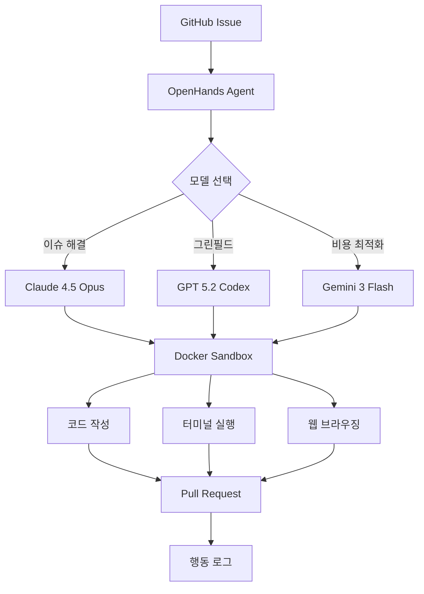

# OpenHands / Devin

## 개요

OpenHands는 All-Hands-AI가 개발한 모델 무관(model-agnostic) 자율 소프트웨어 엔지니어링 에이전트로, MIT 라이선스 기반 오픈소스 프로젝트다. GitHub 스타 70,000개 이상, 기여자 약 490명, $18.8M Series A 펀딩을 확보했으며 2026년 3월 기준 v1.6.0이 최신 버전이다.

실제 GitHub 이슈 해결, 그린필드 앱 구축, 디버깅 등 소프트웨어 엔지니어링의 전 과정을 자동화하는 것을 목표로 한다. 독점 SaaS인 Devin과 경쟁하면서도 오픈소스 자체 호스팅 방식으로 차별화한다. SWE-bench에서 53%+ 해결률로 Devin(~50%)과 동등 이상의 성능을 보이며, 비용 효율성 면에서 우위를 점한다.

## 핵심 특징

### 모델 무관 아키텍처

다양한 언어 모델과 호환되어 태스크 특성에 맞는 최적의 모델을 선택할 수 있다. 작업 단계별로 모델을 전환하는 것도 가능하다.

### 모델별 성능 특성 (OpenHands Index 기준)

| 모델 | 강점 | 특징 |
|------|------|------|
| Claude 4.5 Opus | 종합 1위 | 이슈 해결, 프론트엔드, 테스팅에서 최고. 병렬 도구 사용으로 작업 속도 가장 빠름 |
| GPT 5.2 Codex | 장기 호흡 태스크 | 그린필드 개발에서 유의미하게 높은 성공률 |
| Gemini 3 Flash | 비용 효율 | 코드 기반 작업에 강하나 프론트엔드 작업에서 약세 |
| DeepSeek-v3.2 | 오픈소스 최강 | 그린필드 개발에서 특히 효과적 |

### 샌드박스 실행 환경

모든 작업이 격리된 Docker 컨테이너 내에서 실행된다. 코드 작성, 터미널 명령어 실행, 웹 브라우징, GitHub PR 생성을 수행하며, 모든 행동이 로깅되어 투명성을 확보한다.

### OpenHands Index 벤치마크

회사 자체 벤치마크로 5가지 작업군에서 언어 모델을 평가하며, 벤치마킹 코드 전체가 오픈소스로 공개되어 있다.

| 작업군 | 기반 벤치마크 | 평가 대상 |
|--------|-------------|---------|
| 이슈 해결 | SWE-Bench Verified | 버그 수정, 기능 구현 |
| 그린필드 개발 | commit0 | 처음부터 앱 구축 |
| 프론트엔드 개발 | SWE-Bench Multimodal (verified) | UI/UX 구현 |
| 소프트웨어 테스팅 | SWT-Bench | 테스트 코드 작성 |
| 정보 수집 | GAIA | 코드베이스 탐색, 문서 분석 |

## 기술 상세

### Devin과의 비교

| 기준 | OpenHands | Devin |
|------|----------|-------|
| 라이선스 | MIT (오픈소스) | 독점 SaaS |
| 호스팅 | 자체 호스팅 + 클라우드 | 클라우드 전용 |
| SWE-bench | 53%+ | ~50% |
| 모델 선택 | 멀티 모델 (태스크별 전환 가능) | 고정 |
| 설정 복잡도 | 높음 (Docker 환경 필요) | 낮음 (즉시 사용) |
| 비용 구조 | 인프라 비용 + 모델 API 비용만 | 구독 요금 |
| 투명성 | 모든 행동 로깅, 코드 공개 | 블랙박스 |

### 아키텍처

### 속도 특성

벤치마크 결과, 클로즈드 소스 모델이 오픈소스 모델 대비 실행 속도에서 전반적으로 앞섰다. 이는 독점 추론 최적화(전용 인프라, 양자화 등)가 오픈소스 환경에서 아직 완전히 재현되지 않았기 때문으로 분석된다. Claude 4.5 Opus는 모델 크기에도 불구하고 병렬 도구 사용 능력 덕분에 가장 빠른 작업 완료 시간을 기록했다.

### 경쟁 환경 (자율 코딩 에이전트 2026)

| 에이전트 | 유형 | SWE-bench | 핵심 차별점 |
|----------|------|-----------|-----------|
| OpenHands | 오픈소스 (MIT) | 53%+ | 모델 무관, 자체 호스팅, 최대 커뮤니티 |
| Devin | 독점 SaaS | ~50% | 원클릭 셋업, 관리형 서비스 |
| [[claude-code]] | CLI 에이전트 | - | Anthropic 네이티브, 터미널 우선 |
| Codex CLI | CLI 에이전트 | - | OpenAI 네이티브, Rust 기반 |
| [[augment-intent]] | IDE 통합 | - | git worktree 격리, 자동 검증 |

### GitHub 통합 워크플로

OpenHands는 GitHub App으로 설치하여 이슈에 자동 반응하는 워크플로를 구성할 수 있다. 이슈가 생성되면 에이전트가 자동으로 코드를 분석하고, Docker 샌드박스에서 수정을 시도한 뒤, PR을 생성한다. 이 과정에서 모든 행동(파일 읽기/쓰기, 터미널 명령, 웹 검색)이 투명하게 로깅되어 사람 개발자가 에이전트의 추론 과정을 검토할 수 있다.

### 실무 고려사항

- 자체 호스팅 시 Docker 환경과 충분한 컴퓨팅 리소스 필요
- 모델 API 비용은 태스크 복잡도에 비례하여 증가 -- 간단한 이슈는 Gemini Flash로, 복잡한 이슈는 Claude Opus로 라우팅하는 전략이 비용 효율적
- 프로덕션 배포보다는 개발 보조 도구로 사용하는 것이 현실적
- 벤치마크 결과는 index.openhands.dev에서 실시간 확인 가능
- v1.6.0 기준 GitHub 스타 70K+, 기여자 490명으로 오픈소스 코딩 에이전트 중 최대 커뮤니티

## 관련 문서

- [[swe-bench-pro]] -- SWE-bench Pro 벤치마크
- [[swe-bench-ecosystem-2026]] -- SWE-bench 생태계 2026년 현황
- [[ai-code-review-tools]] -- AI 코드 리뷰 도구
- [[how-coding-agents-work]] -- 코딩 에이전트 작동 원리
