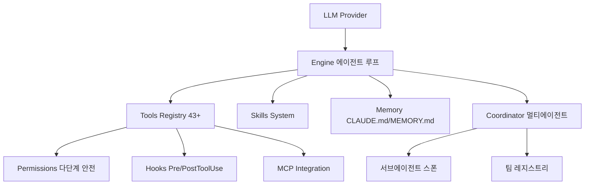

# OpenHarness

HKUDS(홍콩대학교 데이터 사이언스 연구소)가 개발한 오픈소스 Python 에이전트 하네스 프레임워크. LLM에 도구 사용, 스킬, 메모리, 멀티에이전트 조율 인프라를 제공하여 기능적 에이전트로 변환한다. MIT 라이선스.

## 왜 주목할 만한가

- [[claude-code|Claude Code]]의 하네스 설계([[anthropic-harness-design]])를 오픈소스로 재현한 최초의 프레임워크
- anthropics/skills 마크다운 포맷과 호환
- CLAUDE.md 자동 탐색, MEMORY.md 영속 메모리, 컨텍스트 압축 등 Claude Code의 핵심 패턴을 구현
- 개인 AI 어시스턴트 **ohmo**(Feishu, Slack, Telegram, Discord 지원) 번들

## 아키텍처



### 10개 서브시스템

| 서브시스템 | 역할 |
|-----------|------|
| Engine | 에이전트 루프: 쿼리 스트리밍 + 도구 호출 사이클 |
| Tools Registry | 43+ 통합 도구 (파일 I/O, 셸, 웹 검색, MCP) |
| Skills | 온디맨드 지식 로딩 (마크다운 파일) |
| Plugins | 확장: 명령어, 훅, 에이전트 |
| Permissions | 다단계 안전 모드 + 경로/명령어 규칙 |
| Hooks | PreToolUse/PostToolUse 라이프사이클 |
| Commands | 54개 내장 워크플로 명령어 |
| MCP | Model Context Protocol 클라이언트 |
| Memory | 세션 간 영속 지식 저장 |
| Coordinator | 멀티에이전트 스폰 및 팀 관리 |

### 에이전트 루프

핵심 패턴은 [[how-coding-agents-work|코딩 에이전트 동작 원리]]와 동일하다:

> 모델은 *무엇을* 할지 결정하고, 하네스는 *어떻게*--안전하고 관찰 가능하게--처리한다.

## 퍼미션 모델

| 모드 | 동작 |
|------|------|
| Default | 쓰기/실행 시 대화형 승인 |
| Auto | 모든 것 허용 (샌드박스 환경용) |
| Plan Mode | 모든 쓰기 차단 (리뷰 우선 워크플로) |

경로 수준 규칙과 거부 명령어 목록으로 세밀한 제어 가능.

## 프로바이더 호환성

**Anthropic 호환**: Claude, Moonshot/Kimi, Zhipu/GLM, MiniMax
**OpenAI 호환**: OpenAI, OpenRouter, DeepSeek, SiliconFlow, GitHub Models, Groq, Ollama
**구독 브릿지**: Claude CLI, Codex CLI, GitHub Copilot (OAuth 디바이스 플로)

프로바이더는 "named profiles" 기반 워크플로로 관리:
```bash
oh provider list
oh provider use <profile>
oh provider add my-endpoint --provider openai --model my-model
```

## Claude Code와의 비교

| 측면 | Claude Code | OpenHarness |
|------|------------|-------------|
| 개발사 | Anthropic (공식) | HKUDS (커뮤니티) |
| 모델 제한 | Claude 전용 | 멀티 프로바이더 |
| 스킬 포맷 | 마크다운 | 마크다운 (호환) |
| 소스 | 비공개 | MIT 오픈소스 |
| TUI | React/Ink | React/Ink |
| 개인 에이전트 | - | ohmo (채팅 플랫폼) |

## 설치

```bash
curl -fsSL https://raw.githubusercontent.com/HKUDS/OpenHarness/main/scripts/install.sh | bash
pip install openharness-ai
oh setup    # 대화형 프로바이더 설정
oh          # TUI 실행
```

## 관련 문서

- [[anthropic-harness-design]] -- Anthropic 하네스 설계 원칙
- [[how-coding-agents-work]] -- 코딩 에이전트 동작 원리
- [[subagents]] -- 서브에이전트 개념
- [[claude-code-hooks-system]] -- Claude Code 훅 시스템
- [[model-context-protocol-mcp]] -- MCP 개념
