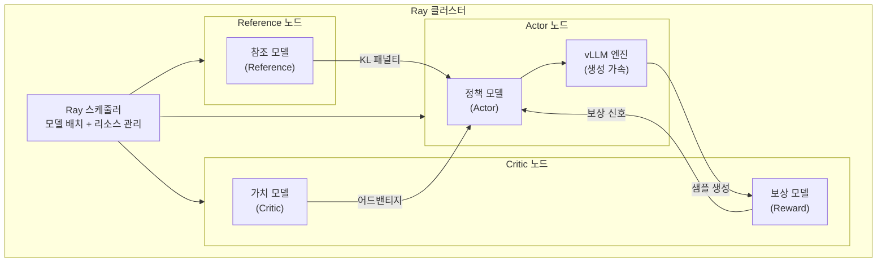

# OpenRLHF - 분산 RLHF 프레임워크

## 개요

OpenRLHF는 Ray와 vLLM을 기반으로 한 오픈소스 분산 RLHF(Reinforcement Learning from Human Feedback) 프레임워크이다. 2024년 초 공개 이후 빠르게 성장하여 2026년 4월 기준 GitHub 약 8.9k 스타를 보유하고 있으며, Google, ByteDance, Alibaba, Meituan, UC Berkeley Starling Team 등 주요 연구/산업 조직에서 실전 사용 중이다. Ray 기반의 최초의 프로덕션급 오픈소스 RLHF 프레임워크로서 PPO, GRPO, REINFORCE++, DAPO 등 다양한 RL 알고리즘을 지원하며, 기존 프레임워크 대비 1.22x-1.68x의 학습 처리량 향상을 달성한다.

- GitHub: [OpenRLHF/OpenRLHF](https://github.com/OpenRLHF/OpenRLHF)
- 논문: [OpenRLHF: An Easy-to-use, Scalable and High-performance RLHF Framework (Hu et al., 2024)](https://arxiv.org/abs/2405.11143)
- EMNLP 2025 Demos에서 발표

## 핵심 아키텍처

OpenRLHF의 아키텍처는 세 가지 핵심 설계 결정에 기반한다: Ray 분산 스케줄링, vLLM 통합, 하이브리드 엔진 스케줄링.

### Ray 기반 분산 스케줄링

[[rlhf-pipeline]]에서 PPO 학습은 Actor, Critic, Reward, Reference의 4개 모델을 동시에 운영해야 하므로 단일 GPU로는 불가능하다. OpenRLHF는 Ray를 사용하여 각 모델을 서로 다른 GPU 그룹에 배치하고 분산 스케줄링한다. 이를 통해 70B+ 규모의 모델에서도 RLHF 학습이 가능하다.

### vLLM 통합

RLHF 학습에서 전체 시간의 약 80%는 샘플 생성(generation) 단계에 소비된다. OpenRLHF는 vLLM의 Auto Tensor Parallelism(AutoTP)과 Pipeline Parallelism(PP)을 통합하여 이 병목을 해소한다. vLLM의 PagedAttention, continuous batching 등 최적화를 그대로 활용하면서 RLHF 학습 루프에 맞는 인터페이스를 제공한다.

### 하이브리드 엔진 스케줄링

모든 모델과 vLLM 엔진이 GPU 리소스를 공유할 수 있도록 하이브리드 스케줄링을 지원한다. 생성 단계에서는 vLLM이 GPU를 점유하고, 학습 단계에서는 Actor/Critic이 GPU를 점유하는 식으로 유휴 시간을 최소화한다. 제한된 하드웨어 환경에서도 전체 RLHF 파이프라인 실행이 가능하다.

## 지원 알고리즘

| 알고리즘 | 핵심 특징 | 참조 |
|---------|----------|------|
| PPO | 4-모델 구조, clipped surrogate 목적함수 | [[ppo-for-llms]] |
| GRPO | Critic 제거, 그룹 기반 보상 정규화 | [[grpo]] |
| REINFORCE++ | PPO 대비 안정적 학습, 빠른 수렴 | Logic-RL, PRIME |
| REINFORCE++-baseline | 베이스라인 추가로 분산 감소 | ProRL V2 |
| RLOO | Leave-One-Out 베이스라인 | - |
| DAPO | Clip-Higher + Dynamic Sampling | [[dapo]] |
| DPO/KTO/SimPO | 오프라인 선호 최적화 | [[direct-preference-optimization]] |
| SFT/Rejection Sampling | 지도 파인튜닝 및 거부 샘플링 | - |

## 주요 버전 이력

| 시점 | 버전/이벤트 | 주요 변경 |
|------|-----------|----------|
| 2024.05 | v0.1 | 초기 공개, PPO + Ray + vLLM 기본 구조 |
| 2025.10 | ScaleRL | REINFORCE++-baseline 대규모 검증 |
| 2025.12 | EMNLP 2025 | 데모 논문 발표 |
| 2026.02 | ProRL V2 | REINFORCE++-baseline으로 1.5B 추론 모델 SOTA 달성 |
| 2026.04 | v0.10 | VLM(Vision-Language Model) RLHF 지원 추가, Qwen3.5 등 멀티모달 RL 학습 가능 |

## veRL과의 비교

OpenRLHF와 [[verl-bytedance]]는 동일한 문제 영역(분산 RLHF 학습)을 타겟으로 하지만 설계 철학이 다르다.

| 관점 | OpenRLHF | veRL |
|------|----------|------|
| 분산 백엔드 | Ray | Ray + NCCL 직접 제어 |
| 설계 패러다임 | 에이전트 기반 (v0.9+) | HybridFlow (단일/다중 컨트롤러 혼합) |
| 생성 엔진 | vLLM | vLLM, SGLang |
| 모델 병렬 | vLLM AutoTP/PP | 3D-HybridEngine (학습/생성 리샤딩) |
| 강점 | 빠른 프로토타이핑, 넓은 알고리즘 커버리지 | 대규모 클러스터 최적화, 메모리 효율 |

## 실전 활용 패턴

### 70B 모델 PPO 학습 예시

OpenRLHF는 70B 모델의 PPO 학습을 다음과 같이 분산 배치한다:

- Actor: 16x A100 (FSDP + vLLM AutoTP)
- Critic: 8x A100 (FSDP)
- Reward Model: 4x A100 (추론만)
- Reference Model: 4x A100 (추론만)

총 32x A100으로 70B 전체 파라미터 PPO 학습이 가능하며, LoRA를 사용하면 GPU 수를 더 줄일 수 있다. [[gpu-cluster-scheduling]]의 효율적 스케줄링과 [[mixed-precision-training]]의 BF16/FP8 지원이 핵심이다.

### Async Agentic RL

v0.9 이후 도입된 에이전트 기반 아키텍처는 비동기(async) RL 학습을 지원한다. 생성과 학습이 파이프라인으로 겹쳐서(overlap) 실행되므로 GPU 유휴 시간이 줄어든다. 이는 코드 생성, 도구 사용 등 에이전트 태스크에서 응답 생성 시간이 긴 경우 특히 효과적이다.

## 제한 사항과 고려 사항

- **학습 곡선**: Ray, vLLM, ZeRO-3 등 여러 분산 시스템의 이해가 필요하며, 디버깅 시 각 컴포넌트의 로그를 개별적으로 확인해야 한다
- **단일 노드 제약**: 소규모 실험(7B 이하)에서는 TRL 등 단순 프레임워크 대비 오버헤드가 존재할 수 있다
- **GPU 간 통신**: 노드 간 네트워크 대역폭이 충분하지 않으면 생성-학습 간 파라미터 동기화가 병목이 된다

## 대표 자료

- [OpenRLHF: An Easy-to-use, Scalable and High-performance RLHF Framework (Hu et al., 2024)](https://arxiv.org/abs/2405.11143)
- [Accelerating RLHF with vLLM -- Best Practice from OpenRLHF (vLLM Blog, 2025)](https://blog.vllm.ai/2025/04/23/openrlhf-vllm.html)
- [OpenRLHF 공식 문서](https://openrlhf.readthedocs.io/)

## 관련 문서

- [[rlhf-pipeline]] -- RLHF의 전체 파이프라인 구조
- [[ppo-for-llms]] -- PPO 알고리즘의 LLM 적용
- [[grpo]] -- GRPO 알고리즘
- [[dapo]] -- DAPO 알고리즘 (OpenRLHF에서 구현 지원)
- [[verl-bytedance]] -- 동일 영역의 ByteDance 프레임워크
- [[reward-model-training]] -- 보상 모델 학습
- [[gpu-cluster-scheduling]] -- 분산 GPU 스케줄링
- [[mixed-precision-training]] -- 혼합 정밀도 학습
- [[training-frameworks]] -- 학습 프레임워크 전반 개요
