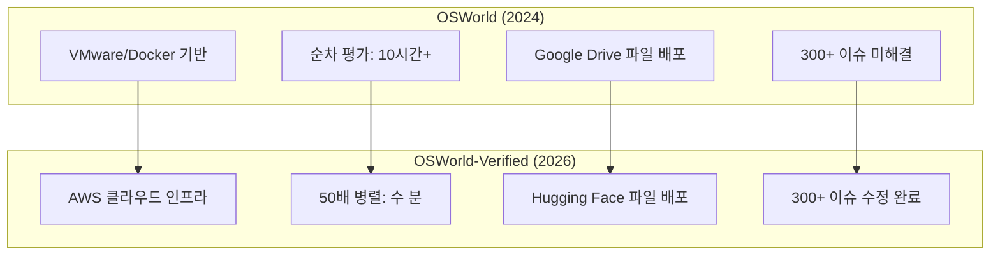

# OSWorld-Verified

OSWorld의 검증 강화판으로, 실제 데스크톱 환경에서 AI 에이전트의 컴퓨터 사용 능력을 측정하는 벤치마크. 원본 OSWorld(NeurIPS 2024)가 15개월간 운영되며 발견된 300건 이상의 이슈를 수정하고, AWS 기반 50배 병렬 평가 인프라를 도입했다.

## 왜 지금 중요한가

컴퓨터 사용 에이전트가 실무 자동화(QA 테스팅, 백오피스 자동화, 스프레드시트 처리)에 투입되면서, 신뢰할 수 있는 평가 기준이 필수가 되었다. OSWorld-Verified는 원본의 웹 구조 변경, 안티크롤링 차단, 타이밍 의존성 등 현실 문제를 해결하여 **재현 가능한 평가**를 보장한다. 최상위 에이전트(CoACT-1: 60.76%)도 인간 기준(~72%)에 미치지 못해, 아직 상당한 개선 여지가 남아 있음을 보여준다.

## 원본 OSWorld 대비 개선점

### 인프라 전환
- VMware/Docker에서 AWS 클라우드로 이전
- 최대 50개 동시 환경으로 평가 시간 10시간 이상에서 수 분으로 단축
- 모든 파일을 Google Drive에서 Hugging Face로 마이그레이션

### 태스크 품질 보강
- 웹 구조 변경, 안티크롤링 차단, 타이밍 의존성 등 300건 이상 수정
- 지시문 모호성 해소 및 평가 함수 견고성 개선

## 평가 대상 역량

OSWorld-Verified는 다섯 가지 핵심 역량을 평가한다.

1. **화면/환경 이해** -- 현재 스크린 상태 파악
2. **다음 행동 선택** -- 적절한 조작 결정
3. **다단계 상태 유지** -- 긴 작업 체인에서의 컨텍스트 보존
4. **파괴적 실수 회피** -- 에러 복구 능력
5. **워크플로우 완수** -- 최종 목표 달성

난도가 높은 이유는 부분 관측 가능성(partial observability), 모호한 UI 상태, 긴 행동 체인, 실수 후 복구, 계획과 실행 간의 괴리를 동시에 다루기 때문이다.

## 모델 성능 결과

| 계층 | 시스템 | 성공률 |
|---|---|---|
| 에이전틱 프레임워크 | CoACT-1 | 60.76% |
| 고급 파운데이션 모델 | Claude 4 Sonnet | 43.9% |
| 특화 모델 | UI-TARS | 40.0% |
| **인간 기준** | -- | **~72%** |

현재 성공률이 인간 기준과 11~31%p 격차를 보이며, 대량의 인간 궤적(trajectory) 데이터 수집과 포스트 트레이닝이 다음 돌파구의 핵심으로 지목된다.

## 적용 영역

- 운영 워크플로우 자동화
- QA 및 테스팅
- 백오피스 업무 처리
- 스프레드시트/문서 작업
- 다중 앱 연계 자동화

## 보완 벤치마크 조합

OSWorld-Verified 단독으로는 에이전트 전체 역량을 포괄하지 못한다. 포괄적 평가를 위해 다음 벤치마크와 병행을 권장한다.

- [[terminal-bench-2-0]] -- 터미널 중심 태스크
- [[browsecomp]] -- 웹 리서치 탐색
- [[swe-bench-pro]] -- 소프트웨어 엔지니어링

## 대표 자료

- [OSWorld-Verified (XLang AI)](https://xlang.ai/blog/osworld-verified)
- [OSWorld GitHub](https://github.com/xlang-ai/OSWorld)
- [OSWorld-Verified: Computer Use Benchmark (BenchLM)](https://benchlm.ai/blog/posts/osworld-verified-computer-use-benchmark)
- [UiPath ScreenAgent OSWorld Ranking](https://www.uipath.com/newsroom/uipath-screenagent-osworld-benchmark-top-ranking)

## 관련 문서

- [[browsecomp]] -- 웹 브라우징 에이전트 벤치마크, 상호 보완
- [[terminal-bench-2-0]] -- 터미널 에이전트 벤치마크
- [[swe-bench-pro]] -- 장기 호흡 SW 엔지니어링 벤치마크
- [[long-horizon-agent-benchmarks]] -- 장기 호흡 에이전트 벤치마크 개요
