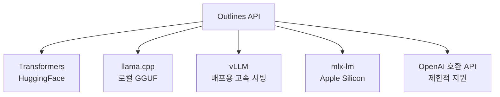

# Outlines

dottxt-ai(구 .txt)가 개발한 오픈소스 구조화 텍스트 생성 라이브러리. LLM의 출력을 JSON 스키마, 정규식(regex), Pydantic 모델 등으로 **제약 디코딩(constrained decoding)**하여 항상 유효한 구조화 출력을 보장한다. 파싱 실패와 재시도 루프 없이 신뢰할 수 있는 LLM 출력을 얻는 것이 핵심 목적이다.

## 개요

| 항목 | 내용 |
|---|---|
| 이름 | Outlines |
| 개발사 | dottxt-ai (구 .txt) |
| 라이선스 | Apache 2.0 |
| 저장소 | github.com/dottxt-ai/outlines |
| 언어 | Python |
| 백엔드 | Transformers, llama.cpp, vLLM, mlx-lm |

## 핵심 개념: 제약 디코딩

일반 LLM 디코딩은 토큰 확률 분포에서 자유롭게 다음 토큰을 샘플링한다. Outlines는 이 과정에서 **유효하지 않은 토큰을 확률 마스킹으로 차단**하여, 생성 과정 전체에서 문법/스키마를 준수하도록 강제한다.

```mermaid
flowchart LR
    subgraph "일반 디코딩"
        P1[토큰 확률 분포] --> S1[자유 샘플링]
        S1 --> T1["{ name: John... (유효)"]
        S1 --> T2["{ name: ... (파싱 실패 가능)"]
    end

    subgraph "Outlines 제약 디코딩"
        P2[토큰 확률 분포] --> Mask[FSM 마스크 적용\n무효 토큰 차단]
        Mask --> S2[제약 샘플링]
        S2 --> T3["{ \"name\": \"John\" } (항상 유효)"]
    end
```

유한 상태 머신(FSM, Finite State Machine)으로 정규식이나 JSON 스키마를 표현하고, 디코딩 매 스텝에서 현재 상태에서 유효한 토큰만 허용한다.

## 주요 기능

### 1. Pydantic 기반 JSON 생성

```python
from pydantic import BaseModel
from outlines import models, generate

class Character(BaseModel):
    name: str
    age: int
    occupation: str
    skills: list[str]

model = models.transformers("mistralai/Mistral-7B-v0.1")
generator = generate.json(model, Character)

result = generator("판타지 세계의 캐릭터를 생성해줘")
# result는 반드시 Character 타입의 유효한 인스턴스
print(result.name, result.age)   # 파싱 실패 없음
```

### 2. 정규식 제약

```python
from outlines import generate

# 날짜 형식 강제 (YYYY-MM-DD)
date_gen = generate.regex(model, r"\d{4}-\d{2}-\d{2}")
date = date_gen("오늘 날짜를 알려줘")   # 항상 "2026-04-16" 형식

# 한국 전화번호 형식
phone_gen = generate.regex(model, r"0\d{1,2}-\d{3,4}-\d{4}")
```

### 3. 선택지 제약 (choice)

```python
from outlines import generate

# 정해진 선택지 중 하나만 출력
sentiment_gen = generate.choice(model, ["positive", "negative", "neutral"])
result = sentiment_gen("이 제품 정말 좋아요!")
# result는 반드시 세 값 중 하나
```

### 4. JSON 스키마 직접 사용

Pydantic 없이 JSON Schema 딕셔너리로도 제약을 정의한다.

```python
schema = {
    "type": "object",
    "properties": {
        "title": {"type": "string"},
        "score": {"type": "number", "minimum": 0, "maximum": 10},
        "tags": {"type": "array", "items": {"type": "string"}},
    },
    "required": ["title", "score"],
}
generator = generate.json(model, schema)
```

## 지원 백엔드



vLLM과의 통합으로 프로덕션 서빙 환경에서도 제약 디코딩을 적용할 수 있다.

## Outlines vs 대안 솔루션

| 방식 | 도구 | 특징 |
|---|---|---|
| 제약 디코딩 | Outlines, llama.cpp grammar | 생성 자체를 제약, 100% 유효성 보장 |
| 프롬프트 강제 | LangChain OutputParser | 재시도 로직 필요, 실패 가능 |
| 함수 호출 | OpenAI function calling | API 종속, 오픈소스 모델 미지원 |
| 파인튜닝 | [[structured-output|Structured Output]] SFT | 비용 높음, 범용성 낮음 |

[[constrained-decoding|제약 디코딩]] 접근법은 프롬프트 수준이 아니라 **디코딩 알고리즘 수준**에서 제약을 적용하므로, 프롬프트 해킹이나 모델 편차로 인한 파싱 실패가 원천적으로 발생하지 않는다.

## 실무 적용 패턴

### 정보 추출 파이프라인

```python
from pydantic import BaseModel
from typing import Optional

class InvoiceData(BaseModel):
    vendor: str
    amount: float
    currency: str
    due_date: Optional[str]
    items: list[str]

extractor = generate.json(model, InvoiceData)
invoice_text = "..."
data = extractor(f"다음 청구서에서 정보를 추출해줘:\n{invoice_text}")
# data.amount, data.vendor 등 직접 접근 가능
```

### 분류 + 추출 연쇄

Outlines 생성기를 함수처럼 조합하여 멀티스텝 파이프라인을 구성한다.

## 실무 관점

Outlines는 **LLM 출력의 신뢰성이 중요한 정보 추출, 분류, 데이터 변환** 파이프라인에서 강점을 갖는다. 오픈소스 모델(Mistral, Llama, Phi 등)에서 OpenAI Function Calling과 동일한 수준의 구조화 출력을 구현할 수 있다. 단, 제약이 강할수록 모델이 창의적인 표현을 할 여지가 줄어들므로, 의미 있는 자유 텍스트와 구조화 필드를 혼합할 때는 스키마 설계에 주의가 필요하다.

## 관련 문서
- [[guidance]] -- Guidance (Microsoft 구조화 생성 라이브러리)

- [[structured-output|구조화 출력 (Structured Output)]]
- [[constrained-decoding|제약 디코딩 (Constrained Decoding)]]
- [[instructor|Instructor]]
- [[langchain|LangChain]]
