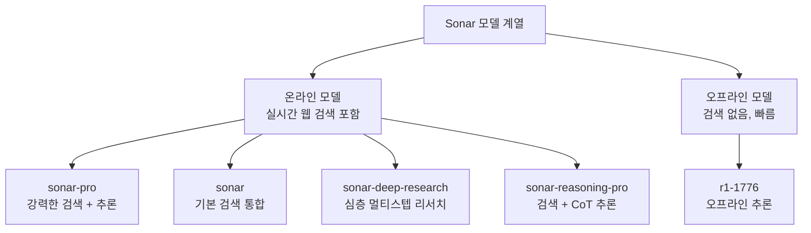
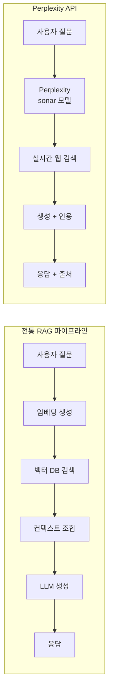

# Perplexity API - 검색 강화 LLM API

Perplexity API는 실시간 웹 검색이 통합된 LLM(Large Language Model) 추론 API다. 일반 LLM API와 달리 모델이 답변을 생성하는 동시에 웹을 검색하고, 참조 인용(citation)을 응답에 포함한다. 자체 개발한 Sonar(소나) 모델 계열을 사용하며, 최신 정보가 필요한 질의응답, 리서치 자동화, 사실 확인 워크플로우에 특화되어 있다.

## 정체성

| 항목 | 내용 |
|------|------|
| 공식 명칭 | Perplexity API |
| 회사 | Perplexity AI, Inc. |
| 설립 | 2022년 |
| 주요 제품 | Perplexity (AI 검색엔진), Perplexity API |
| API 엔드포인트 | https://api.perplexity.ai |
| OpenAI 호환 | 네 (chat completions 엔드포인트) |
| 공식 문서 | https://docs.perplexity.ai |
| 가격 모델 | 토큰 기반 과금 (입력/출력 토큰 별도) |

## Sonar 모델 계열

Perplexity가 자체 개발한 Sonar 모델 계열은 검색 기능 내장 여부와 성능에 따라 구분된다:



- **sonar-pro:** 강력한 멀티소스 검색과 긴 컨텍스트 처리. 복잡한 리서치 질의에 적합
- **sonar:** 기본 검색 통합. 빠르고 저렴한 검색 강화 응답
- **sonar-deep-research:** 복잡한 주제를 멀티스텝으로 탐색하는 심층 리서치 모드 [교차검증 필요: 모델명 및 기능은 변동 가능]
- **sonar-reasoning-pro:** 검색 결과를 기반으로 단계적 추론(Chain-of-Thought)을 수행

## 핵심 기능

### 1. 실시간 웹 검색 통합

일반 LLM은 학습 데이터 컷오프(cutoff) 이후 정보를 알지 못한다. Perplexity API는 매 요청마다 실시간 웹을 검색하고 그 결과를 컨텍스트로 활용한다:

```python
from openai import OpenAI  # Perplexity는 OpenAI SDK 호환

client = OpenAI(
    api_key="PERPLEXITY_API_KEY",
    base_url="https://api.perplexity.ai"
)

응답 = client.chat.completions.create(
    model="sonar-pro",
    messages=[
        {
            "role": "system",
            "content": "당신은 최신 정보를 바탕으로 정확한 답변을 제공하는 AI 어시스턴트입니다."
        },
        {
            "role": "user",
            "content": "2026년 4월 현재 가장 성능이 좋은 오픈소스 LLM은 무엇인가요?"
        }
    ],
    max_tokens=1000,
    temperature=0.2,
)

print(응답.choices[0].message.content)
```

### 2. 인용 출처 반환 (Citations)

Perplexity API는 응답과 함께 참조한 웹 소스 목록을 반환한다. 이를 통해 답변의 출처를 검증할 수 있다:

```python
응답 = client.chat.completions.create(
    model="sonar-pro",
    messages=[{"role": "user", "content": "Claude 4.5의 출시일과 주요 기능을 알려줘"}],
)

# 응답 텍스트
답변 = 응답.choices[0].message.content
print("답변:", 답변)

# 인용 출처 (응답 객체의 확장 필드)
if hasattr(응답, "citations"):
    print("\n출처:")
    for i, 인용 in enumerate(응답.citations, 1):
        print(f"{i}. {인용}")
```

인용은 `[1]`, `[2]` 같은 번호로 응답 텍스트 내에 인라인으로 삽입되며, `citations` 필드에 해당 URL이 포함된다.

### 3. 검색 도메인 필터링

특정 도메인만 검색하거나 특정 도메인을 제외하도록 설정할 수 있다:

```python
응답 = client.chat.completions.create(
    model="sonar-pro",
    messages=[{"role": "user", "content": "최신 PyTorch 릴리즈 노트 요약"}],
    # 추가 파라미터 (Perplexity 확장)
    extra_body={
        "search_domain_filter": ["pytorch.org", "github.com"],  # 이 도메인만 검색
        "return_citations": True,
        "return_images": False,
        "search_recency_filter": "month"  # 최근 1개월 이내 결과만
    }
)
```

[교차검증 필요: `extra_body` 파라미터명과 지원 필드는 공식 문서에서 최신 버전 확인 필요]

### 4. 날짜 기반 검색 필터

`search_recency_filter`로 검색 결과를 시간 범위로 제한할 수 있다:
- `"hour"` - 최근 1시간
- `"day"` - 최근 24시간
- `"week"` - 최근 1주일
- `"month"` - 최근 1개월

속보, 최신 뉴스, 최신 릴리즈 정보를 조회할 때 유용하다.

### 5. 스트리밍 응답

긴 리서치 답변을 실시간으로 스트리밍할 수 있다:

```python
스트림 = client.chat.completions.create(
    model="sonar-pro",
    messages=[{
        "role": "user",
        "content": "Transformer 아키텍처의 역사와 발전 과정을 상세히 설명해줘"
    }],
    max_tokens=2000,
    stream=True
)

전체_응답 = ""
for 청크 in 스트림:
    델타 = 청크.choices[0].delta
    if 델타.content:
        print(델타.content, end="", flush=True)
        전체_응답 += 델타.content

print()  # 줄바꿈
```

## 실무 활용 패턴

### 리서치 자동화 에이전트

```python
from openai import OpenAI
from typing import TypedDict

client = OpenAI(
    api_key="PERPLEXITY_API_KEY",
    base_url="https://api.perplexity.ai"
)

class 리서치_결과(TypedDict):
    요약: str
    인용: list[str]
    핵심_사실: list[str]

def 주제_리서치(주제: str, 깊이: str = "sonar-pro") -> 리서치_결과:
    """주어진 주제를 Perplexity로 리서치하고 구조화된 결과 반환"""
    
    시스템_프롬프트 = """당신은 전문 리서치 어시스턴트입니다.
주어진 주제를 조사하고 다음 형식으로 답변해주세요:

## 핵심 요약
(2-3문장 요약)

## 핵심 사실
- 사실 1
- 사실 2
- 사실 3

## 상세 설명
(상세 내용)
"""
    
    응답 = client.chat.completions.create(
        model=깊이,
        messages=[
            {"role": "system", "content": 시스템_프롬프트},
            {"role": "user", "content": f"다음 주제를 조사해줘: {주제}"}
        ],
        max_tokens=2000,
        temperature=0.1,  # 낮은 온도로 사실 기반 답변 유도
    )
    
    내용 = 응답.choices[0].message.content
    인용들 = getattr(응답, "citations", [])
    
    # 핵심 사실 파싱 (단순 파싱)
    사실_목록 = []
    for 줄 in 내용.split("\n"):
        if 줄.startswith("- "):
            사실_목록.append(줄[2:].strip())
    
    return {
        "요약": 내용,
        "인용": 인용들,
        "핵심_사실": 사실_목록
    }

# 사용
결과 = 주제_리서치("NVIDIA H200 GPU의 H100 대비 성능 차이")
print(결과["요약"])
print("\n출처:")
for 인용 in 결과["인용"]:
    print(f"- {인용}")
```

### RAG 파이프라인과의 차이



Perplexity API는 실시간 웹 전체를 검색 소스로 사용하는 반면, 전통 RAG는 사전에 인덱싱된 내부 문서만 검색한다. Perplexity는 최신 공개 정보에 강하고, RAG는 사내 비공개 데이터에 강하다.

### 뉴스 모니터링 파이프라인

```python
import schedule
import time
from openai import OpenAI

client = OpenAI(api_key="PERPLEXITY_API_KEY", base_url="https://api.perplexity.ai")

관심_주제들 = [
    "AI 규제 최신 동향",
    "LLM 새 모델 출시",
    "NVIDIA GPU 가격 동향"
]

def 일간_AI_브리핑() -> None:
    """매일 AI 관련 최신 뉴스 요약"""
    
    for 주제 in 관심_주제들:
        응답 = client.chat.completions.create(
            model="sonar",
            messages=[{
                "role": "user",
                "content": f"최근 24시간 내 {주제}에 관한 중요한 뉴스를 3줄로 요약해줘"
            }],
            extra_body={"search_recency_filter": "day"},
            max_tokens=300
        )
        
        print(f"\n## {주제}")
        print(응답.choices[0].message.content)

# 매일 오전 9시 실행
schedule.every().day.at("09:00").do(일간_AI_브리핑)
```

## 차별점 - 경쟁 서비스 비교

| 항목 | Perplexity API | Bing API | Tavily | You.com API |
|------|---------------|----------|--------|-------------|
| LLM + 검색 통합 | 네이티브 | 별도 조합 필요 | 검색 전용 | 네이티브 |
| 인용 반환 | 자동 | 별도 처리 | 자동 | 자동 |
| OpenAI 호환 | 네 | 아니오 | 아니오 | 부분 |
| 자체 LLM | Sonar (자체) | GPT-4 기반 | 없음 | 있음 |
| 실시간성 | 강함 | 강함 | 강함 | 강함 |
| 가격 | 토큰 기반 | API 호출 기반 | 검색당 과금 | 다양 |

Perplexity의 가장 강력한 포지션은 **검색+LLM+인용이 하나의 API 호출로 해결**된다는 점이다. Tavily 같은 검색 전용 API + 별도 LLM 조합보다 구현이 단순하다.

## 한계 및 트레이드오프

### 사내 비공개 데이터 접근 불가
Perplexity는 공개 웹만 검색한다. 내부 문서, 사내 데이터베이스, 비공개 지식베이스 접근이 필요한 경우 [[rag]] 파이프라인이 필수다.

### 검색 결과 신뢰도
웹에서 가져온 정보는 항상 오류나 편향이 있을 수 있다. 의료, 법률, 금융 등 정확도가 중요한 도메인에서는 인용 출처를 반드시 검증해야 한다.

### 재현성(Reproducibility) 부족
같은 질의를 다른 시간에 보내면 검색 결과가 달라져 응답이 달라질 수 있다. 결정론적(deterministic) 응답이 필요한 시스템에는 적합하지 않다.

### 지연시간
웹 검색 과정이 포함되므로 일반 LLM API보다 지연시간이 더 높다. 짧은 지연이 중요한 실시간 UI에는 주의 필요.

### API 가용성
Perplexity는 규모가 큰 기업이지만, OpenAI나 Anthropic에 비해 API 안정성/SLA 보장 수준이 상대적으로 낮을 수 있다.

## 관련 문서

- [[rag]] - 검색 증강 생성 개념 (전통 RAG vs Perplexity API)
- [[groq-cloud-api]] - Groq 저지연 추론 (검색 불필요한 빠른 추론)
- [[openrouter]] - OpenRouter 멀티모델 라우팅
- [[haystack]] - Haystack RAG 프레임워크 (자체 검색 파이프라인)
- [[llamaindex]] - LlamaIndex 검색 증강 프레임워크
