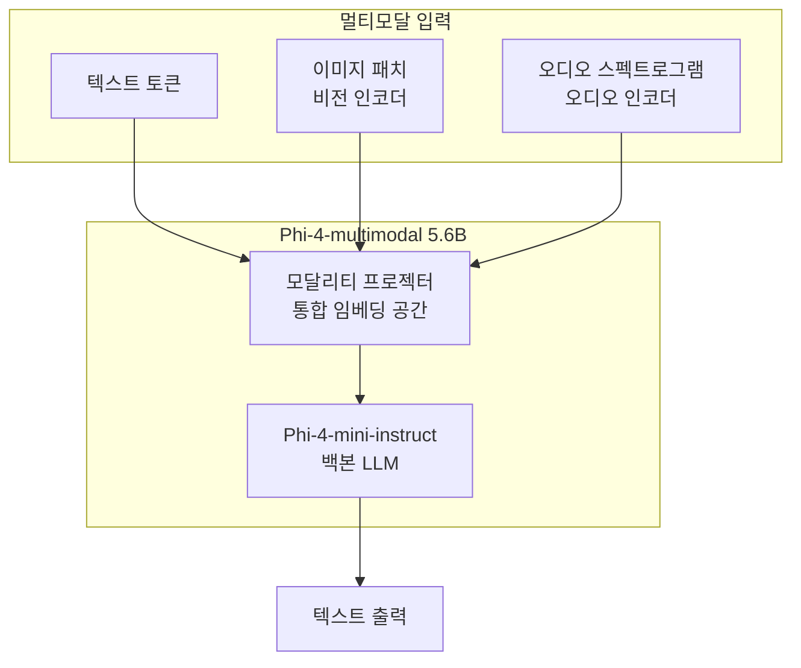
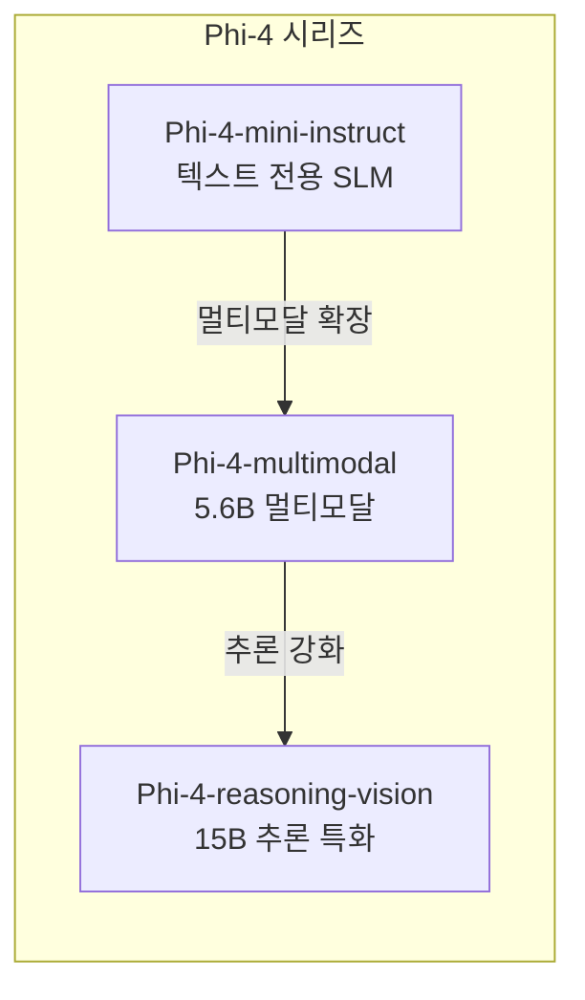
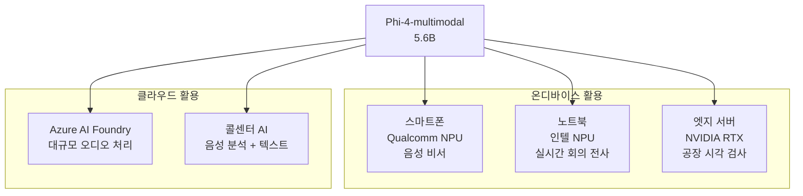

# Microsoft Phi-4 Multimodal

Microsoft Research가 개발한 5.6B 파라미터 경량 멀티모달 모델로, 텍스트·이미지·오디오 입력을 단일 신경망에서 처리한다. [[multimodal-llm|멀티모달 LLM]] 중 소형 모델 부문에서 WhisperV3·SeamlessM4T-v2를 능가하는 ASR 성능을 달성했으며, Hugging Face OpenASR 리더보드 WER 6.14%로 1위를 기록했다. [[bitnet-b158-2b4t|BitNet b1.58 2B4T]]와 함께 Microsoft Research의 2026년 상반기 핵심 모델 릴리스다.

## 왜 중요한가

SLM(Small Language Model) 시장에서 Phi 시리즈의 핵심 가치는 **크기 대비 성능**이다. Phi-4 Multimodal은 이 전략을 텍스트를 넘어 멀티모달로 확장한다.

- **5.6B 파라미터로 멀티모달**: 동급 멀티모달 모델(LLaVA 13B, InternVL-7B 등)과 경쟁
- **단일 모델, 세 가지 모달리티**: 별도 오디오/비전 모델 없이 통합 처리
- **ASR 성능 1위**: 음성 인식에서 전문 모델인 Whisper를 소형 통합 모델로 뛰어넘음
- **온디바이스 배포**: 5.6B는 최신 모바일 NPU/중급 GPU에서 실용적으로 실행 가능

## 모델 아키텍처



### 백본: Phi-4-mini-instruct

Phi-4 Multimodal의 텍스트 처리 백본은 Phi-4-mini-instruct다. 이 아키텍처 선택이 중요한 이유는 다음과 같다.

- **강력한 텍스트 기반**: Phi-4-mini는 이미 수학·코딩·추론에서 두각을 보이는 모델
- **효율적 사전학습**: 텍스트 기초가 탄탄하므로 멀티모달 확장 시 추가 학습 부담 감소
- **지시 추종**: instruct 튜닝된 모델이 멀티모달 지시를 잘 이행

### 오디오 인코더

WhisperV3와 SeamlessM4T-v2의 아키텍처를 참고해 설계된 오디오 인코더를 사용한다. 멜 스펙트로그램(mel spectrogram)을 입력으로 받아 오디오 특징 벡터를 추출하며, 이를 백본 LLM의 임베딩 공간으로 프로젝션한다.

### 비전 인코더

이미지는 비전 인코더로 처리 후 패치 임베딩으로 변환된다. 구체적인 인코더 아키텍처(ViT 변형 등)는 [교차검증 필요].

## 성능 벤치마크

### ASR (음성 인식) 성능

| 모델 | WER (Hugging Face OpenASR) | 파라미터 | 비고 |
|------|--------------------------|---------|------|
| Phi-4-multimodal | **6.14%** | 5.6B | 멀티모달 통합 모델 |
| WhisperV3 | ~8-9% (추정) | 1.5B | 전문 ASR 모델 |
| SeamlessM4T-v2 | ~7-8% (추정) | 2.3B | 음성/텍스트 멀티모달 |
| Whisper Large-v3 Turbo | ~7% (추정) | 809M | 최적화 버전 |

*WER(Word Error Rate)은 낮을수록 좋다. WhisperV3, SeamlessM4T-v2의 정확한 수치는 [교차검증 필요].*

Hugging Face OpenASR 리더보드 WER 6.14% 1위는 단순 ASR 전문 모델이 아닌 5.6B 통합 멀티모달 모델이 달성했다는 점에서 의미가 크다.

### 비전-언어 태스크

| 태스크 | 성능 | 비교 기준 |
|--------|------|---------|
| VQA (Visual Question Answering) | 동급 최고 수준 | InternVL-7B, LLaVA-7B 대비 |
| 차트/다이어그램 이해 | 강점 영역 | 수학/과학 차트 특화 |
| UI 이해 | - | [교차검증 필요] |

## Phi-4-reasoning-vision-15B와의 관계

2026년 3월에는 Phi-4 Multimodal(5.6B)에 이어 **Phi-4-reasoning-vision-15B**가 추가 공개됐다.

| 모델 | 파라미터 | 특징 | 용도 |
|------|---------|------|------|
| Phi-4-multimodal | 5.6B | 균형잡힌 멀티모달 | 일반 멀티모달 태스크 |
| Phi-4-reasoning-vision | 15B | 멀티모달 체인오브소트 추론 | 수학·과학·UI 이해 심층 분석 |

Phi-4-reasoning-vision-15B는 시각 정보를 포함한 복잡한 추론 문제에 특화됐다. 수학 문제 풀이(수식 이미지 + 텍스트), 과학 다이어그램 분석, 소프트웨어 UI 이해 등이 주요 시나리오다.



## 배포 옵션

### Azure AI Foundry

Azure AI Studio와 Azure AI Foundry에서 Phi-4 Multimodal을 API 형태로 사용할 수 있다. Azure OpenAI Service와 유사한 REST API로 접근하며, 엔터프라이즈 보안(RBAC, 감사 로그, 네트워크 격리)이 적용된다.

### Azure AI Foundry Local

Microsoft의 [[azure-foundry-local|Azure AI Foundry Local]]을 통해 Phi-4 Multimodal을 로컬 디바이스에서 실행할 수 있다. ONNX Runtime으로 최적화되어 NVIDIA GPU, AMD GPU/NPU, Intel NPU, Qualcomm Snapdragon X Elite, Apple Silicon을 모두 지원한다.

### Hugging Face

Hugging Face Hub에서 모델 가중치를 직접 다운로드해 사용할 수 있다.

```python
# Phi-4-multimodal 사용 예시 (Hugging Face Transformers)
from transformers import AutoModelForCausalLM, AutoProcessor  # [교차검증 필요]
import torch

model = AutoModelForCausalLM.from_pretrained(
    "microsoft/Phi-4-multimodal",  # [교차검증 필요] - 실제 모델 ID 확인 필요
    torch_dtype=torch.bfloat16,
    device_map="auto"
)
processor = AutoProcessor.from_pretrained("microsoft/Phi-4-multimodal")
```

### ONNX Runtime 최적화

온디바이스 배포를 위해 ONNX Runtime으로 변환된 최적화 버전을 제공한다. INT4 양자화 적용 시 2-3GB 수준으로 모바일 기기 배포가 가능하다.

## 멀티모달 처리 상세

### 오디오 처리 파이프라인

```mermaid
flowchart LR
    WAV[오디오 입력\n.wav/.mp3] --> MEL[멜 스펙트로그램\n변환]
    MEL --> ENC[오디오 인코더\n특징 추출]
    ENC --> PROJ[프로젝터\n임베딩 공간 변환]
    PROJ --> LLM[Phi-4-mini 백본\n텍스트 생성]
    LLM --> OUT[텍스트 출력\n(전사/번역/분석)]
```

지원하는 오디오 태스크:
- **자동 음성 인식 (ASR)**: 음성 전사
- **음성 번역**: 외국어 음성을 직접 텍스트로 번역
- **오디오 질의응답**: 오디오 내용에 대한 질문 답변
- **감정 분석**: 음성에서 감정 상태 추론

### 이미지 처리 파이프라인

지원하는 비전 태스크:
- **이미지 캡셔닝**: 이미지 내용을 텍스트로 설명
- **시각적 질의응답 (VQA)**: 이미지에 관한 질문 답변
- **OCR**: 이미지 내 텍스트 추출
- **다이어그램 분석**: 차트, 플로우차트, 수식 이미지 이해
- **UI 이해**: 스크린샷 분석, UI 요소 설명

## 경쟁 모델 비교

| 모델 | 파라미터 | 모달리티 | 강점 |
|------|---------|---------|------|
| Phi-4-multimodal | 5.6B | 텍스트+이미지+오디오 | ASR 성능, 균형 |
| LLaVA-7B | 7B | 텍스트+이미지 | 범용 비전-언어 |
| Qwen2-VL-7B | 7B | 텍스트+이미지+비디오 | 비디오 이해 |
| InternVL2-8B | 8B | 텍스트+이미지 | 다국어 비전 |
| Gemini 2.0 Flash Lite | ~20B+ | 텍스트+이미지+오디오 | 성능, 비용 |

Phi-4 Multimodal의 독특한 점은 **오디오를 포함한 세 가지 모달리티를 5.6B 소형 모델에 통합**했다는 것이다. Qwen2-VL은 비디오를 지원하지만 오디오가 없고, LLaVA는 이미지만 지원하는 등 완전한 멀티모달은 훨씬 큰 모델에서나 가능했다.

## 엣지 AI 활용 시나리오

Phi-4 Multimodal의 5.6B 규모는 온디바이스/엣지 AI에 최적화된 크기다.



## 관련 문서

- [[multimodal-llm]] - 멀티모달 LLM 개요와 설계 패턴
- [[bitnet-b158-2b4t]] - Microsoft Research의 또 다른 2026년 핵심 모델
- [[on-device-inference-stack]] - 온디바이스 추론 기술 스택
- [[quantization]] - 온디바이스 배포를 위한 모델 양자화
