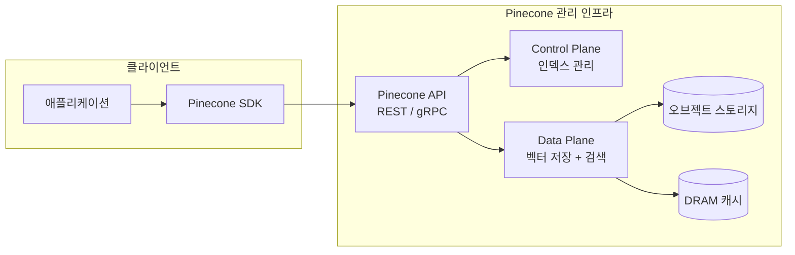

# Pinecone

2019년 설립된 벡터 데이터베이스 전문 기업 Pinecone Systems가 제공하는 완전 관리형(serverless) 벡터 DB 서비스. 인프라 운영 부담 없이 프로덕션 규모의 벡터 검색을 제공하는 것이 핵심 가치다. 자체 호스팅 솔루션이 없으며 순수 클라우드 SaaS 형태로만 제공된다.

## 개요

| 항목 | 내용 |
|---|---|
| 이름 | Pinecone |
| 회사 | Pinecone Systems, Inc. |
| 설립 | 2019 |
| 투자 | 시리즈 B (1억 달러+) |
| 제공 형태 | 클라우드 SaaS (AWS, GCP, Azure) |
| 클라이언트 | Python, JavaScript/TypeScript, Java, Go, C# |
| 무료 플랜 | Starter (1개 인덱스, 2M 벡터) |

## 아키텍처

Pinecone은 스토리지와 컴퓨팅을 분리하는 서버리스 아키텍처를 사용한다.



### Serverless vs Pod 인덱스

| 구분 | Serverless | Pod 기반 |
|---|---|---|
| 과금 | 쿼리/업서트 단위 | Pod 시간 단위 |
| 확장 | 자동 (무제한) | 수동 Pod 추가 |
| 지연 시간 | 중간 (콜드 스타트 있음) | 낮음 (상시 웨이업) |
| 적합 | 가변 트래픽, 개발/테스트 | 일정한 고부하 |

2023년 말 기준 Pinecone은 Serverless 인덱스를 기본으로 권장한다.

## 핵심 개념

### 인덱스 (Index)

Pinecone의 기본 단위. 생성 시 벡터 차원, 메트릭(cosine, euclidean, dotproduct), 클라우드/리전을 지정한다.

```python
from pinecone import Pinecone, ServerlessSpec

pc = Pinecone(api_key="...")

pc.create_index(
    name="my-rag-index",
    dimension=1536,            # OpenAI text-embedding-3-small 기준
    metric="cosine",
    spec=ServerlessSpec(cloud="aws", region="us-east-1"),
)

index = pc.Index("my-rag-index")
```

### 업서트 (Upsert)

```python
vectors = [
    {
        "id": "doc-001",
        "values": [0.1, 0.2, ...],   # 임베딩 벡터
        "metadata": {"text": "원본 텍스트", "source": "wiki", "date": "2026-04"},
    },
]
index.upsert(vectors=vectors, namespace="production")
```

### 쿼리 (Query)

```python
results = index.query(
    vector=query_embedding,
    top_k=10,
    namespace="production",
    filter={"source": {"$eq": "wiki"}},   # 메타데이터 필터
    include_metadata=True,
)
```

메타데이터 필터링으로 특정 소스, 날짜 범위, 카테고리 등에 대한 조건 검색이 가능하다.

## 네임스페이스와 멀티테넌시

네임스페이스(Namespace)는 단일 인덱스 내 데이터를 논리적으로 분리한다. 테넌트별 데이터 격리, 환경(dev/staging/prod) 분리 등에 활용한다.

```python
# 테넌트별 격리
index.upsert(vectors=vectors, namespace=f"tenant-{tenant_id}")
results = index.query(vector=q, top_k=5, namespace=f"tenant-{tenant_id}")
```

## Pinecone vs 자체 호스팅 솔루션

| 항목 | Pinecone | [[faiss|FAISS]] | [[weaviate|Weaviate]] | [[qdrant|Qdrant]] |
|---|---|---|---|---|
| 운영 부담 | 없음 (완전 관리) | 직접 관리 | 직접/클라우드 | 직접/클라우드 |
| 데이터 소유 | 벤더 클라우드 | 직접 소유 | 직접 소유 | 직접 소유 |
| 확장성 | 자동 | 수동 | 수동/클러스터 | 수동/클러스터 |
| 하이브리드 검색 | 없음 (순수 벡터) | 없음 | 내장 | 내장 |
| 과금 | 사용량 기반 | 무료 | 클러스터 기반 | 클러스터 기반 |

Pinecone은 운영 복잡도를 최소화하는 대신 하이브리드 검색이나 그래프 기능은 제공하지 않는다.

## 통합 생태계

[[rag-pipeline|RAG 파이프라인]] 프레임워크들과 공식 통합을 제공한다.

```python
# LangChain 통합
from langchain_pinecone import PineconeVectorStore
from langchain_openai import OpenAIEmbeddings

vectorstore = PineconeVectorStore(
    index=index,
    embedding=OpenAIEmbeddings(model="text-embedding-3-small"),
    text_key="text",
)
retriever = vectorstore.as_retriever(search_kwargs={"k": 5})
```

LlamaIndex, [[haystack|Haystack]], LangChain, CrewAI, Semantic Kernel 등과 공식 커넥터를 제공한다.

## 실무 관점

Pinecone은 **인프라 운영 역량 없이 빠르게 프로덕션 벡터 검색을 구축**해야 하는 팀에 적합하다. 완전 관리형으로 스케일링, 복제, 장애 복구를 자동 처리한다. 하지만 데이터가 벤더 클라우드에 저장되므로 컴플라이언스, 데이터 주권, 벤더 락인 리스크를 반드시 검토해야 한다. 하이브리드 검색이 필요하거나 온프레미스 배포가 필수라면 [[weaviate|Weaviate]]나 [[qdrant|Qdrant]]가 더 적합하다.

## 관련 문서

- [[faiss|FAISS]]
- [[weaviate|Weaviate]]
- [[qdrant|Qdrant]]
- [[chroma-db|ChromaDB]]
- [[rag-pipeline|RAG 파이프라인]]
- [[llamaindex|LlamaIndex]]
- [[haystack|Haystack]]
