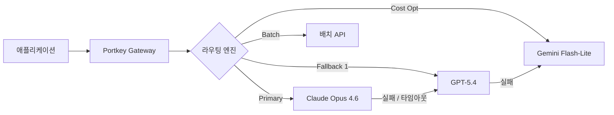
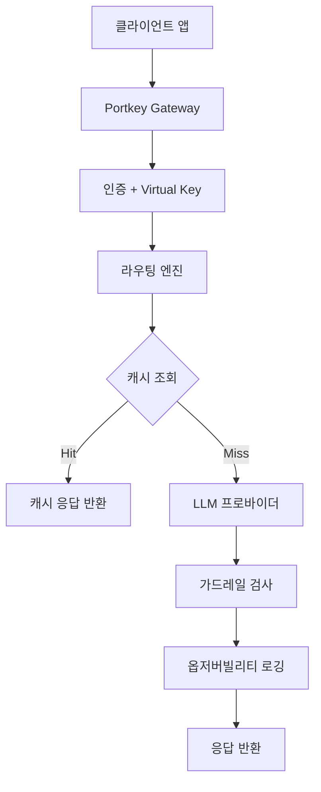

## 개요

Portkey는 1,600개 이상의 LLM을 단일 API로 통합하는 오픈소스 AI 게이트웨이다. 거버넌스, 옵저버빌리티, 스마트 라우팅, 폴백/재시도를 포함한 프로덕션 필수 기능을 제공하며, 월 수십억 건의 요청을 처리한다. 2025년 전면 오픈소스로 전환하여 자체 호스팅도 가능하다. [[prompt-caching-agentic|프롬프트 캐싱]] 및 [[kv-cache|KV 캐시]]와 연계하면 반복 에이전트 호출 비용이 크게 줄어들며, [[llm-observability-platforms|LLM 옵저버빌리티]] 레이어를 게이트웨이 수준에서 SDK 없이 자동 확보할 수 있다.

## 핵심 특징

### 유니버설 API 게이트웨이

1,600개 이상의 LLM과 프로바이더에 단일 API로 접근. 별도 통합 작업 없이 코드 한 줄 변경으로 프로바이더 전환이 가능하다. 텍스트, 비전, 오디오, 이미지 생성까지 모든 모달리티를 지원한다.

### 스마트 라우팅 및 폴백

- **조건부 라우팅**: 요청 메타데이터, 비용 예산, 지연 SLA 등 커스텀 로직 기반 프로바이더 선택
- **자동 폴백**: 프로바이더 장애 또는 타임아웃 시 자동으로 대체 프로바이더로 전환
- **로드 밸런싱**: 여러 LLM에 가중치 기반 트래픽 분산
- **카나리 테스트**: 새 모델/프롬프트를 일부 트래픽에만 적용하여 프로덕션 전 안전하게 검증
- **자동 재시도**: 일시적 오류 발생 시 설정된 횟수만큼 자동 재시도

### 캐싱

- **시맨틱 캐싱**: 의미적으로 유사한 요청에 캐시된 응답 반환. 동일하지 않아도 유사 의도의 요청을 매칭
- **단순 캐싱**: 정확히 동일한 요청에 대한 캐시 매칭
- 지연 시간과 비용을 동시에 절감하며, 반복적인 에이전트 호출 패턴에서 특히 효과적

### 옵저버빌리티 및 거버넌스

- 실시간 API 모니터링: 프로바이더별 비용, 지연, 에러율, 토큰 사용량 추적
- 가드레일: 네트워크 레벨에서 콘텐츠 필터링, PII 탐지, 프롬프트 인젝션 방어
- 조직 전체 감사 로그 (누가 어떤 모델을 어떤 프롬프트로 호출했는지)
- 역할 기반 접근 제어(RBAC) + SSO 지원

## 기술 상세

### 주요 기능 상세

| 기능 | 설명 |
|------|------|
| **Key Vault** | 가상 키(Virtual Key)로 LLM 자격증명을 안전 관리. 실제 API 키를 노출하지 않고 교체/취소 제어 |
| **프롬프트 관리** | 프롬프트 버전 관리, A/B 테스트, 프로덕션 배포 파이프라인 |
| **인텔리전트 배칭** | 대량 요청을 프로바이더 배치 API로 처리하여 비용 절감 |
| **파인튜닝** | 통합 API를 통한 프로바이더별 모델 최적화 |
| **멀티모달** | 비전, 오디오, 이미지 생성, 임베딩 모두 단일 API로 지원 |
| **모델 허용목록** | 승인된 모델/프로바이더만 사용 가능하도록 제한 (섀도우 AI 방지) |
| **요청 타임아웃** | 프로바이더별 응답 시간 제한 설정으로 SLA 보장 |

### 아키텍처

### 인프라 성능

- **가용성**: 99.9% 업타임
- **처리량**: 월 수십억 건 요청
- **배포**: 글로벌 분산 엣지 인프라로 최소 지연
- **응답 속도**: 게이트웨이 자체 오버헤드 최소화 (직접 호출 대비 수 ms 수준)

### 오픈소스 및 배포 옵션

GitHub에서 전체 게이트웨이 코드가 공개되어 있어 자체 호스팅이 가능하다. 배포 형태는 세 가지:

| 배포 형태 | 특징 |
|----------|------|
| **클라우드 (Managed)** | 즉시 사용 가능, 엔터프라이즈 기능(SSO, RBAC, 감사 로그) 포함 |
| **자체 호스팅** | 오픈소스 게이트웨이를 자체 인프라에 배포, 데이터 주권 확보 |
| **하이브리드** | 게이트웨이는 자체 호스팅, 관리/모니터링은 클라우드 활용 |

### 에이전트 옵저버빌리티

에이전틱 AI 워크로드에서 Portkey는 단일 요청이 아닌 에이전트 세션 전체를 추적한다. 에이전트가 여러 모델을 연쇄 호출하고, 도구를 사용하고, 피드백 루프를 돌 때 전체 흐름의 비용/지연/에러를 통합 대시보드에서 모니터링할 수 있다. 이는 [[langfuse]] 같은 전용 옵저버빌리티 도구와 경쟁하면서도, 게이트웨이 레벨에서 별도 SDK 통합 없이 자동으로 수집된다는 차별점이 있다.

### 유사 도구 비교

| 도구 | 유형 | 오픈소스 | 프로바이더 수 | 차별화 |
|------|------|---------|-------------|--------|
| **Portkey** | AI Gateway | O | 1,600+ | 가드레일, 프롬프트 관리, 배칭, 에이전트 옵저버빌리티 |
| [[openrouter]] | API 마켓플레이스 | X | 300+ | 단일 결제로 다수 모델 접근 |
| [[litellm]] | 프록시 서버 | O | 100+ | OpenAI 호환 API 프록시, 경량 |

## 관련 문서
- [[llm-gateway]] -- LLM 게이트웨이 (LLM Gateway)

- [[openrouter]] - 유니버설 AI API 게이트웨이
- [[litellm]] - 오픈소스 LLM 프록시
- [[langfuse]] - LLM 옵저버빌리티
- [[prompt-caching-agentic]] - 프롬프트 캐싱 (Portkey 캐싱과 연계)
