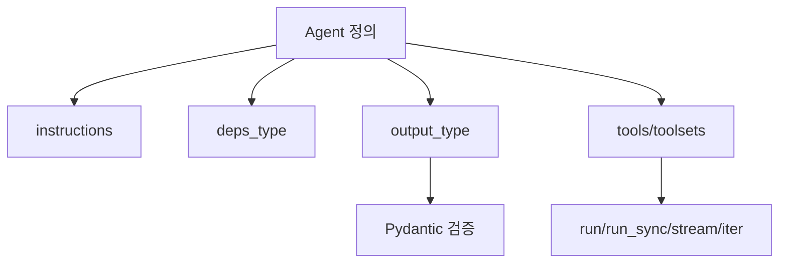

# Pydantic AI Agent Core Concepts

[[pydantic-ai|Pydantic AI]]의 Agent 핵심 개념 문서 요약이다. 타입 안전한 에이전트 정의, instructions, dependency injection, running agents의 기본 모델을 정리한다.

## 구조도

Pydantic AI의 Agent는 프롬프트 래퍼가 아니라, 타입·의존성·실행 결과 계약을 함께 묶는 중심 추상화다.

## 핵심 구조

- Agent를 instructions, tool/toolset, structured output type, dependency type, model settings, capabilities를 담는 컨테이너로 설명한다.
- 핵심 차별점은 "에이전트를 실행 가능한 프롬프트"가 아니라 **정적 타입이 붙은 런타임 계약**으로 다룬다는 점이다.
- 원문 예시는 `Agent[int, bool]`처럼 dependency type과 output type이 generic으로 붙는다. `RunContext[int]`는 deps_type 불일치 시 typing error를 낼 수 있고, `output_type=bool`은 최종 결과가 Pydantic으로 검증되게 한다.

## Running Agents

`run`, `run_sync`, `run_stream`, `run_stream_events`, `iter`는 같은 Agent를 서로 다른 실행 표면으로 노출한다. Pydantic AI를 도입할 때는 "agent를 몇 개 만들까"보다 먼저 output schema, dependency injection, streaming 필요성을 결정해야 한다.

## 실무 관점

- Python 백엔드 팀에게는 [[fastapi|FastAPI]]와 비슷한 개발 경험이 큰 장점이다. 타입 힌트와 검증 규율을 agent 런타임까지 확장하는 셈이다.
- output schema와 deps 구조를 먼저 설계해야 이후 tool, eval, [[langgraph|graph 레이어]]가 자연스럽게 올라간다.
- [[baml|BAML]]은 계약 파일 중심, Pydantic AI는 runtime object 중심이라는 차이가 있다.

## 관련 문서

- [[pydantic-ai|Pydantic AI]]
- [[pydantic-ai-mcp-overview|Pydantic AI MCP Overview]]
- [[pydantic-ai-durable-execution-overview|Pydantic AI Durable Execution Overview]]
