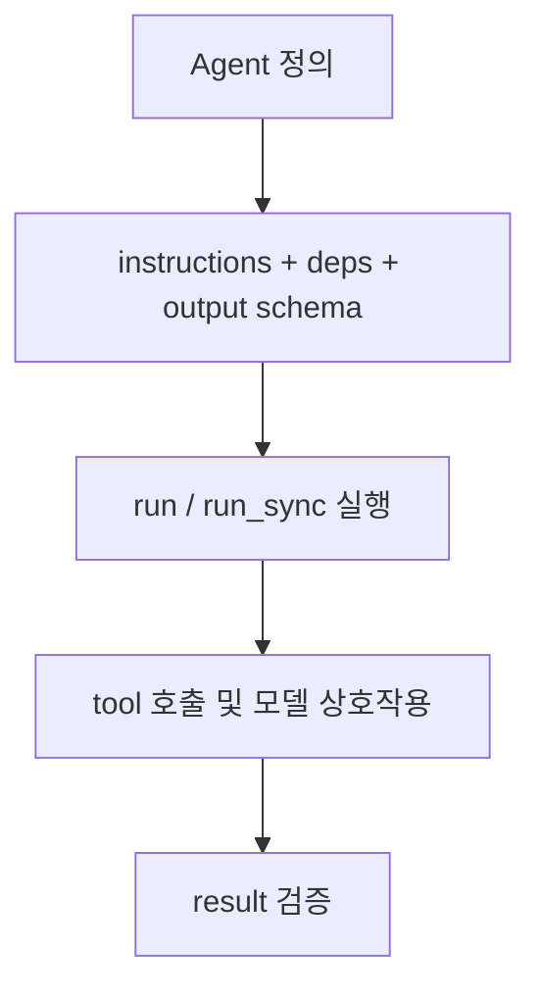

# Pydantic AI Agent Core Concepts

Pydantic AI의 Agent 핵심 개념 문서 요약이다. 타입 안전한 에이전트 정의, instructions, dependency injection, running agents의 기본 모델을 정리한다.

## 구조도

Pydantic AI의 Agent는 프롬프트 래퍼가 아니라, 타입·의존성·실행 결과 계약을 함께 묶는 중심 추상화다.

## 핵심 구조

- 문서는 Agent를 Pydantic AI의 중심 추상화로 놓고, 지침(instructions), 의존성(dependencies), 출력 타입, 도구 연결을 한 객체 안에서 다루는 방식을 설명한다.
- 핵심 차별점은 “에이전트를 실행 가능한 프롬프트”가 아니라 **정적 타입이 붙은 런타임 계약**으로 다룬다는 점이다.
- 즉 agent 정의 단계에서부터 입력/출력/의존성 경계를 명시해, 나중에 테스트와 검증이 쉬운 구조를 만들게 한다.

## 무엇이 중요한가

- 문서는 Agent를 instructions, tool/toolset, structured output type, dependency type, model settings, capabilities를 담는 컨테이너로 설명한다.
- running agents 섹션은 `run`, `run_sync`, `run_stream`, `run_stream_events`, `iter`처럼 서로 다른 실행 표면을 한 mental model로 정리한다.
- Pydantic 기반 출력 검증 덕분에 “잘 말하는 모델”이 아니라 “스키마를 만족하는 결과”를 시스템 기본값으로 삼을 수 있다.

## 실무 관점

- Pydantic AI를 도입하는 팀은 agent를 늘리기 전에 output schema와 deps 구조를 먼저 설계하는 편이 좋다. 그래야 이후 tool, eval, graph 레이어가 자연스럽게 올라간다.
- 특히 Python 백엔드 팀에게는 FastAPI와 비슷한 개발 경험이 큰 장점이다. 타입 힌트와 검증 규율을 agent 런타임까지 확장하는 셈이다.
- 이 문서는 [[pydantic-ai-mcp-overview|Pydantic AI MCP Overview]], [[pydantic-ai-durable-execution-overview|Pydantic AI Durable Execution Overview]]를 읽기 전의 기반 문서다.

## 도입 체크리스트

- Agent 정의 시 출력 스키마를 먼저 정했는가?
- instructions와 application state를 분리해 관리하는가?
- dependency injection 경로가 테스트 가능한 형태인가?
- 동기/비동기 실행 정책을 팀에서 통일했는가?

## 관련 문서

- [[pydantic-ai|Pydantic AI]]
- [[pydantic-ai-mcp-overview|Pydantic AI MCP Overview]]
- [[pydantic-ai-durable-execution-overview|Pydantic AI Durable Execution Overview]]
