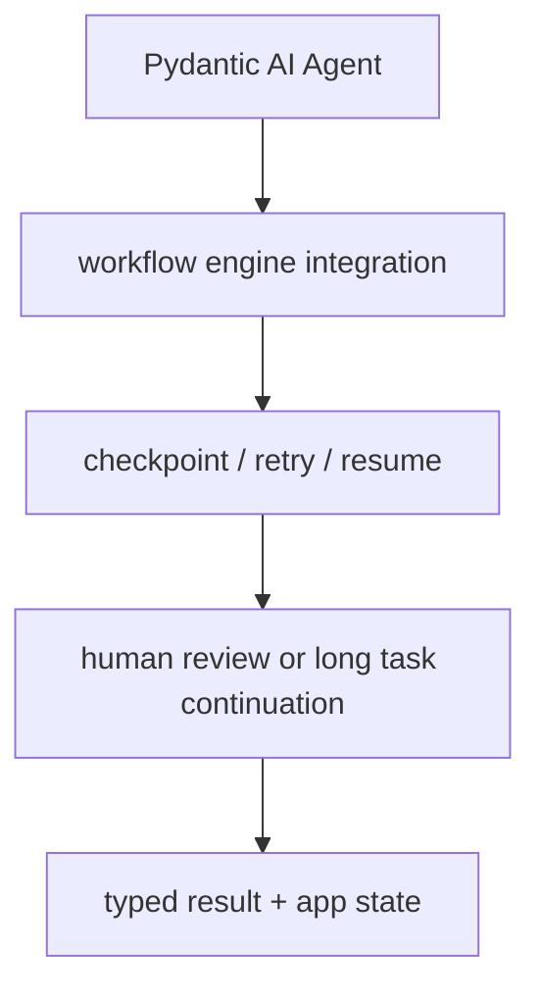

# Pydantic AI Durable Execution Overview

[[pydantic-ai|Pydantic AI]]에서 [[langgraph-durable-execution|durable execution]]을 어떻게 통합하는지 설명하는 공식 overview 요약이다. 장기 실행 agent를 workflow engine과 결합하는 전략을 정리한다.

## 구조도

Pydantic AI의 durable execution은 자체 런타임 하나로 모든 것을 해결하기보다, 외부 workflow 엔진과 agent를 결합하는 통합 전략에 가깝다.

## 핵심 구조

원문 기준으로 Pydantic AI는 세 가지 durable execution 솔루션을 네이티브 지원한다: **Temporal**, **DBOS**, **Prefect**. 이 통합들은 Pydantic AI의 public interface만 사용하므로, 다른 durable 시스템과의 통합 레퍼런스로도 활용할 수 있다.

- agent는 reasoning과 tool use를 담당하고, 장기 실행·재시도·resume·fault tolerance는 workflow 계층이 받치는 구조다.
- 이것은 "에이전트 프레임워크가 모든 문제를 해결한다"는 환상을 줄이고, 시스템 경계를 더 명료하게 만든다.

## 왜 중요한가

장기 실행 agent는 결국 실패·중단·승인 대기·외부 API 타임아웃을 만나게 된다. durable execution은 이 현실을 다루는 계층이다. Python 백엔드 팀이 기존 orchestration/queue/workflow 자산을 재사용할 수 있게 한다. 결국 핵심은 agent 품질만이 아니라 **resume semantics와 idempotency**다.

## 실무 관점

- 장시간 실행이 필요하면 agent 프레임워크 선정과 별개로, 어떤 workflow engine과 붙일지 먼저 결정하는 편이 낫다.
- durable execution을 붙이면 입력/출력 스키마 안정성, side effect 중복 방지, human approval 재개 규칙이 중요해진다.
- [[langgraph-durable-execution|LangGraph Durable Execution]]과 비교해서 읽으면 "프레임워크 내부 제공형"과 "통합형"의 차이를 선명하게 볼 수 있다.

## 관련 문서

- [[pydantic-ai|Pydantic AI]]
- [[langgraph-durable-execution|LangGraph Durable Execution]]
- [[long-running-agent-harnesses|Agent Harnesses for Long-Running Coding Sessions]]
