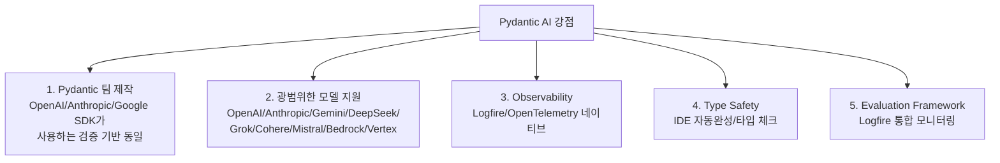

# Pydantic AI - Type-Safe Agent Framework Overview

Pydantic 팀이 운영하는 공식 docs("ai/overview/")의 요약. 프로덕션 등급 generative AI 애플리케이션을 위한 Python 에이전트 프레임워크.

## 핵심 가치 제안

- **Type safety** (런타임 → 작성 시 에러 검출)
- 모델 agnostic
- Logfire 통합 observability

## 핵심 강점 5가지



1. **Pydantic 팀 제작** — OpenAI SDK, Google ADK, Anthropic SDK 등이 사용하는 검증 기반 동일
2. **광범위한 모델 지원** — OpenAI, Anthropic, Gemini, DeepSeek, Grok, Cohere, Mistral, Azure, AWS Bedrock, Google Vertex AI
3. **Observability**: "Tightly integrates with Pydantic Logfire, our general-purpose OpenTelemetry observability platform."
4. **Type Safety**: IDE 자동완성/타입 체크
5. **Evaluation Framework**: Logfire와 통합된 성능 모니터링

## 핵심 개념

### Agent Architecture
Agents는 **dependency types**와 **output types**에 generic — 유연한 커스터마이징.

### Dependency Injection
`RunContext` 파라미터가 의존성을 안전하게 type checking과 함께 전달. **Unit testing/evals에 특히 유용**.

### Tool Registration
`@agent.tool` 데코레이터:
- Pydantic 자동 검증
- Docstring에서 파라미터 설명 추출

### Structured Output
Pydantic 모델로 예상 응답 형식 정의, 자동 검증.

## 예제 아키텍처

Support agent 예시:

```python
@dataclass
class SupportDependencies:
    customer_id: int
    db: DatabaseConn

class SupportOutput(BaseModel):
    support_advice: str
    block_card: bool
    risk: int
```

Agent는 **typed 의존성을 받고 검증된 output 모델 반환**.

## 지원 모델/제공자

OpenAI, Anthropic, Google, xAI, Bedrock, Cerebras, Cohere, Groq, Hugging Face, Mistral, Ollama, OpenRouter, Outlines, 커스텀 구현.

## 추가 기능

- **MCP (Model Context Protocol)** 통합
- **A2A (Agent-to-Agent)** 통신
- **Durable execution** — 실패에도 지속
- **Human-in-the-loop tool approval**
- **Graph-based workflow** 정의
- Web search, thinking 능력

## 메모

- 공식 docs: pydantic.dev/docs/ai/overview/ (이전 ai.pydantic.dev에서 마이그레이션)
- GitHub: pydantic/pydantic-ai (16.8k+ stars)
- 핵심 차별화: **type-safe 의존성 주입** — 컴파일 타임 에러 검출
- 주요 패턴: 입력 dataclass + 출력 BaseModel + tool 함수 데코레이터

## 관련 문서

- [[pydantic-ai]] — Pydantic AI entity 페이지
- [[pydantic-ai-agent-core]] — 코어 Agent 구조
- [[pydantic-ai-durable-execution-overview]] — Durable execution
- [[pydantic-ai-mcp-overview]] — MCP 통합
- [[langfuse-observability-summary]] — Langfuse가 Pydantic AI 네이티브 OTEL 지원
- [[mcp-protocol]] — MCP 표준
- [[a2a-protocol]] — A2A 통신
